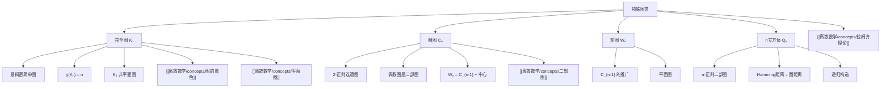

# 完全图

> [!abstract] 概述
> ==完全图==（complete graph）$K_n$ 是每对不同顶点之间都有边相连的图，是给定顶点数下边数最多的简单图。完全图是图论中最基本的特殊图类之一，也是许多定理和构造的极值案例。除了完全图，图论中还有其他重要的特殊图类：==圈图== $C_n$（顶点首尾相连形成的环）、==轮图== $W_n$（圈图加一个中心顶点）和==n 立方体== $Q_n$（超立方体图，表示 $n$ 位二进制数的邻接关系）。这些特殊图在 Ramsey 理论、着色理论、编码理论和并行计算中有广泛应用。

## 定义

> [!def] 完全图（Complete Graph）
>
> ==完全图== $K_n$ 是具有 $n$ 个顶点的简单图，其中每对不同的顶点之间都恰好有一条边相连。
>
> - 顶点数：$|V| = n$
> - 边数：$|E| = \binom{n}{2} = \dfrac{n(n-1)}{2}$
> - 每个顶点的度：$\deg(v) = n - 1$（==正则图==）
> - 总度数：$\sum_{v \in V} \deg(v) = n(n-1) = 2|E|$（满足握手定理）
> - 色数：$\chi(K_n) = n$（每个顶点互不相邻，需要不同颜色）
> - 直径：$\text{diam}(K_n) = 1$（任意两个顶点之间距离为 1）

> [!def] 圈图（Cycle Graph）
>
> ==圈图== $C_n$（$n \geq 3$）是由 $n$ 个顶点首尾相连形成的环。
>
> - 顶点数：$|V| = n$
> - 边数：$|E| = n$
> - 每个顶点的度：$\deg(v) = 2$（2-正则图）
> - 色数：$\chi(C_n) = \begin{cases} 2 & \text{若 } n \text{ 为偶数} \\ 3 & \text{若 } n \text{ 为奇数} \end{cases}$
> - 直径：$\text{diam}(C_n) = \lfloor n/2 \rfloor$
> - $C_n$ 是==二部图==当且仅当 $n$ 为偶数

> [!def] 轮图（Wheel Graph）
>
> ==轮图== $W_n$（$n \geq 4$）是由圈图 $C_{n-1}$ 加上一个与 $C_{n-1}$ 中所有顶点相连的中心顶点构成的图。
>
> - 顶点数：$|V| = n$
> - 边数：$|E| = 2(n - 1)$（$n - 1$ 条圈边 + $n - 1$ 条辐条边）
> - 中心顶点的度：$\deg(\text{center}) = n - 1$
> - 外圈顶点的度：$\deg(\text{rim}) = 3$
> - 色数：$\chi(W_n) = \begin{cases} 3 & \text{若 } n \text{ 为奇数} \\ 4 & \text{若 } n \text{ 为偶数} \end{cases}$
> - $W_n$ 总是非二部图（因为中心顶点与所有外圈顶点相邻，外圈至少有 3 个顶点）

> [!def] n 立方体（n-Cube / Hypercube）
>
> ==n 立方体== $Q_n$ 是以所有长度为 $n$ 的二进制串为顶点、当且仅当两个二进制串恰有一位不同时连边的图。
>
> - 顶点数：$|V| = 2^n$
> - 边数：$|E| = n \cdot 2^{n-1}$（每个顶点有 $n$ 个邻居，总度数为 $n \cdot 2^n$，由握手定理得边数）
> - 每个顶点的度：$\deg(v) = n$（$n$-正则图）
> - 色数：$\chi(Q_n) = 2$（二部图：按二进制串中 1 的个数的奇偶性划分）
> - 直径：$\text{diam}(Q_n) = n$（两个顶点之间的距离等于它们对应二进制串中不同位的个数，即 Hamming 距离）
> - 递归构造：$Q_n$ 可以由两个 $Q_{n-1}$ 在对应顶点之间连边得到

## 核心性质

| 图类 | 顶点数 $|V|$ | 边数 $|E|$ | 顶点度 | 色数 $\chi$ | 直径 | 是否二部图 |
|:-----|:------------|:----------|:-------|:-----------|:-----|:-----------|
| ==$K_n$== | $n$ | $\binom{n}{2}$ | $n - 1$ | $n$ | $1$ | 仅 $K_1, K_2$ |
| ==$C_n$== | $n$ | $n$ | $2$ | $2$（偶）/ $3$（奇） | $\lfloor n/2 \rfloor$ | $n$ 为偶数 |
| ==$W_n$== | $n$ | $2(n-1)$ | 中心 $n-1$，外圈 $3$ | $3$（奇）/ $4$（偶） | $2$ | 否 |
| ==$Q_n$== | $2^n$ | $n \cdot 2^{n-1}$ | $n$ | $2$ | $n$ | 是 |

## 关系网络

- **前置知识**：图的基本概念（顶点、边、度、路径、连通性）
- **核心关联**：特殊图类是图论中的"标准模型"，许多定理的极值案例和反例都来自这些图
- **后继概念**：[[离散数学/concepts/二部图]]（$Q_n$ 和偶数 $C_n$ 是二部图）、[[离散数学/concepts/平面图]]（$K_5$ 是非平面图）、[[离散数学/concepts/拉姆齐理论]]（$K_n$ 是 Ramsey 数的定义基础）

## 章节扩展

### 第10章：图论

**特殊图在定理中的角色**：

- **$K_n$ 与 Ramsey 理论**：Ramsey 数 $R(s, t)$ 定义为满足以下条件的最小正整数 $n$：对 $K_n$ 的任意一种 2-着色（红/蓝），都存在红色的 $K_s$ 或蓝色的 $K_t$。完全图是 Ramsey 理论的基本研究对象（参见 [[离散数学/concepts/拉姆齐理论]]）。

- **$K_5$ 与平面性**：$K_5$ 是 Kuratowski 定理中两个基本非平面图之一。$K_5$ 有 5 个顶点和 10 条边，而平面图的边数上界为 $3v - 6 = 9$，因此 $K_5$ 不是平面图（参见 [[离散数学/concepts/平面图]]）。

- **$K_n$ 与着色**：$\chi(K_n) = n$ 给出了色数的上界——任何 $n$ 个顶点的图的色数不超过 $n$。完全图是色数最大的 $n$ 阶图。

**n 立方体 $Q_n$ 的应用**：

- **并行计算**：$Q_n$ 的结构被用于超立方体并行计算机的互联网络，其直径为 $n$ 意味着任意两个处理器之间最多经过 $n$ 步通信
- **编码理论**：$Q_n$ 中的顶点对应长度为 $n$ 的二进制码字，边对应单位距离的码字对，与纠错码理论密切相关
- **布尔函数**：$Q_n$ 是表示 $n$ 变量布尔函数的自然框架，每个顶点对应一个输入组合

**特殊图之间的关系**：

- $W_n$ 由 $C_{n-1}$ 加中心顶点构成：$W_n = C_{n-1} + K_1$
- $K_n$ 可以看作 $W_{n+1}$ 去掉中心顶点的"补"：$K_n$ 是 $W_{n+1}$ 的外圈部分
- $Q_1 = K_2$，$Q_2 = C_4$，$Q_3$ 是立方体的骨架图
- $C_3 = K_3$（三角形既是圈图也是完全图）

### 第11章：树

完全图 $K_n$ 与树的计数有深刻联系。根据==Cayley 公式==，$n$ 个标记顶点上的不同树共有 $n^{n-2}$ 棵。这一公式可以通过 Prüfer 序列优雅地证明——每棵 $n$ 顶点的标记树唯一对应一个长度为 $n-2$ 的序列，每个位置有 $n$ 种选择，因此总数为 $n^{n-2}$。

完全图 $K_n$ 恰好有 $n^{n-2}$ 棵生成树（Kirchhoff 矩阵树定理的推论）。

## 补充

> [!info] 特殊图的应用
>
> 特殊图类在理论和实践中都有重要价值：
>
> - **完全图 $K_n$**：团问题、Ramsey 理论、社交网络中的"全连接"子网络
> - **圈图 $C_n$**：环形网络拓扑、循环调度、化学分子环结构
> - **轮图 $W_n$**：星型网络的扩展、Hub-and-Spoke 运输模型
> - **n 立方体 $Q_n$**：超立方体并行计算、Gray 码、纠错码、布尔函数分析

> [!tip] 特殊图的记忆方法
>
> - $K_n$：$n$ 个顶点"全部"（Complete）相连，边数 $\binom{n}{2}$
> - $C_n$：$n$ 个顶点排成"圈"（Cycle），每个顶点度数为 2
> - $W_n$：$C_{n-1}$ 加"轮轴"（Wheel），共 $n$ 个顶点
> - $Q_n$：$n$ 维"立方体"（Cube），$2^n$ 个顶点，每个顶点度数为 $n$

> [!warning] 常见误区
>
> - $W_n$ 有 $n$ 个顶点而非 $n$ 个外圈顶点；外圈是 $C_{n-1}$，有 $n - 1$ 个顶点
> - $K_1$（单个顶点）和 $K_2$（一条边）既是完全图也是二部图
> - $Q_0$ 是一个孤立顶点（$K_1$），$Q_1 = K_2$
> - $C_n$ 要求 $n \geq 3$；$C_1$ 和 $C_2$ 不是标准定义
> - 轮图 $W_n$ 要求 $n \geq 4$（因为外圈 $C_{n-1}$ 至少需要 3 个顶点）

## 参见

- [[离散数学/concepts/二部图]] -- $Q_n$ 和偶数 $C_n$ 是二部图的重要例子
- [[离散数学/concepts/平面图]] -- $K_5$ 是 Kuratowski 定理中的基本非平面图
- [[离散数学/concepts/图的着色]] -- $\chi(K_n) = n$ 是色数上界的极值案例
- [[离散数学/concepts/拉姆齐理论]] -- $K_n$ 是 Ramsey 数定义的基础
