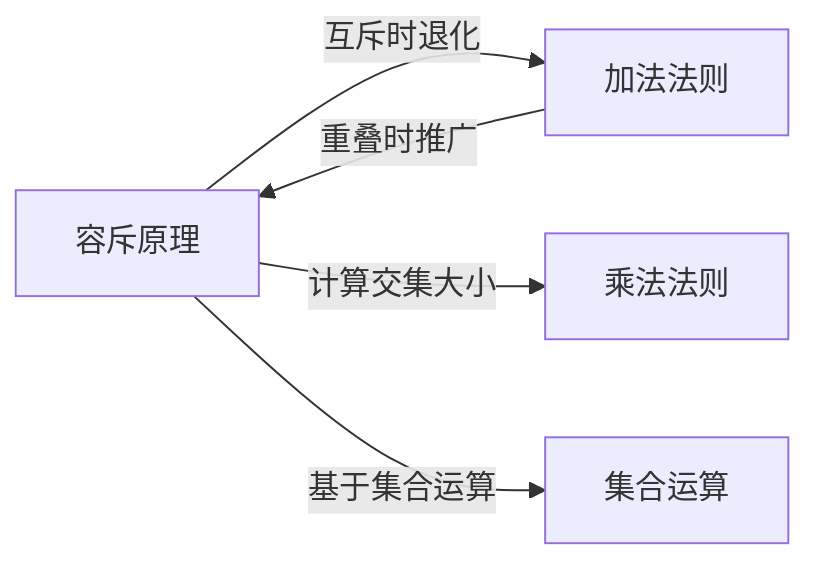

# 容斥原理

> [!abstract]
> ==容斥原理（Inclusion-Exclusion Principle）==是[[加法法则]]在集合存在重叠时的推广，用于精确计算多个集合并集的元素个数。其核心思想是：先"包含"所有集合的大小，再"排斥"（减去）交集部分，交替进行以消除重复计数。

## 定义

> [!def] 容斥原理（两个集合）
> 对任意两个有限集 $A$ 和 $B$：
> $$|A \cup B| = |A| + |B| - |A \cap B|$$
>
> **直观理解**：直接将 $|A|$ 和 $|B|$ 相加时，$A \cap B$ 中的元素被计算了两次，因此需要减去一次 $|A \cap B|$ 来修正。

> [!def] 容斥原理（三个集合）
> 对任意三个有限集 $A$、$B$、$C$：
> $$|A \cup B \cup C| = |A| + |B| + |C| - |A \cap B| - |A \cap C| - |B \cap C| + |A \cap B \cap C|$$
>
> **规律**：奇数个集合的交集前取正号，偶数个集合的交集前取负号。

> [!def] 容斥原理（一般形式）
> 对 $n$ 个有限集 $A_1, A_2, \ldots, A_n$：
> $$\left|\bigcup_{i=1}^{n} A_i\right| = \sum_{i}|A_i| - \sum_{i<j}|A_i \cap A_j| + \sum_{i<j<k}|A_i \cap A_j \cap A_k| - \cdots + (-1)^{n+1}|A_1 \cap A_2 \cap \cdots \cap A_n|$$
>
> 用紧凑形式表示：
> $$\left|\bigcup_{i=1}^{n} A_i\right| = \sum_{k=1}^{n}(-1)^{k+1}\sum_{1 \leq i_1 < i_2 < \cdots < i_k \leq n}|A_{i_1} \cap A_{i_2} \cap \cdots \cap A_{i_k}|$$

## 核心性质

| 编号 | 性质 | 说明 |
|:---:|------|------|
| P1 | **交替符号** | 交集的基数项符号交替变化：单集取正、两两交集取负、三三交集取正，依此类推 |
| P2 | **退化情况** | 当所有集合两两不相交时，容斥原理退化为[[加法法则]]：$|A \cup B| = |A| + |B|$ |
| P3 | **补集形式** | 可转化为计算不在任何集合中的元素数：$|\overline{A_1 \cup \cdots \cup A_n}| = |U| - |A_1 \cup \cdots \cup A_n|$，其中 $U$ 为全集 |
| P4 | **De Morgan 定律联系** | 容斥原理与 De Morgan 定律密切相关：$\overline{A \cup B} = \overline{A} \cap \overline{B}$ |
| P5 | **计算复杂度** | 对 $n$ 个集合，需要计算 $2^n - 1$ 个交集项，因此当 $n$ 较大时计算量急剧增长 |
| P6 | **与乘法法则联合** | 在计算交集 $|A_i \cap A_j|$ 的大小时，经常需要使用[[乘法法则]] |

## 关系网络

## 章节扩展

- **加法法则**：[[加法法则]]是容斥原理在集合不相交时的特例
- **乘法法则**：[[乘法法则]]常用于计算容斥原理中各项交集的大小
- **集合运算**：容斥原理依赖于[[集合运算]]中的并集、交集等基本概念
- **排列与组合**：在高级计数问题中，容斥原理可用于计算"至少"、"恰好"等约束条件下的排列组合数
- **7.1 离散概率导论**：容斥原理直接应用于事件并集概率计算 $P(E_1 \cup E_2) = P(E_1) + P(E_2) - P(E_1 \cap E_2)$。

### 第8章：高级计数 — 8.5-8.6节内容

- **8.5 一般 $n$ 集合容斥原理**：前面给出的容斥原理一般形式
  $$\left|\bigcup_{i=1}^{n} A_i\right| = \sum_{k=1}^{n}(-1)^{k+1}\sum_{1 \leq i_1 < \cdots < i_k \leq n}|A_{i_1} \cap \cdots \cap A_{i_k}|$$
  是处理任意 $n$ 个集合重叠计数的核心公式。当 $n$ 较大时，计算复杂度为 $O(2^n)$，需要计算所有非空子集对应的交集大小。

- **容斥原理的补集形式**：计算不在任何 $A_i$ 中的元素数：
  $$\left|\overline{A_1} \cap \overline{A_2} \cap \cdots \cap \overline{A_n}\right| = |U| - \left|\bigcup_{i=1}^{n} A_i\right|$$
  $$= \sum_{k=0}^{n}(-1)^k \sum_{1 \leq i_1 < \cdots < i_k \leq n}|A_{i_1} \cap \cdots \cap A_{i_k}|$$
  其中 $k=0$ 的项为 $|U|$。补集形式在"都不满足某性质"的计数问题中极为常用。

- **8.6 错排问题（Derangements）**：$n$ 个元素的错排数 $D_n$（没有任何元素出现在原始位置上的排列数）可用容斥原理推导：
  $$D_n = n! \sum_{i=0}^{n} \frac{(-1)^i}{i!} = n! \left(1 - 1 + \frac{1}{2!} - \frac{1}{3!} + \cdots + \frac{(-1)^n}{n!}\right)$$
  直觉：$n!$（总排列）减去至少1个固定点 + 至少2个固定点 - ... 交替修正。当 $n \to \infty$ 时，$D_n / n! \to 1/e \approx 0.3679$。详见[[离散数学/concepts/错排问题]]。

- **onto 函数计数**：从 $m$ 元素集合到 $n$ 元素集合的满射（onto）函数个数可用容斥原理计算：
  $$\text{onto}(m, n) = \sum_{j=0}^{n}(-1)^j \binom{n}{j}(n-j)^m = n^m - \binom{n}{1}(n-1)^m + \binom{n}{2}(n-2)^m - \cdots$$
  直觉：从 $n^m$（总函数）中减去至少遗漏1个值域元素的函数，再加回至少遗漏2个的，交替修正。详见[[离散数学/concepts/onto函数]]。

- **欧拉函数 $\phi(n)$**：不超过 $n$ 且与 $n$ 互素的正整数个数。利用容斥原理，设 $n = p_1^{a_1} p_2^{a_2} \cdots p_k^{a_k}$ 为 $n$ 的素因子分解，则：
  $$\phi(n) = n \prod_{p \mid n}\left(1 - \frac{1}{p}\right)$$
  该公式可通过容斥原理的补集形式推导：从 $\{1, 2, \ldots, n\}$ 中排除被 $p_1, p_2, \ldots, p_k$ 中任何一个整除的数。详见[[离散数学/concepts/欧拉函数]]。

## 补充

> [!info] 生活类比
> 假设调查100名学生选修课程的情况：60人选了数学，50人选了物理，30人选了化学。如果直接相加得到140，超过了总人数100，因为有些学生同时选了多门课。容斥原理通过"先加后减"的方式修正：总选课人数 = 选数学 + 选物理 + 选化学 - 同时选两门的 + 同时选三门的，从而得到精确的不重复计数。

> [!info] 典型例题
> 在1到1000的整数中，不能被3、5、7中任何一个整除的整数有多少个？
> - 设 $A_3$、$A_5$、$A_7$ 分别为被3、5、7整除的整数集
> - $|A_3| = \lfloor 1000/3 \rfloor = 333$，$|A_5| = 200$，$|A_7| = 142$
> - $|A_3 \cap A_5| = \lfloor 1000/15 \rfloor = 66$，$|A_3 \cap A_7| = \lfloor 1000/21 \rfloor = 47$，$|A_5 \cap A_7| = \lfloor 1000/35 \rfloor = 28$
> - $|A_3 \cap A_5 \cap A_7| = \lfloor 1000/105 \rfloor = 9$
> - $|A_3 \cup A_5 \cup A_7| = 333 + 200 + 142 - 66 - 47 - 28 + 9 = 543$
> - 答案：$1000 - 543 = 457$

## 参见

- [[加法法则]]：容斥原理在不相交时的退化形式
- [[乘法法则]]：常用于计算交集大小
- [[集合运算]]：容斥原理的基础——并集与交集
