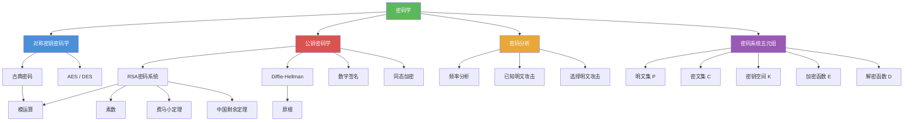

# 密码学

> [!abstract] 概述
> ==密码学（Cryptography）==是研究信息加密与解密的学科，通过数学变换将==明文==（plaintext）转换为==密文==（ciphertext），使得只有拥有特定密钥的人才能恢复原始信息。一个完整的==密码系统==由五元组 $(\mathcal{P}, \mathcal{C}, \mathcal{K}, \mathcal{E}, \mathcal{D})$ 定义。密码学分为==对称密钥密码学==（加密与解密使用相同密钥）和==公钥密码学==（加密密钥公开、解密密钥保密）两大范式。==密码分析==（Cryptanalysis）则是在不知道密钥的情况下从密文恢复明文的过程，其安全性级别分为计算安全与无条件安全。

## 定义

> [!def] 密码学（Cryptography）
>
> ==密码学==是研究如何在存在对手的环境中实现安全通信的学科，核心任务是通过数学变换保护信息的机密性、完整性和认证性。
>
> - "Cryptography" 一词源自希腊语 *kryptós*（隐藏）和 *gráphein*（书写），意为"秘密书写"
> - 数论在现代密码学中扮演关键角色，特别是模运算、素数理论和离散对数问题

> [!def] 密码系统（Cryptosystem）
>
> 一个==密码系统==是一个五元组 $(\mathcal{P}, \mathcal{C}, \mathcal{K}, \mathcal{E}, \mathcal{D})$，其中：
> - $\mathcal{P}$ 是==明文==字符串集合
> - $\mathcal{C}$ 是==密文==字符串集合
> - $\mathcal{K}$ 是==密钥空间==（所有可能密钥的集合）
> - $\mathcal{E}$ 是==加密函数==集合
> - $\mathcal{D}$ 是==解密函数==集合
>
> 对每个密钥 $k \in \mathcal{K}$，有加密函数 $E_k \in \mathcal{E}$ 和解密函数 $D_k \in \mathcal{D}$，满足：
>
> $$D_k(E_k(p)) = p \quad \text{对所有明文 } p$$

> [!def] 对称密钥密码学（Symmetric Key Cryptography）
>
> ==对称密钥密码学==（又称==私钥密码学==）中，加密和解密使用==相同密钥==或可以容易地从彼此推导出的密钥。
>
> - 通信双方必须通过安全信道预先共享密钥
> - 代表算法：AES、DES、[[古典密码]]中的凯撒密码、仿射密码、维吉尼亚密码等
> - 优点：加解密速度快；缺点：密钥分发困难，$n$ 个用户需要 $n(n-1)/2$ 个密钥

> [!def] 公钥密码学（Public Key Cryptography）
>
> ==公钥密码学==于 1970 年代被提出，其核心思想是：
> - ==加密密钥==（公钥）公开，任何人都可以加密消息
> - ==解密密钥==（私钥）保密，只有接收者可以解密
> - 知道加密方法==不等于==知道解密方法
>
> - 代表算法：[[RSA密码系统]]、ECC
> - 解决了对称密钥密码学中的密钥分发问题

> [!def] Kerckhoffs 原则
>
> ==Kerckhoffs 原则==（1883 年由 Auguste Kerckhoffs 提出）指出：密码系统的安全性应仅依赖于==密钥的保密性==，而非算法的保密性。即算法应当是公开的，即使攻击者完全了解加密方法，只要不知道密钥就无法解密。

> [!def] 密码分析（Cryptanalysis）
>
> ==密码分析==是在不知道加密方法和密钥的情况下，从密文恢复明文的过程。
>
> 主要攻击类型：
>
> | 攻击类型 | 攻击者已知信息 |
> |----------|---------------|
> | ==唯密文攻击== | 仅知道密文 |
> | ==已知明文攻击== | 知道部分明文-密文对 |
> | ==选择明文攻击== | 可以选择任意明文并获得对应密文 |
> | ==选择密文攻击== | 可以选择任意密文并获得对应明文 |

> [!def] 安全性级别
>
> | 安全级别 | 定义 | 说明 |
> |----------|------|------|
> | ==计算安全== | 破解所需计算资源超出实际可用 | 现实中大多数密码系统的安全级别 |
> | ==无条件安全== | 即使拥有无限计算资源也无法破解 | 又称"信息论安全"，如一次性密码本 |

## 核心性质

| 性质 | 描述 | 说明 |
|------|------|------|
| 机密性 | 只有授权方可以访问信息 | 密码学的基本目标 |
| 完整性 | 信息在传输过程中未被篡改 | 通过哈希函数和数字签名实现 |
| 认证性 | 确认信息来源的真实性 | 通过数字签名实现 |
| 不可否认性 | 发送者无法否认发送过消息 | 通过数字签名实现 |
| 五元组完备性 | $D_k(E_k(p)) = p$ | 加密-解密必须构成恒等变换 |
| Kerckhoffs 原则 | 安全性仅依赖密钥保密 | 算法公开是现代密码学的基本假设 |
| 对称密钥效率 | 加解密速度快 | 适合大量数据加密，但密钥分发困难 |
| 公钥密钥分发 | 无需安全信道交换密钥 | 解决了 $n$ 用户密钥管理问题 |
| 频率分析 | 利用字母频率分布破解 | 对简单替换密码（如凯撒密码）有效 |

## 关系网络

- [[古典密码]] 是对称密钥密码学的历史起点：凯撒密码、仿射密码、维吉尼亚密码等均为对称密钥方案
- [[RSA密码系统]] 是公钥密码学的里程碑：安全性基于大整数分解的计算困难性
- [[公钥密码学]] 解决了对称密钥密码学的密钥分发难题：加密密钥公开，解密密钥保密
- [[模运算]] 是密码学的数学基石：几乎所有密码算法都依赖模运算的性质

## 章节扩展

### 第4章：数论与密码学

密码学是第 4 章的核心应用主题（4.6 节），展示了数论知识在信息安全中的实际价值：

- **4.6 密码学**：密码系统的形式化定义（五元组）、古典密码（凯撒密码、仿射密码、维吉尼亚密码、换位密码）、密码分析（频率分析）、公钥密码学的基本思想、RSA 密码系统的完整推导与正确性证明、Diffie-Hellman 密钥交换协议、数字签名、同态加密
- **4.4 解同余方程**：模逆元的计算是 RSA 密钥生成和仿射密码解密的核心工具
- **4.3 素数与最大公因数**：素数的性质和欧拉函数 $\varphi(n)$ 是 RSA 安全性的数学基础

## 补充

> [!info] 密码学的历史与学术背景
>
> 密码学的历史可以追溯到古埃及和古罗马时期。凯撒密码（Caesar Cipher）是最古老的加密方法之一，由 Julius Caesar 在军事通信中使用。现代密码学的理论化始于 Claude Shannon 1949 年的论文 "Communication Theory of Secrecy Systems"，奠定了密码学的信息论基础。1976 年，Whitfield Diffie 和 Martin Hellman 发表了 "New Directions in Cryptography"，提出了公钥密码学的革命性概念。1977 年，MIT 的 Rivest、Shamir 和 Adleman 提出了 [[RSA密码系统]]，成为最广泛使用的公钥密码系统。值得注意的是，英国 GCHQ 的 Clifford Cocks 在 1973 年就独立发现了相同的方案，Malcolm Williamson 在 1974 年秘密发明了 Diffie-Hellman 密钥交换，但由于保密原因直到 1997 年才公开。
>
> **学术来源**：Rosen, K. H. (2019). *Discrete Mathematics and Its Applications* (8th ed.). McGraw-Hill, Section 4.6.
>
> **参考链接**：Singh, S. (1999). *The Code Book: The Science of Secrecy from Ancient Egypt to Quantum Cryptography*. Fourth Estate.

## 参见

- [[古典密码]] -- 凯撒密码、仿射密码、维吉尼亚密码、换位密码等对称密钥方案
- [[RSA密码系统]] -- 基于大整数分解困难性的公钥密码系统
- [[公钥密码学]] -- 公钥密码学的基本思想、Diffie-Hellman 密钥交换、数字签名
- [[模运算]] -- 密码学的数学基石，所有密码算法的核心运算
