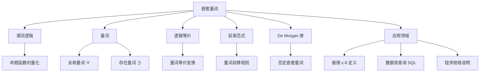

# 嵌套量词

> [!abstract] 概述
> ==嵌套量词==（nested quantifiers）是指当一个量词出现在另一个量词的==辖域==（scope）内时形成的量化结构。其本质是将内层量化结果作为外层量词的==命题函数==，例如 $\forall x \exists y P(x,y)$ 即 $\forall x Q(x)$，其中 $Q(x) = \exists y P(x,y)$。嵌套量词在数学分析（如 $\epsilon$-$\delta$ 极限定义）、数据库查询和程序规格说明中无处不在，==量词顺序至关重要==——$\forall x \exists y P(x,y)$ 与 $\exists y \forall x P(x,y)$ 一般不等价。

## 定义

> [!def] 嵌套量词
>
> 当一个量词出现在另一个量词的辖域内时，就形成了**嵌套量词**。形式化地，嵌套量词具有如下结构：
>
> $$Q_1 x_1\, Q_2 x_2\, \cdots\, Q_k x_k\, P(x_1, x_2, \ldots, x_k)$$
>
> 其中每个 $Q_i$ 是 $\forall$ 或 $\exists$，$P$ 是谓词。内层量化 $\exists y P(x, y)$ 的结果作为外层量词 $\forall x$ 的命题函数 $Q(x)$。

**嵌套循环类比**：判定嵌套量化命题的真假值时，可以将量词想象为嵌套循环——$\forall$ 对应"对所有元素遍历"，$\exists$ 对应"搜索是否存在满足条件的元素"。

## 核心性质

| 性质 | 表达式 | 说明 |
|:-----|:-------|:-----|
| 全称量词可交换 | $\forall x \forall y P(x,y) \equiv \forall y \forall x P(x,y)$ | 同类量词顺序不影响结果 |
| 存在量词可交换 | $\exists x \exists y P(x,y) \equiv \exists y \exists x P(x,y)$ | 同类量词顺序不影响结果 |
| $\forall\exists$ 不可交换 | $\forall x \exists y P(x,y) \not\equiv \exists y \forall x P(x,y)$ | $y$ 是否依赖于 $x$ 是核心区别 |
| 蕴含关系 | $\exists y \forall x P(x,y) \implies \forall x \exists y P(x,y)$ | "万能 $y$" 蕴含 "每个 $x$ 有自己的 $y$"，反之不成立 |
| 否定规则 | $\neg \forall x \exists y P(x,y) \equiv \exists x \forall y \neg P(x,y)$ | 逐层 De Morgan 律，每穿过一个量词翻转其类型 |

**四种两变量量化的真值条件：**

| 语句 | 为真条件 | 为假条件 |
|:-----|:---------|:---------|
| $\forall x \forall y P(x,y)$ | $P(x,y)$ 对**每对** $x,y$ 为真 | 存在一对使 $P(x,y)$ 为假 |
| $\forall x \exists y P(x,y)$ | 对**每个** $x$，存在 $y$ 使 $P(x,y)$ 为真 | 存在 $x$ 使得对所有 $y$，$P(x,y)$ 为假 |
| $\exists x \forall y P(x,y)$ | 存在 $x$ 使得对**所有** $y$，$P(x,y)$ 为真 | 对每个 $x$，存在 $y$ 使 $P(x,y)$ 为假 |
| $\exists x \exists y P(x,y)$ | 存在一对 $x,y$ 使 $P(x,y)$ 为真 | $P(x,y)$ 对**每对** $x,y$ 为假 |

## 关系网络

- **前置知识**：[[逻辑学/concepts/量词]]（量词的基本概念）、[[谓词逻辑]]（谓词与命题函数）
- **核心关联**：[[离散数学/concepts/逻辑等价]]（量词等价变换的理论基础）
- **应用延伸**：前束范式（标准化逻辑表达式）、极限的 $\epsilon$-$\delta$ 定义、SQL 中的 `EXISTS`/`NOT EXISTS` 子查询

## 章节扩展

### 第1章：逻辑与证明基础

嵌套量词是第1章第1.5节的核心内容，是谓词逻辑（1.4节）的自然延伸。在离散数学课程中，嵌套量词的知识为后续学习推理规则（1.6节）和证明方法（1.7-1.8节）提供了形式化语言基础。

**典型应用——极限的 $\epsilon$-$\delta$ 定义：**

$$\lim_{x \to a} f(x) = L \iff \forall \epsilon > 0\, \exists \delta > 0\, \forall x (0 < |x - a| < \delta \to |f(x) - L| < \epsilon)$$

其中 $\delta$ **依赖于** $\epsilon$ 的选择，量词顺序 $\forall \epsilon \exists \delta$ 不可交换。

**否定嵌套量词的逐层 De Morgan 律：**

$$\neg \forall x \exists y P(x,y) \equiv \exists x \neg \exists y P(x,y) \equiv \exists x \forall y \neg P(x,y)$$

否定符号从外向内逐层推进，每穿过一个量词，$\forall$ 变 $\exists$，$\exists$ 变 $\forall$。

**前束范式（Prenex Normal Form）：**

将所有量词移到公式最前端，形如 $Q_1 x_1\, Q_2 x_2\, \cdots\, Q_k x_k\, P(x_1, \ldots, x_k)$，其中 $P$ 不含量词。每个由逻辑连接词和量词构成的公式都等价于某个前束范式。

## 补充

> [!info] 学术参考
>
> - **Rosen, K. H.** *Discrete Mathematics and Its Applications*, 8th ed., McGraw-Hill, Section 1.5.
>   URL: https://www.mheducation.com/highered/product/discrete-mathematics-applications-rosen/M9781259676512.html
> - **Rudin, W.** *Principles of Mathematical Analysis*, 3rd ed., McGraw-Hill, 1976. Chapter 4, Section 5（连续性与一致连续性的量词刻画）。
>   URL: https://www.mheducation.com/highered/product/principles-mathematical-analysis-rudin/M9780070542358.html
> - **Codd, E. F.** "A Relational Model of Data for Large Shared Data Banks." *Communications of the ACM*, 13(6): 377-387, 1970（嵌套量词在关系数据库中的理论基础）。
>   URL: https://doi.org/10.1145/362384.362685

## 参见

- [[谓词逻辑]] — 谓词与量词的基本概念
- [[离散数学/concepts/逻辑等价]] — 量词等价变换的理论基础
- [[逻辑学/concepts/量词]] — 逻辑学知识库中的量词概念
- [[推理规则]] — 使用嵌套量词进行推理
