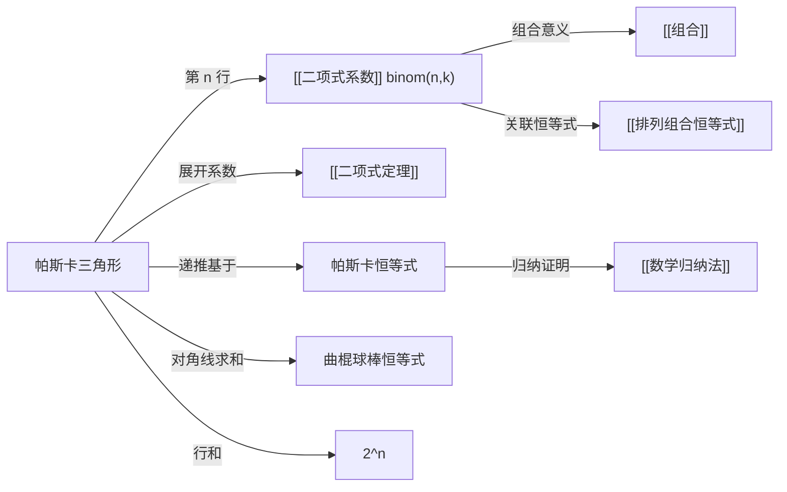

# 帕斯卡三角形

> [!abstract]
> ==帕斯卡三角形（Pascal's Triangle）==是[[二项式系数]]的三角形排列方式。第 $n$ 行（从第 0 行开始计数）对应 $(x+y)^n$ 展开式的各项系数 $\binom{n}{0}, \binom{n}{1}, \ldots, \binom{n}{n}$。三角形中每个数等于其正上方两数之和，这正是帕斯卡恒等式 $\binom{n}{k} = \binom{n-1}{k-1} + \binom{n-1}{k}$ 的几何表现。该三角形在中国最早由杨辉于 1261 年记载，在欧洲由 Pascal 于 1653 年系统研究。

## 定义

> [!def] 帕斯卡三角形（Pascal's Triangle）
> 帕斯卡三角形是一个无限的三角形数组，构造规则如下：
>
> - **第 0 行**：$1$
> - **第 1 行**：$1 \quad 1$
> - **第 2 行**：$1 \quad 2 \quad 1$
> - **第 3 行**：$1 \quad 3 \quad 3 \quad 1$
> - **第 4 行**：$1 \quad 4 \quad 6 \quad 4 \quad 1$
> - **一般地，第 $n$ 行**：$\dbinom{n}{0}, \dbinom{n}{1}, \ldots, \dbinom{n}{n}$
>
> 每个数等于其**左上方**和**右上方**两个数之和（边界处缺少的数视为 $0$）。

> [!def] 帕斯卡三角形的递推构造
> 设 $T(n,k)$ 表示第 $n$ 行第 $k$ 列的数（$0 \leq k \leq n$），则：
>
> $$T(n,k) = \begin{cases} 1 & \text{若 } k = 0 \text{ 或 } k = n \\ T(n-1,k-1) + T(n-1,k) & \text{若 } 0 < k < n \end{cases}$$
>
> 这正是[[二项式系数]]的帕斯卡恒等式的直接体现：$T(n,k) = \binom{n}{k}$。

## 核心性质

| 编号 | 性质 | 描述 | 公式/说明 |
|:---:|------|------|------|
| 1 | 行与二项式系数对应 | 第 $n$ 行为 $\binom{n}{0}, \binom{n}{1}, \ldots, \binom{n}{n}$ | 即 $(x+y)^n$ 的展开系数 |
| 2 | 递推构造 | 每个数等于上方两数之和 | $\binom{n}{k} = \binom{n-1}{k-1} + \binom{n-1}{k}$ |
| 3 | 行和 | 第 $n$ 行所有数之和 | $\displaystyle\sum_{k=0}^{n} \binom{n}{k} = 2^n$ |
| 4 | 左右对称 | 每行关于中间对称 | $\binom{n}{k} = \binom{n}{n-k}$（对称性） |
| 5 | 对角线规律 | 第 $d$ 条对角线上的数为 $\binom{n}{d}$ | $d=0$: 全 $1$；$d=1$: 自然数；$d=2$: 三角数 |
| 6 | 曲棍球棒恒等式 | 沿对角线求和 | $\displaystyle\sum_{i=r}^{n} \binom{i}{r} = \binom{n+1}{r+1}$ |
| 7 | 最大值 | 每行最大值在中间 | $\binom{n}{\lfloor n/2 \rfloor}$（[[二项式系数]]的单峰性） |

## 关系网络



## 章节扩展

### 帕斯卡三角形的前 7 行

```
                    1                    第 0 行
                  1   1                  第 1 行
                1   2   1                第 2 行
              1   3   3   1              第 3 行
            1   4   6   4   1            第 4 行
          1   5  10  10   5   1          第 5 行
        1   6  15  20  15   6   1        第 6 行
```

### 对角线规律

帕斯卡三角形中的对角线蕴含丰富的数列：

> [!def] 主要对角线
> - **第 0 条对角线**（左边界）：$1, 1, 1, 1, \ldots$ —— 常数列 $\binom{n}{0} = 1$
> - **第 1 条对角线**：$1, 2, 3, 4, 5, \ldots$ —— 自然数列 $\binom{n}{1} = n$
> - **第 2 条对角线**：$1, 3, 6, 10, 15, \ldots$ —— 三角数 $\binom{n}{2} = \frac{n(n+1)}{2}$
> - **第 3 条对角线**：$1, 4, 10, 20, 35, \ldots$ —— 四面体数 $\binom{n}{3} = \frac{n(n+1)(n+2)}{6}$
>
> 一般地，第 $d$ 条对角线上的第 $n$ 个数为 $\binom{n+d-1}{d}$，对应 $d$ 维单纯形数。

### 历史背景

> [!def] 杨辉三角与帕斯卡三角形的历史
> - **中国**：北宋数学家贾宪（约 1050 年）在其著作中已记载此三角形（"贾宪三角"）。南宋数学家**杨辉**于 1261 年在《详解九章算法》中详细描述了该三角形的构造方法，因此在中国称为**"杨辉三角"**。
> - **波斯**：数学家 al-Karaji（约 953-1029）和 Omar Khayyam（1048-1131）也独立发现了这一结构。
> - **欧洲**：法国数学家**帕斯卡**（Blaise Pascal）于 1653 年在《论算术三角形》（Traité du triangle arithmétique）中系统研究了该三角形的性质，因此西方称为**"帕斯卡三角形"**（Pascal's Triangle）。

## 补充

> [!info] 帕斯卡三角形中的隐藏规律
> 帕斯卡三角形蕴含大量优美的数学规律：
>
> - **斐波那契数列**：沿浅对角线求和可得斐波那契数：$1, 1, 2, 3, 5, 8, 13, \ldots$
> - **2 的幂**：第 $n$ 行之和为 $2^n$
> - **11 的幂**：第 $n$ 行的数字（无进位时）恰好是 $11^n$ 的各位数字，例如第 4 行 $14641 = 11^4$
> - **Sierpinski 三角形**：将奇数标记为黑色、偶数标记为白色，当行数足够多时呈现分形图案
> - **组合恒等式可视化**：曲棍球棒恒等式、对称性等都能在三角形中直观看到

> [!info] 帕斯卡三角形与二项式定理的关系
> [[二项式定理]] $(x+y)^n = \sum_{k=0}^{n} \binom{n}{k} x^{n-k} y^k$ 的展开系数恰好构成帕斯卡三角形的第 $n$ 行。
>
> 例如 $(x+y)^4 = x^4 + 4x^3y + 6x^2y^2 + 4xy^3 + y^4$，系数 $1, 4, 6, 4, 1$ 正是第 4 行。
>
> 帕斯卡恒等式解释了为什么相邻两行之间存在递推关系：$(x+y)^n = (x+y)^{n-1} \cdot (x+y)$，展开后合并同类项即得递推。

## 参见

- [[二项式系数]] —— 帕斯卡三角形中的每个数
- [[二项式定理]] —— 帕斯卡三角形各行对应的展开式
- [[排列组合恒等式]] —— 三角形中蕴含的恒等式
- [[组合]] —— 二项式系数的组合意义
- [[数学归纳法]] —— 证明帕斯卡恒等式的工具
