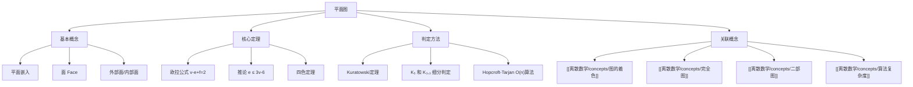

# 平面图

> [!abstract] 概述
> ==平面图==（planar graph）是可以在平面上画出且边不相交的图。平面性是图论中最基本的结构性质之一，与==欧拉公式== $v - e + f = 2$ 紧密关联。欧拉公式揭示了平面图的顶点数、边数和面数之间的深刻约束关系，由此可推导出边数上界 $e \leq 3v - 6$ 等重要推论。==Kuratowski 定理==给出了平面性的精确判定准则：一个图是平面图当且仅当它不包含 $K_5$ 或 $K_{3,3}$ 的细分作为子图。平面图的研究直接催生了==四色定理==（参见 [[离散数学/concepts/图的着色]]）。

## 定义

> [!def] 平面图与平面嵌入（Planar Graph & Planar Embedding）
>
> 一个图 $G$ 是==平面图==（planar graph），如果它可以被画在平面上，使得图的顶点用平面上的点表示，边用连接对应顶点的曲线表示，且任意两条边除端点外不相交。
>
> - 这样的画法称为 $G$ 的一个==平面嵌入==（planar embedding）
> - 平面嵌入将平面划分为若干连通区域，每个区域称为一个==面==（face）
> - 有且仅有一个无界的面，称为==外部面==（outer face）或==无限面**
> - 其余面都是有界的，称为==内部面==（inner face）
> - 包围一个面的边构成的闭通路称为该面的==边界==（boundary）

> [!def] 欧拉公式（Euler's Formula）
>
> 对于任意连通的平面图 $G$，设其顶点数为 $v$、边数为 $e$、面数为 $f$（含外部面），则：
>
> $$v - e + f = 2$$
>
> **证明思路**（对边数 $e$ 进行数学归纳）：
>
> - **基础步**：当 $e = 0$ 时，$G$ 是单个顶点，$v = 1$，$e = 0$，$f = 1$（仅外部面），$1 - 0 + 1 = 2$，成立
> - **归纳步**：假设对所有边数小于 $e$ 的连通平面图成立。考虑有 $e$ 条边的连通平面图 $G$：
>   - **情况 1**：若 $G$ 中有度为 1 的顶点（叶子），删除该顶点及其关联边得到 $G'$，则 $v' = v - 1$，$e' = e - 1$，$f' = f$（面数不变）。由归纳假设 $v' - e' + f' = 2$，即 $(v-1) - (e-1) + f = 2$，化简得 $v - e + f = 2$
>   - **情况 2**：若 $G$ 中无度为 1 的顶点，则 $G$ 中必有圈。删除圈上的一条边得到 $G'$，则 $v' = v$，$e' = e - 1$，$f' = f - 1$（两个面合并为一个）。由归纳假设 $v' - e' + f' = 2$，即 $v - (e-1) + (f-1) = 2$，化简得 $v - e + f = 2$

> [!def] Kuratowski 定理
>
> 一个图 $G$ 是平面图，当且仅当 $G$ 不包含 $K_5$（5 个顶点的完全图）或 $K_{3,3}$（完全二部图）的==细分==（subdivision）作为子图。
>
> - 图 $H$ 的一个==细分==是将 $H$ 的某些边替换为路径（在边上插入新的度为 2 的顶点）得到的图
> - $K_5$ 和 $K_{3,3}$ 是两个最小的非平面图
> - Kuratowski 定理给出了平面性的==充要条件==，是平面图理论的核心定理
> - 判定平面性的算法复杂度为 $O(n)$（Hopcroft-Tarjan 算法，1974）

## 核心性质

| 性质 | 描述 | 备注 |
|:-----|:-----|:-----|
| ==欧拉公式== | $v - e + f = 2$（连通平面图） | 平面图最基本的恒等式 |
| ==边数上界== | $e \leq 3v - 6$（$v \geq 3$，简单连通平面图） | 由欧拉公式推导 |
| ==无 $K_5$ 子图== | 非平面图必含 $K_5$ 或 $K_{3,3}$ 的细分 | Kuratowski 定理 |
| ==最小度== | 简单平面图存在度 $\leq 5$ 的顶点 | 由 $e \leq 3v - 6$ 推出 |
| ==二部图边数== | $e \leq 2v - 4$（简单连通平面二部图） | 每面至少 4 条边 |
| ==四色定理== | $\chi(G) \leq 4$（平面图） | 参见 [[离散数学/concepts/图的着色]] |
| ==对偶图== | 平面嵌入对应一个对偶图 $G^*$ | 顶点对应面，边对应相邻面 |

## 关系网络

- **前置知识**：[[离散数学/concepts/完全图]]（$K_5$ 是 Kuratowski 定理中的关键非平面图）
- **核心关联**：平面图的结构约束（欧拉公式）直接限制了图的密度，并决定了着色的上界（四色定理）
- **后继概念**：[[离散数学/concepts/图的着色]]（四色定理是平面图理论最重要的应用之一）

## 章节扩展

### 第10章：图论

**欧拉公式的关键推论**：

由欧拉公式 $v - e + f = 2$ 可以推导出一系列重要结论：

1. **边数上界**：在简单连通平面图（$v \geq 3$）中，每个面至少由 3 条边围成，且每条边至多属于 2 个面的边界，因此 $3f \leq 2e$，即 $f \leq \frac{2e}{3}$。代入欧拉公式：
   $$v - e + \frac{2e}{3} \geq 2 \implies v - \frac{e}{3} \geq 2 \implies e \leq 3v - 6$$

2. **$K_5$ 的非平面性**：$K_5$ 有 $v = 5$，$e = 10$。若 $K_5$ 是平面图，则 $e \leq 3 \times 5 - 6 = 9$，但 $10 > 9$，矛盾。

3. **$K_{3,3}$ 的非平面性**：$K_{3,3}$ 是二部图，不含三角形，每个面至少由 4 条边围成，因此 $4f \leq 2e$，即 $f \leq \frac{e}{2}$。代入欧拉公式：$v - e + \frac{e}{2} \geq 2 \implies e \leq 2v - 4$。$K_{3,3}$ 有 $v = 6$，$e = 9$，但 $2 \times 6 - 4 = 8 < 9$，矛盾。

4. **最小度不超过 5**：若简单平面图每个顶点的度都至少为 6，则由握手定理 $\sum \deg(v) = 2e$，得 $6v \leq 2e$，即 $e \geq 3v$，与 $e \leq 3v - 6$ 矛盾。

**Kuratowski 定理的意义**：Kuratowski 定理（1930）给出了平面性的精确判定准则，是图论中最重要的结构定理之一。它将平面性问题转化为子图检测问题。在实际应用中，Hopcroft 和 Tarjan 在 1974 年提出了线性时间的平面性判定算法，这是图算法领域的里程碑成果。

**对偶图**：平面图的每个平面嵌入都对应一个==对偶图== $G^*$，其构造方式为：在 $G$ 的每个面中放一个顶点，若两个面共享一条边，则在对偶图中对应的两个顶点之间连一条边。对偶图的概念在地图着色、网络流等问题中有重要应用。

## 补充

> [!info] 平面图的应用
>
> 平面图在多个领域有重要应用：
>
> - **电路设计**：印刷电路板（PCB）布线要求导线不相交，本质上就是平面嵌入问题
> - **地理信息系统**：地图的区域划分天然对应平面图的面
> - **网络可视化**：社交网络、通信网络的直观展示需要平面或近平面布局
> - **图绘制**：Graph Drawing 领域研究如何在平面上美观地绘制图

> [!tip] 判断平面性的实用方法
>
> - **快速排除**：若 $e > 3v - 6$（$v \geq 3$），则 $G$ 一定不是平面图
> - **二部图快速排除**：若 $G$ 是二部图且 $e > 2v - 4$，则 $G$ 一定不是平面图
> - **精确判定**：检查是否含有 $K_5$ 或 $K_{3,3}$ 的细分子图
> - **常见非平面图**：$K_5$、$K_{3,3}$、$K_{3,4}$、$K_7$ 等都不是平面图

> [!warning] 常见误区
>
> - $e \leq 3v - 6$ 是平面图的必要条件而非充分条件：满足该不等式的图不一定是平面图（如 $K_{3,3}$ 满足 $9 \leq 12$，但不是平面图）
> - 平面图的概念要求边不相交，但允许边在顶点处相交
> - 一个图可能是平面图但其某些画法中边会相交——关键在于是否存在至少一种不相交的画法
> - 欧拉公式仅适用于连通平面图；对于有 $k$ 个连通分量的平面图，公式推广为 $v - e + f = 1 + k$

## 参见

- [[离散数学/concepts/图的着色]] -- 四色定理：平面图的色数不超过 4
- [[离散数学/concepts/完全图]] -- $K_5$ 是 Kuratowski 定理中的关键非平面图
- [[离散数学/concepts/二部图]] -- $K_{3,3}$ 是 Kuratowski 定理中的关键非平面图
- [[离散数学/concepts/算法复杂度]] -- 平面性判定存在线性时间算法
