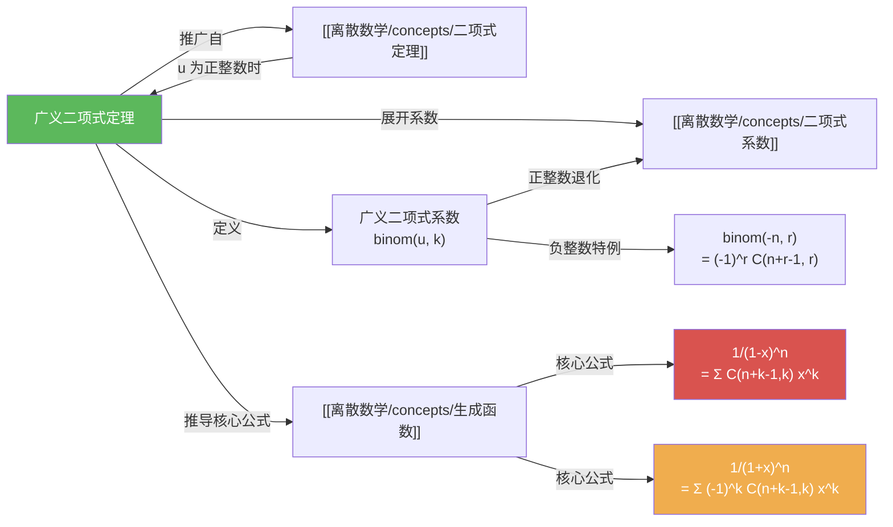

# 广义二项式定理

> [!abstract]
> ==广义二项式定理（Extended Binomial Theorem）==将经典[[离散数学/concepts/二项式定理]]从正整数指数推广到任意实数指数：$(1+x)^u = \sum_{k=0}^{\infty} \binom{u}{k} x^k$，其中 $\binom{u}{k}$ 为==广义二项式系数==。当 $u$ 为正整数时退化为普通二项式定理。广义二项式定理是[[离散数学/concepts/生成函数]]中核心幂级数公式（如 $\frac{1}{(1-x)^n}$ 的展开）的推导基础。

## 定义

> [!def] 广义二项式系数（Extended Binomial Coefficient）
> 设 $u$ 为实数，$k$ 为非负整数。==广义二项式系数==定义为
>
> $$\binom{u}{k} = \begin{cases} \dfrac{u(u-1)(u-2)\cdots(u-k+1)}{k!}, & \text{若 } k > 0 \\ 1, & \text{若 } k = 0 \end{cases}$$
>
> 分子是从 $u$ 开始递减的 $k$ 个因子的乘积（降阶乘），分母为 $k!$。当 $u$ 为正整数 $n$ 时，$\binom{n}{k}$ 就是普通的[[离散数学/concepts/二项式系数]] $C(n,k)$；当 $k > n$ 时，分子中出现因子 $0$，故 $\binom{n}{k} = 0$。

> [!def] 负整数的广义二项式系数
> 当 $u$ 为负整数 $-n$ 时，有重要公式：
>
> $$\binom{-n}{r} = (-1)^r C(n+r-1, r) = (-1)^r \binom{n+r-1}{r}$$
>
> **推导**：
> $$\binom{-n}{r} = \frac{(-n)(-n-1)\cdots(-n-r+1)}{r!}$$
> $$= \frac{(-1)^r \cdot n(n+1)\cdots(n+r-1)}{r!}$$
> $$= (-1)^r \frac{(n+r-1)!}{r!(n-1)!} = (-1)^r C(n+r-1, r)$$
>
> 注意前面的 $(-1)^r$ 因子：$(1+x)^{-n}$ 的系数是==交错符号==的，而 $(1-x)^{-n}$ 的系数全部为正。

> [!def] 广义二项式定理（Extended Binomial Theorem / Theorem 2）
> 设 $x$ 为实数且 $|x| < 1$，$u$ 为实数，则
>
> $$(1+x)^u = \sum_{k=0}^{\infty} \binom{u}{k} x^k$$
>
> 当 $u$ 为正整数时，广义二项式定理退化为普通的[[离散数学/concepts/二项式定理]]（因为当 $k > u$ 时 $\binom{u}{k} = 0$，级数自动截断为有限和）。

## 核心性质

| 编号 | 性质 | 公式 | 说明 |
|:---:|------|------|------|
| 1 | 基本定义 | $\dbinom{u}{k} = \dfrac{u(u-1)\cdots(u-k+1)}{k!}$ | 降阶乘除以 $k!$ |
| 2 | 零值约定 | $\dbinom{u}{0} = 1$ | 对所有实数 $u$ 成立 |
| 3 | 正整数退化 | $\dbinom{n}{k} = C(n,k)$（$n \in \mathbb{Z}^+$） | 退化为普通二项式系数 |
| 4 | 负整数公式 | $\dbinom{-n}{r} = (-1)^r C(n+r-1, r)$ | 最常用的特殊情况 |
| 5 | 广义二项式定理 | $(1+x)^u = \displaystyle\sum_{k=0}^{\infty} \dbinom{u}{k} x^k$ | $|x| < 1$ |
| 6 | $(1-x)^{-n}$ 展开 | $(1-x)^{-n} = \displaystyle\sum_{k=0}^{\infty} C(n+k-1, k) x^k$ | 生成函数核心公式 |
| 7 | $(1+x)^{-n}$ 展开 | $(1+x)^{-n} = \displaystyle\sum_{k=0}^{\infty} (-1)^k C(n+k-1, k) x^k$ | 系数交错符号 |
| 8 | $(1-ax)^{-n}$ 展开 | $(1-ax)^{-n} = \displaystyle\sum_{k=0}^{\infty} C(n+k-1, k) a^k x^k$ | 引入比例因子 $a$ |

## 关系网络

## 章节扩展

### 第08章 高级计数技术 -- 8.4 生成函数

广义二项式定理是 8.4 节中[[离散数学/concepts/生成函数]]理论的核心推导工具：

### 与常生成函数核心公式的联系

广义二项式定理直接推导出[[离散数学/concepts/生成函数]]中最重要的一组公式：

**推导 $(1-x)^{-n}$ 的展开**：
$$(1-x)^{-n} = \sum_{k=0}^{\infty} \binom{-n}{k} (-x)^k = \sum_{k=0}^{\infty} (-1)^k \cdot (-1)^k C(n+k-1, k) x^k = \sum_{k=0}^{\infty} C(n+k-1, k) x^k$$

**推导 $(1+x)^{-n}$ 的展开**：
$$(1+x)^{-n} = \sum_{k=0}^{\infty} \binom{-n}{k} x^k = \sum_{k=0}^{\infty} (-1)^k C(n+k-1, k) x^k$$

这两个公式是生成函数方法中提取系数的基础，广泛应用于组合计数和递推关系求解。

### 应用实例

**实例1：广义二项式系数的计算**
- $\binom{-2}{3} = \frac{(-2)(-3)(-4)}{3!} = \frac{-24}{6} = -4$
- $\binom{1/2}{3} = \frac{(1/2)(1/2-1)(1/2-2)}{3!} = \frac{(1/2)(-1/2)(-3/2)}{6} = \frac{3/8}{6} = \frac{1}{16}$

**实例2：推导允许重复的组合数公式**
从 $n$ 个元素中选 $r$ 个（允许重复）的组合数，其生成函数为 $G(x) = (1-x)^{-n}$。由广义二项式定理，$x^r$ 的系数为 $C(n+r-1, r)$，这与第6章 Theorem 2 的结论一致。

**实例3：推导至少选一个的组合数**
每种物品至少选 1 个的生成函数为 $G(x) = (x/(1-x))^n = x^n(1-x)^{-n}$。由广义二项式定理，$x^r$ 的系数为 $C(r-1, n-1)$。

## 补充

> [!info] 广义二项式系数的符号规律
> 广义二项式系数 $\binom{u}{k}$ 的符号取决于 $u$ 的值：
> - 当 $u$ 为正整数时，所有系数非负（普通二项式系数）
> - 当 $u$ 为负整数 $-n$ 时，$\binom{-n}{r} = (-1)^r C(n+r-1, r)$，符号由 $(-1)^r$ 决定
> - 当 $u$ 为非整数时，系数的符号规律更复杂，取决于 $u$ 的具体值
>
> 这意味着 $(1+x)^{-n}$ 的展开系数是交错符号的：$1 - C(n,1)x + C(n+1,2)x^2 - \cdots$，而 $(1-x)^{-n}$ 的展开系数全部为正：$1 + C(n,1)x + C(n+1,2)x^2 + \cdots$。在生成函数的应用中，$(1-x)^{-n}$ 更为常用。

> [!info] 广义二项式定理与 Newton 二项式级数
> 广义二项式定理也称为 Newton 二项式级数（Newton's Binomial Series），由 Isaac Newton 于 1665 年发现。Newton 在研究流数术（微积分的前身）时，尝试将 $(1+x)^{1/2}$ 展开为无穷级数，从而发现了这个对任意实数指数都成立的公式。这一发现比正整数指数的二项式定理晚了数百年，但极大地拓展了二项式定理的适用范围。

## 参见

- [[离散数学/concepts/生成函数]] -- 广义二项式定理的主要应用场景
- [[离散数学/concepts/二项式定理]] -- 广义二项式定理的正整数特例
- [[离散数学/concepts/二项式系数]] -- 广义二项式系数在正整数时的退化形式
