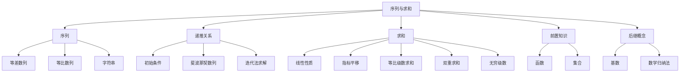

# 序列与求和

> [!abstract] 概述
> ==序列==（sequence）是从整数集的某个子集到集合 $S$ 的函数，是离散数学中最基本的数据结构之一。==求和符号== $\sum$ 提供了紧凑的累加记法，配合==线性性质==与==指标平移==可灵活化简表达式。等差数列与等比数列分别是线性函数与指数函数的离散类比，而==递推关系==通过前项定义后项，其经典代表==斐波那契数列==在自然界与计算机科学中广泛出现。

## 定义

> [!def] 序列（Sequence）
>
> ==序列==是一个从整数集的某个子集（通常是 $\{0, 1, 2, \ldots\}$ 或 $\{1, 2, 3, \ldots\}$）到集合 $S$ 的==函数==。用 $a_n$ 表示整数 $n$ 的像，$a_n$ 称为序列的==项（term）==，用 $\{a_n\}$ 描述整个序列。序列可以是==有限的==（finite）或==无限的==（infinite）。

> [!def] 等差数列（Arithmetic Progression）
>
> ==等差数列==是形如 $a, a+d, a+2d, \ldots, a+nd, \ldots$ 的序列，其中==首项== $a$ 和==公差== $d$ 都是实数。等差数列是线性函数 $f(x) = dx + a$ 的**离散类比**，通项公式为 $a_n = a + nd$。

> [!def] 等比数列（Geometric Progression）
>
> ==等比数列==是形如 $a, ar, ar^2, \ldots, ar^n, \ldots$ 的序列，其中==首项== $a$ 和==公比== $r$ 都是实数。等比数列是指数函数 $f(x) = ar^x$ 的**离散类比**，通项公式为 $a_n = ar^n$。

> [!def] 递推关系（Recurrence Relation）
>
> 序列 $\{a_n\}$ 的==递推关系==是一个方程，它将 $a_n$ 用前一项或多项来表示，即用 $a_0, a_1, \ldots, a_{n-1}$ 来表达 $a_n$（对所有 $n \geq n_0$ 的整数成立）。==初始条件==指定递推关系生效之前的那几项，递推关系与初始条件一起唯一确定一个序列。

> [!def] 斐波那契数列（Fibonacci Sequence）
>
> ==斐波那契数列== $f_0, f_1, f_2, \ldots$ 由初始条件 $f_0 = 0, f_1 = 1$ 和递推关系
>
> $$f_n = f_{n-1} + f_{n-2} \quad (n = 2, 3, 4, \ldots)$$
>
> 定义。相邻斐波那契数之比 $\dfrac{f_{n+1}}{f_n}$ 在 $n \to \infty$ 时收敛到黄金比例 $\varphi = \dfrac{1+\sqrt{5}}{2}$。

> [!def] 求和符号（Summation Notation）
>
> 用大写希腊字母 $\sum$ 表示求和：
>
> $$\sum_{j=m}^{n} a_j = a_m + a_{m+1} + \cdots + a_n$$
>
> 其中 $j$ 称为==求和指标==（index of summation），$m$ 为==下限==，$n$ 为==上限==。求和指标的选择是任意的：$\sum_{j=m}^{n} a_j = \sum_{i=m}^{n} a_i = \sum_{k=m}^{n} a_k$。

## 核心性质

| 性质 | 公式 | 说明 |
|:-----|:-----|:-----|
| ==等差数列通项== | $a_n = a + nd$ | 首项 $a$，公差 $d$ |
| ==等比数列通项== | $a_n = ar^n$ | 首项 $a$，公比 $r$ |
| ==求和线性性质== | $\displaystyle\sum_{j=1}^{n}(ax_j + by_j) = a\sum_{j=1}^{n}x_j + b\sum_{j=1}^{n}y_j$ | 加法的交换律、结合律与分配律 |
| ==指标平移== | $\displaystyle\sum_{j=1}^{n} a_j = \sum_{k=0}^{n-1} a_{k+1}$（令 $k = j - 1$） | 求和指标可自由替换 |
| ==等比级数求和== | $\displaystyle\sum_{j=0}^{n} ar^j = \frac{ar^{n+1} - a}{r - 1}$（$r \neq 1$） | $r = 1$ 时为 $(n+1)a$ |
| ==前 $n$ 个正整数求和== | $\displaystyle\sum_{k=1}^{n} k = \frac{n(n+1)}{2}$ | 高斯求和公式 |
| ==平方和== | $\displaystyle\sum_{k=1}^{n} k^2 = \frac{n(n+1)(2n+1)}{6}$ | 立方和为 $\frac{n^2(n+1)^2}{4}$ |
| ==无穷几何级数== | $\displaystyle\sum_{k=0}^{\infty} x^k = \frac{1}{1-x}$（$|x| < 1$） | 令 $n \to \infty$，$x^{n+1} \to 0$ |
| ==双重求和== | $\displaystyle\sum_{i=1}^{m}\sum_{j=1}^{n} a_{ij}$ | 先展开内层，再计算外层 |

## 关系网络

- **前置知识**：[[函数]]（序列本质上是定义域为整数子集的函数）、[[集合]]（序列的项取自某个集合）
- **核心关联**：[[基数]]（可数集的元素可排成序列 $a_1, a_2, \ldots$）
- **验证工具**：迭代法给出的是"猜想"，严格证明需用数学归纳法

## 章节扩展

### 第2章：基本结构

序列与求和是 Rosen 第8版第2章第2.4节的核心内容，是连接函数概念（2.3节）与基数理论（2.5节）的桥梁。

**迭代法求解递推关系**：通过反复应用递推关系推导闭公式（closed formula）。以 $a_n = a_{n-1} + 3$，$a_0 = 2$ 为例：

- **正向代入**：$a_1 = 2+3$，$a_2 = 2+2\cdot 3$，$a_3 = 2+3\cdot 3$，...，$a_n = 2 + 3(n-1)$
- **反向代入**：$a_n = a_{n-1}+3 = a_{n-2}+3\cdot 2 = \cdots = a_0 + 3n = 2 + 3n$，修正得 $a_n = 2 + 3(n-1)$

**等比级数求和公式证明**：令 $S_n = \sum_{j=0}^{n} ar^j$，两边同乘 $r$ 得 $rS_n = \sum_{k=1}^{n+1} ar^k = S_n + (ar^{n+1} - a)$，解方程得 $S_n = \frac{ar^{n+1} - a}{r-1}$（$r \neq 1$）。

**无穷级数**：当 $|x| < 1$ 时，$x^{n+1} \to 0$，故 $\sum_{n=0}^{\infty} x^n = \frac{1}{1-x}$。对两边求导可得 $\sum_{k=1}^{\infty} kx^{k-1} = \frac{1}{(1-x)^2}$。

### 第5章：归纳与递归

- **5.3 递归定义**：第5章通过递归方式定义序列（如斐波那契数列），递归定义与第2章的显式定义形成互补。递归定义的序列可通过递推关系或数学归纳法求出通项公式。

## 补充

> [!info] 学术参考
>
> - **Rosen, K. H.** *Discrete Mathematics and Its Applications*, 8th ed., McGraw-Hill, Section 2.4.
>   URL: https://www.mheducation.com/highered/product/discrete-mathematics-applications-rosen/M9781259676512.html
> - **Knuth, D. E.** (1997). *The Art of Computer Programming, Volume 1: Fundamental Algorithms* (3rd ed.). Addison-Wesley（斐波那契数列在算法分析中的应用）。
>   URL: https://www-cs-faculty.stanford.edu/~knuth/taocp.html
> - **OEIS Foundation.** (2023). *The On-Line Encyclopedia of Integer Sequences*（超过 250,000 个整数序列的在线数据库）。
>   URL: https://oeis.org
> - **Binet, J. P. M.** (1843). "Memoire sur l'integration des equations lineaires aux differences finies d'un ordre quelconque, a coefficients variables." *Comptes Rendus de l'Academie des Sciences*, 17, 559-567（Binet 公式：$f_n = \frac{\varphi^n - \psi^n}{\sqrt{5}}$）。

## 参见

- [[函数]] — 序列本质上是定义域为整数子集的函数
- [[集合]] — 序列的项取自某个集合
- [[基数]] — 可数集的元素可排成序列
