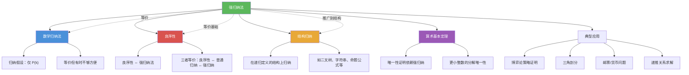

# 强归纳法

> [!abstract] 概述
> ==强归纳法（Strong Induction）==也称==完全归纳法==（Complete Induction）或==第二数学归纳法==（Second Principle of Mathematical Induction），是[[数学归纳法]]的加强版本。其核心区别在于归纳步：普通归纳法仅假设 $P(k)$ 为真来证明 $P(k+1)$，而强归纳法的归纳步假设==$P(1), P(2), \ldots, P(k)$ 全部为真==（即"强归纳假设"），从而证明 $P(k+1)$。这一更强的假设使得强归纳法特别适用于结论依赖于==多个前例==而非仅前一个情形的问题，例如算术基本定理的唯一性证明、博弈论中的策略证明、组合问题中的三角剖分等。

## 定义

> [!def] 强归纳法原理（Principle of Strong Induction）
>
> 设 $P(n)$ 是关于正整数 $n$ 的命题。若以下两步均成立，则 $\forall n \geq 1,\ P(n)$ 为真：
>
> - **基础步（Basis Step）**：证明 $P(1)$ 为真
> - **归纳步（Inductive Step）**：证明对任意正整数 $k \geq 1$，强归纳假设（Strong Inductive Hypothesis, SIH）$P(1) \wedge P(2) \wedge \cdots \wedge P(k)$ 为真蕴含 $P(k+1)$ 为真
>
> 形式化表述：
> $$P(1) \wedge \forall k \geq 1\,\bigl[(P(1) \wedge P(2) \wedge \cdots \wedge P(k)) \to P(k+1)\bigr] \implies \forall n \geq 1,\ P(n)$$
>
> 直觉类比：攀爬无限阶梯时，每一步可以踩在==之前所有台阶==上（而非仅前一级台阶），因此能到达更高的地方。

> [!def] 强归纳法与普通归纳法的等价性
>
> 强归纳法与普通数学归纳法是==等价==的证明方法——能用强归纳法证明的命题也一定能用普通归纳法证明，反之亦然。等价性的证明思路如下：
>
> **强归纳法 $\Rightarrow$ 普通归纳法**：显然，因为强归纳假设 $P(1) \wedge \cdots \wedge P(k)$ 比普通归纳假设 $P(k)$ 更强，若强归纳法有效则普通归纳法自然有效。
>
> **普通归纳法 $\Rightarrow$ 强归纳法**：定义辅助命题 $Q(n)$："对 $\forall j \leq n,\ P(j)$ 为真"。用普通归纳法证明 $Q(n)$：
> - 基础步：$Q(1)$ 即 $P(1)$，由基础步得证
> - 归纳步：假设 $Q(k)$ 为真（即 $P(1) \wedge \cdots \wedge P(k)$），由强归纳步得 $P(k+1)$ 为真，故 $Q(k+1)$ 为真
> - 因此 $\forall n,\ Q(n)$ 为真，即 $\forall n,\ P(n)$ 为真。$\blacksquare$
>
> 虽然二者等价，但强归纳法在许多问题中更自然、更直接，避免了构造辅助命题的麻烦。

> [!def] 典型应用场景
>
> **1. 算术基本定理的唯一性证明**：
> 证明每个 $n > 1$ 的整数有唯一的素因子分解（标准形式）。
> - 归纳步中，若 $n + 1$ 有两种分解 $n+1 = p_1 \cdots p_r = q_1 \cdots q_s$
> - 由于 $p_1 \mid (q_1 \cdots q_s)$，由引理 $p_1$ 整除某个 $q_j$
> - 两边除以 $p_1 = q_j$ 后，得到更小整数的分解，需对==所有更小整数==应用归纳假设
> - 这正是需要强归纳法的典型情形
>
> **2. 博弈论策略证明**：
> 证明某些组合博弈（如取石子游戏）中某方有必胜策略。
> - 归纳步中，当前局面的必胜策略可能依赖于==多种不同前局面==的分析
> - 需要对所有可能的先前局面应用归纳假设
>
> **3. 凸多边形的三角剖分**：
> 证明每个 $n \geq 3$ 边的凸多边形可以被对角线划分为 $n - 2$ 个三角形。
> - 归纳步中，选择一条对角线将 $n$ 边形分为一个 $k$ 边形和一个 $n - k + 2$ 边形
> - 需要对==两个更小多边形==分别应用归纳假设，因此需要强归纳法
>
> **4. 邮票问题与货币问题**：
> 证明当 $n$ 足够大时，$n$ 分的邮资可以用特定面额的邮票组合。
> - 归纳步中，$n + 1$ 分的邮资可能需要从 $n - k$ 分（$k$ 为最大面额）开始构造
> - 需要对多个前例应用归纳假设

## 核心性质

| 性质 | 描述 | 说明 |
|------|------|------|
| ==与普通归纳法等价== | 二者可互相推出 | 强归纳法并不比普通归纳法"更强"，但更方便 |
| ==强归纳假设== | 假设 $P(1) \wedge P(2) \wedge \cdots \wedge P(k)$ | 比普通归纳假设 $P(k)$ 提供更多信息 |
| ==适用场景== | 结论依赖于多个前例的问题 | 如唯一性证明、博弈策略、三角剖分等 |
| ==基础步可能需要多个== | 有时需验证 $P(1)$ 和 $P(2)$ | 当归纳步中 $P(k+1)$ 依赖于 $P(k-1)$ 时，需两个基础步 |
| ==与良序性等价== | 强归纳法、普通归纳法、良序性三者等价 | 三者是同一数学原理的不同表述形式 |
| ==辅助命题技巧== | 普通归纳法通过构造 $Q(n)$ 模拟强归纳 | $Q(n)$ = "$\forall j \leq n,\ P(j)$"，将强归纳转化为普通归纳 |

## 关系网络

- [[数学归纳法]] 是强归纳法的特例：当归纳步仅需要 $P(k)$ 时，强归纳法退化为普通归纳法
- [[良序性]] 是强归纳法的等价理论基础：三者（良序性、普通归纳法、强归纳法）相互等价
- [[结构归纳]] 是强归纳法在递归定义的结构上的推广：将"所有更小整数"推广为"所有更小的子结构"
- [[算术基本定理]] 的唯一性证明是强归纳法的经典应用：需要假设所有更小整数的分解唯一

## 章节扩展

### 第5章 — 5.2节内容

强归纳法是第5章第5.2节（强归纳与良序性）的核心内容之一，与良序性一起构成归纳法理论的完整体系。

**5.2节要点**：
- 强归纳法原理的形式化表述与等价性证明
- 强归纳法的典型应用：算术基本定理的唯一性、博弈策略、三角剖分
- 使用强归纳法证明递推关系的解的正确性
- 良序性公理及其与归纳法的等价性
- 广义归纳法（在任意良序集上的归纳证明）

**与5.1节的区别**：5.1节介绍普通数学归纳法，适用于结论仅依赖于前一个情形的问题；5.2节引入强归纳法，适用于结论依赖于多个前例的问题。强归纳法并不比普通归纳法更"强大"（二者等价），但在实际应用中更灵活、更自然。

## 补充

> [!info] 强归纳法的历史与数学地位
>
> 强归纳法（也称完全归纳法或第二数学归纳法）的历史与数学归纳法紧密相连：
>
> - **Augustus De Morgan**（1806--1871）在其著作中系统阐述了强归纳法，并明确区分了"第一数学归纳法"（普通归纳法）和"第二数学归纳法"（强归纳法）。De Morgan 对归纳法的严格化和推广做出了重要贡献。
> - 强归纳法在某些欧洲数学传统中被称为"完全归纳法"（Vollständige Induktion），这个词在德语数学文献中尤为常见。
> - 在计算机科学中，强归纳法是证明递归程序和递归数据结构性质的标准工具。例如，证明二叉搜索树的性质、归并排序的正确性等，都需要在归纳步中引用多个前例。
> - 强归纳法与[[结构归纳]]有密切联系：结构归纳可以看作强归纳法从自然数域到任意良基关系（well-founded relation）上的推广。
>
> **学术来源**：Rosen, K. H. (2019). *Discrete Mathematics and Its Applications* (8th ed.). McGraw-Hill, Section 5.2, pp. 346-356.
>
> **参考链接**：
> - De Morgan, A. (1838). *An Essay on Probabilities, and on Their Application to Life Contingencies and Insurance Offices*. Longman.
> - Bussey, W. H. (1917). "The Origin of Mathematical Induction." *The American Mathematical Monthly*, 24(5), 199-207. https://www.jstor.org/stable/2973026

## 参见

- [[数学归纳法]] — 强归纳法的基础版本，归纳步仅假设 $P(k)$
- [[良序性]] — 与强归纳法等价的基础公理，每个非空正整数集有最小元
- [[结构归纳]] — 强归纳法在递归定义的结构（如树、字符串、公式）上的推广
- [[算术基本定理]] — 强归纳法的经典应用：素因子分解唯一性的证明
