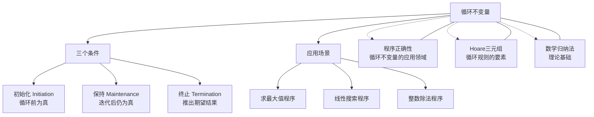

# 循环不变量

> [!abstract] 概述
> ==循环不变量（Loop Invariant）==是在循环的==每次迭代前后都保持为真的断言==。它是证明循环程序正确性的核心工具，需要满足三个条件：==初始化（initiation）==——循环前为真；==保持（maintenance）==——若迭代前为真则迭代后仍为真；==终止（termination）==——循环终止时结合不变量可推出期望结果。

## 定义

> [!def] 循环不变量的三个条件
>
> 设 $P$ 为循环 `while $B$ do $S$` 的候选循环不变量。$P$ 必须同时满足以下三个条件：
>
> **条件一：初始化（Initiation）**
>
> 在循环开始执行前（即第一次测试循环条件之前），$P$ 为真。
>
> $$P \text{ 在循环入口处为真}$$
>
> **条件二：保持（Maintenance）**
>
> 若某次迭代开始时 $P$ 为真且循环条件 $B$ 为真，则该次迭代执行 $S$ 后 $P$ 仍然为真。
>
> $$(P \land B) \Rightarrow \{S\}\ P$$
>
> 即：$P$ 是循环体的不变量——执行循环体不会破坏 $P$ 的真值。
>
> **条件三：终止（Termination）**
>
> 若循环终止（即 $B$ 变为假），则结合 $P$ 和 $\neg B$ 可以推出期望的终结断言 $Q$。
>
> $$P \land \neg B \Rightarrow Q$$
>
> 这三个条件共同保证了：若循环前 $P$ 为真，则循环终止后 $Q$ 为真（部分正确性）。

> [!def] 循环不变量与数学归纳法的关系
>
> 循环不变量的三个条件与==数学归纳法==（Mathematical Induction）存在精确的对应关系：
>
> | 循环不变量条件 | 数学归纳法对应 | 含义 |
> |:--------------|:--------------|:-----|
> | ==初始化== | ==基础步==（Base Case） | 证明循环开始前 $P$ 为真，对应 $P(0)$ 为真 |
> | ==保持== | ==归纳步==（Inductive Step） | 假设第 $k$ 次迭代前 $P$ 为真，证明第 $k+1$ 次迭代前 $P$ 仍为真 |
> | ==终止== | 归纳结论的应用 | 循环结束时，由不变量 $P$ 和终止条件 $\neg B$ 推出结果 $Q$ |
>
> 这种对应关系不是巧合——循环本质上是对归纳过程的**计算展开**。每次循环迭代对应归纳中的一步递推，不变量就是那个"对所有 $n$ 都成立"的命题 $P(n)$。
>
> 因此，掌握 [[数学归纳法]] 是理解和使用循环不变量的前提。

> [!def] 应用示例
>
> **示例 1：求最大值程序**
>
> ```plaintext
> max := a[1]
> i := 2
> while i ≤ n do
>     if a[i] > max then max := a[i]
>     i := i + 1
> ```
>
> **循环不变量**：`max` 等于 $a[1], a[2], \ldots, a[i-1]$ 中的最大值。
>
> - **初始化**：$i = 2$ 时，`max` $= a[1]$，确实是 $a[1]$ 到 $a[1]$ 的最大值。✓
> - **保持**：若 `max` 是 $a[1]$ 到 $a[i-1]$ 的最大值，则执行循环体后 `max` 是 $a[1]$ 到 $a[i]$ 的最大值，且 $i$ 增 1。✓
> - **终止**：循环终止时 $i = n + 1$，不变量给出 `max` 是 $a[1]$ 到 $a[n]$ 的最大值。✓
>
> **示例 2：线性搜索程序**
>
> ```plaintext
> i := 1
> while (i ≤ n) ∧ (x ≠ a[i]) do
>     i := i + 1
> ```
>
> **循环不变量**：$x$ 不在 $a[1], a[2], \ldots, a[i-1]$ 中。
>
> - **初始化**：$i = 1$ 时，$a[1]$ 到 $a[0]$ 为空集，$x$ 不在空集中。✓
> - **保持**：若 $x$ 不在 $a[1]$ 到 $a[i-1]$ 中，且 $x \neq a[i]$，则 $x$ 不在 $a[1]$ 到 $a[i]$ 中，$i$ 增 1 后不变量保持。✓
> - **终止**：循环终止时，要么 $i > n$（$x$ 不在数组中），要么 $x = a[i]$（找到了 $x$）。✓
>
> **示例 3：整数除法程序**
>
> ```plaintext
> q := 0; r := a
> while r ≥ b do
>     r := r - b
>     q := q + 1
> ```
>
> **循环不变量**：$a = b \times q + r$ 且 $r \geq 0$。
>
> - **初始化**：$q = 0, r = a$ 时，$a = b \times 0 + a$，且 $a \geq 0$（假设 $a \geq 0$）。✓
> - **保持**：若 $a = bq + r$ 且 $r \geq b$，则 $r' = r - b, q' = q + 1$，有 $a = bq' + r' = b(q+1) + (r-b) = bq + r$。✓
> - **终止**：循环终止时 $0 \leq r < b$，结合 $a = bq + r$，得 $q$ 为商、$r$ 为余数。✓

## 核心性质

| 性质 | 描述 | 说明 |
|:----:|:-----|:-----|
| 归纳对应 | 初始化=基础步，保持=归纳步 | 循环不变量证明本质上是归纳法 |
| 非唯一性 | 同一循环可能有多个有效不变量 | 选择"足够强"的不变量是关键 |
| 不蕴含终止 | 不变量保持不保证循环终止 | 终止性需要单独证明（如度量函数递减） |
| 后向构造 | 通常从期望结果反推不变量 | 结合终止条件和后条件 $Q$ 构造 $P$ |
| 强化策略 | 不变量可能需要比直觉更强的断言 | 弱不变量无法在终止时推出 $Q$ |
| 循环体依赖 | 不变量必须对循环体的每条路径都保持 | 条件分支中的所有路径都需验证 |

## 关系网络



- **应用领域**：[[程序正确性]] 使用循环不变量作为证明循环程序正确性的核心工具
- **形式化框架**：[[Hoare三元组]] 的循环规则中，循环不变量是必须找到的关键断言
- **理论基础**：[[数学归纳法]] 提供了循环不变量三条件的数学基础

## 章节扩展

### 第5章 — 5.5节内容

循环不变量是 Rosen 第5章 5.5 节中程序验证部分的核心概念：

- **循环不变量的定义**：三个条件（初始化、保持、终止）的精确表述
- **与数学归纳法的对应**：初始化对应基础步，保持对应归纳步
- **构造策略**：如何从期望结果反推合适的循环不变量
- **典型应用**：求最大值、线性搜索、整数除法等程序的验证
- **终止性证明**：使用度量函数（如循环计数器递减）证明循环终止
- **常见陷阱**：不变量过弱（无法推出结果）、不变量过强（无法证明保持性）

循环不变量是连接离散数学（归纳法）与计算机科学（程序验证）的桥梁概念。

## 补充

> [!info] 学术背景
>
> 循环不变量的概念最早由 **Floyd（1967）** 在 "Assigning Meanings to Programs" 中以**归纳断言**（inductive assertion）的形式提出。Floyd 的方法是在程序控制流图的边上标注断言，其中循环处的断言就是循环不变量。
>
> **Dijkstra** 在其 1976 年的名著 "A Discipline of Programming" 中进一步发展了循环不变量理论，并提出了==卫式命令==（guarded commands）语言。Dijkstra 强调：**程序的正确性应该在编写程序的同时就建立**，而不是事后验证。他提倡"先写不变量，再写循环"的程序设计方法论。
>
> 在实践中，循环不变量不仅是形式化验证的工具，也是**算法设计和程序构造**的思维工具。优秀的程序员在编写循环时，往往会在心中（或注释中）明确循环不变量，以此指导代码的正确实现。
>
> **来源**：
> - Rosen, K. H. *Discrete Mathematics and Its Applications*, 8th ed., Section 5.5
> - Floyd, R. W. (1967). "Assigning Meanings to Programs." *Mathematical Aspects of Computer Science*, 19, 19-32.
> - Dijkstra, E. W. (1976). *A Discipline of Programming*. Prentice-Hall.

## 参见

- [[程序正确性]] — 循环不变量的应用领域
- [[Hoare三元组]] — 循环不变量在公理化框架中的形式化表示
- [[数学归纳法]] — 循环不变量三条件的数学理论基础
