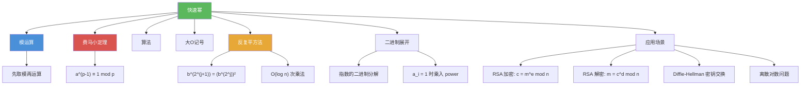

# 快速幂

> [!abstract] 概述
> ==快速幂（modular exponentiation）==也称==模幂算法==，用于高效计算 $b^n \bmod m$。其核心思想是==反复平方法==（successive squaring）：利用指数 $n$ 的二进制展开 $n = (a_{k-1} \ldots a_1 a_0)_2$，将 $b^n$ 分解为 $\prod_{j: a_j = 1} b^{2^j}$，只需 $O(\log n)$ 次乘法（而非朴素方法的 $O(n)$ 次），每次乘法后取模保证中间结果不超过 $m^2$。总复杂度为 $O((\log m)^2 \log n)$ 位运算，是 ==RSA 加密==等密码学应用能够高效运行的关键。

## 定义

> [!def] 快速幂算法（Algorithm 5: Modular Exponentiation）
>
> 计算 $b^n \bmod m$，其中 $b, n, m$ 为大整数：
>
> **核心思想**：利用指数 $n$ 的二进制展开 $n = (a_{k-1} \ldots a_1 a_0)_2$，将 $b^n$ 分解为：
> $$b^n = b^{a_{k-1} \cdot 2^{k-1} + \cdots + a_1 \cdot 2 + a_0} = \prod_{j: a_j = 1} b^{2^j}$$
>
> **算法步骤**：
> 1. 预计算 $b^{2^j} \bmod m$（$j = 0, 1, \ldots, k-1$），通过反复平方法：$b^{2^{j+1}} = (b^{2^j})^2$
> 2. 将 $a_j = 1$ 对应的项相乘，每次乘法后取模
>
> **伪代码**：
> ```
> procedure modular_exponentiation(b, n, m)
>     x := 1
>     power := b mod m
>     for i := 0 to k-1
>         if a_i = 1 then x := (x · power) mod m
>         power := (power · power) mod m
>     return x
> ```

## 核心性质

| 性质 | 描述 | 说明 |
|------|------|------|
| 乘法次数 | $O(\log n)$ 次 | 指数的二进制位数 |
| 每次乘法复杂度 | $O((\log m)^2)$ 位运算 | 两个不超过 $m$ 的数相乘 |
| 总复杂度 | $O((\log m)^2 \log n)$ 位运算 | 乘法次数乘以每次乘法的复杂度 |
| 空间效率 | 中间结果不超过 $m^2$ | "边乘边取模"策略 |
| 朴素方法对比 | 朴素方法需 $O(n)$ 次乘法 | 且中间结果 $b^n$ 可能极大 |
| power 更新时机 | 先判断 $a_i$ 再平方 | $a_i$ 对应 $b^{2^i}$，power 初始为 $b^{2^0}$ |

## 关系网络



- [[模运算]] 是快速幂的基础：每次乘法后取模，保证中间结果不溢出
- [[费马小定理]] $a^{p-1} \equiv 1 \pmod{p}$ 是快速幂的重要应用场景和理论基础
- [[算法]] 的框架为快速幂提供了精确的伪代码描述和正确性分析工具
- [[大O记号]] 用于量化快速幂的效率优势：$O(\log n)$ vs 朴素方法的 $O(n)$

## 章节扩展

### 第4章：数论与密码学

快速幂是第 4 章 4.2 节的重要算法：

- **4.2 整数表示与算法**：模幂算法（Algorithm 5），利用指数的二进制展开实现高效计算
- **4.5 密码学应用**：RSA 加密 $c = m^e \bmod n$ 和解密 $m = c^d \bmod n$ 都依赖快速幂
- **4.6 素性测试**：Miller-Rabin 测试中需要计算 $a^d \bmod n$，使用快速幂实现

## 补充

> [!info] 快速幂的广泛应用
>
> 快速幂（反复平方法）是计算机科学中最重要的算法技巧之一，应用远超密码学。在==竞赛编程==中，快速幂是必学的基础算法；在==大整数运算==中，Python 的 `pow(base, exp, mod)` 内置函数就使用了快速幂；在==矩阵快速幂==中，同样的技巧可以用于 $O(\log n)$ 时间内计算矩阵的 $n$ 次幂，从而高效求解线性递推关系（如斐波那契数列的第 $n$ 项）；在==多项式求值==中，Horner 法则与快速幂思想类似。快速幂的核心洞察是：$n$ 的二进制表示只有 $O(\log n)$ 位，因此只需 $O(\log n)$ 次平方运算就能覆盖所有可能的幂次。
>
> **学术来源**：Rosen, K. H. (2019). *Discrete Mathematics and Its Applications* (8th ed.). McGraw-Hill, Section 4.2.
>
> **参考链接**：Cormen, T. H., Leiserson, C. E., Rivest, R. L., & Stein, C. (2022). *Introduction to Algorithms* (4th ed.). MIT Press, Chapter 31.

## 参见

- [[模运算]] -- 快速幂的基础，每次乘法后取模保证结果不溢出
- [[费马小定理]] -- $a^{p-1} \equiv 1 \pmod{p}$，快速幂的重要应用场景
- [[算法]] -- 算法的定义与特性，快速幂的描述框架
- [[大O记号]] -- 度量快速幂效率的渐近记号，$O(\log n)$ vs $O(n)$
