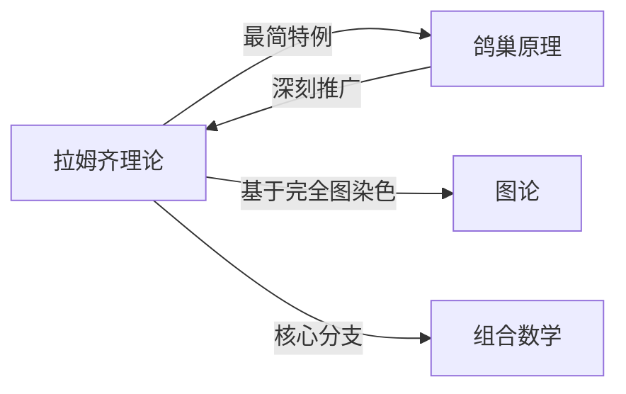

# 拉姆齐理论

> [!abstract]
> ==拉姆齐理论（Ramsey Theory）==是组合数学的一个重要分支，其核心思想是：**在足够大的结构中，必然会出现某种完全有序的子结构**。通俗地说，"完全无序是不可能的"——只要系统足够大，就一定存在规律。[[鸽巢原理]]可以看作拉姆齐理论最简单的特例。

## 定义

> [!def] 拉姆齐数 $R(m, n)$
> **拉姆齐数** $R(m, n)$ 定义为满足以下条件的最小正整数 $N$：
> - 在 $N$ 个人中，每两人之间要么互相认识，要么互不认识
> - 则**必然**存在 $m$ 个人互相认识，或者 $n$ 个人互不认识
>
> **图论表述**：对完全图 $K_N$ 的每条边用红色或蓝色染色，则必然存在红色 $K_m$（$m$ 个顶点的红色完全子图）或蓝色 $K_n$（$n$ 个顶点的蓝色完全子图）。
>
> $R(m, n)$ 是使上述结论成立的最小 $N$。

> [!def] 基本拉姆齐数的值
> - $R(1, n) = 1$（平凡情况）
> - $R(2, n) = n$（鸽巢原理的直接推论）
> - $R(3, 3) = 6$：6人中必有3人互相认识或3人互不认识
> - $R(3, 4) = 9$，$R(4, 3) = 9$（由对称性）
> - $R(4, 4) = 18$
> - $R(5, 5)$ 的精确值至今未知（已知 $43 \leq R(5,5) \leq 48$）

> [!def] 拉姆齐理论的一般思想
> 拉姆齐理论的一般形式可以表述为：
> - 对任何给定的"模式"（pattern），都存在一个足够大的结构，使得无论怎样对该结构进行"着色"（分类），都**必然**包含该模式的一个"单色"副本
> - 这意味着**完全的随机性是不可能的**——结构大到一定程度，必然出现规律

## 核心性质

| 编号 | 性质 | 说明 |
|:---:|------|------|
| P1 | **对称性** | $R(m, n) = R(n, m)$，即交换两种颜色对应的拉姆齐数不变 |
| P2 | **存在性保证** | 对任意正整数 $m, n \geq 2$，$R(m, n)$ 一定存在且有限（由拉姆齐定理保证） |
| P3 | **鸽巢原理的推广** | [[鸽巢原理]]是拉姆齐理论的退化情形：$R(2, n) = n$，$R(m, 2) = m$ |
| P4 | **上界估计** | $R(m, n) \leq R(m-1, n) + R(m, n-1)$（递推上界），且当 $R(m-1, n)$ 和 $R(m, n-1)$ 均为偶数时严格不等 |
| P5 | **计算困难性** | 拉姆齐数的精确值极难计算，$R(5, 5)$ 至今未知，这是组合数学中最著名的开放问题之一 |

## 关系网络

## 章节扩展

- **鸽巢原理**：[[鸽巢原理]]是拉姆齐理论的基础，$R(2, n) = n$ 直接对应鸽巢原理
- **图论**：拉姆齐理论用完全图边染色的语言表述，与图论中的团（clique）和独立集（independent set）密切相关
- **组合数学**：拉姆齐理论是组合数学中"存在性证明"的典范，展示了"足够大则必然有序"的核心思想

### 第10章：图论

> [!info] 拉姆齐理论与图论
> 在第10章图论中，拉姆齐理论与完全图的子图结构密切相关：
>
> - ==拉姆齐数== $R(m,n)$：保证完全图 $K_p$ 的任意红蓝边染色中必含红色 $K_m$ 或蓝色 $K_n$ 的最小 $p$
> - 完全图 $K_n$ 的边染色是拉姆齐理论的核心模型
> - 拉姆齐理论为图论提供了==存在性保证==：足够大的图中必然存在特定子结构

## 补充

> [!info] 生活类比——六人聚会问题
> 在任何6个人的聚会上，必然存在3人互相认识，或者3人互不认识。
> - 任选一人A，A对其余5人的关系分为"认识"和"不认识"两类
> - 由鸽巢原理，A至少认识其中3人（或至少不认识其中3人）
> - 假设A认识B、C、D三人。如果B、C、D中有两人互相认识，则这两人加上A构成3人互识组；如果B、C、D中无人互相认识，则B、C、D构成3人互不识组
> - 无论哪种情况，结论都成立。这就是 $R(3, 3) = 6$ 的证明。

> [!info] 历史背景
> 拉姆齐理论由英国数学家 Frank P. Ramsey（1903-1930）在1930年的论文中首次提出。Ramsey 在证明形式逻辑系统一致性时发现了这一组合结果。令人惋惜的是，Ramsey 在年仅27岁时因腹部手术并发症去世，但他的名字永远与这一深刻的数学理论联系在一起。Erdős 后来关于拉姆齐理论的名言生动地概括了其精神："想象一支军队的敌人逃入丛林，人数足够多的话，他们中一定有人……或者一群人……"

> [!info] 开放问题
> 拉姆齐数的精确计算是组合数学中最困难的开放问题之一：
> - $R(5, 5)$ 已知在 $43$ 到 $48$ 之间，但精确值未知
> - Paul Erdős 曾说："假设外星人威胁我们，必须在一年内算出 $R(5,5)$，否则就毁灭地球。那我们应该集中全人类的计算力量来解决这个问题。但如果他们要求算出 $R(6,6)$，我们应该集中全人类的力量去消灭外星人。"

## 参见

- [[鸽巢原理]]：拉姆齐理论的最简特例和基础
