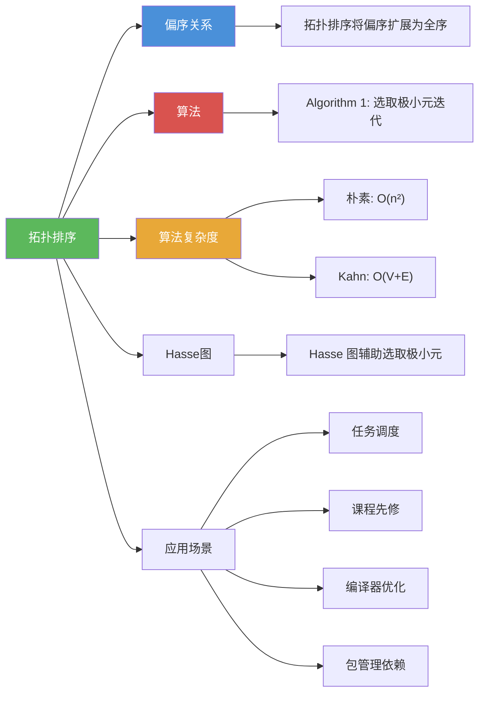

# 拓扑排序

> [!abstract] 概述
> ==拓扑排序==（topological sorting）是将==偏序集==扩展为==全序==的过程，即构造一个与原偏序==相容==的线性排列。核心算法基于一个关键引理：每个有限非空偏序集至少有一个==极小元==。算法反复选取极小元并将其从集合中删除，直到集合为空，所得序列即为一个合法的拓扑排序。拓扑排序的结果==不唯一==（当存在不可比元素时）。拓扑排序在任务调度、课程先修规划、编译器指令调度、软件包依赖管理等场景中有广泛应用。

## 定义

> [!def] 拓扑排序（Topological Sort）
>
> 设 $(S, R)$ 是==偏序集==。==拓扑排序==是构造一个与 $R$ ==相容的全序== $\preceq_t$ 的过程。
>
> 全序 $\preceq_t$ 与偏序 $R$ ==相容==意味着：若 $a R b$（即 $a \preceq b$），则 $a \preceq_t b$。
>
> 直觉：将偏序"线性化"，使得所有原有的先后关系都被保持。

> [!def] 引理1：有限偏序集有极小元
>
> 每个有限非空偏序集至少有一个==极小元==。
>
> **证明**：
>
> 任取 $a_0 \in S$。若 $a_0$ 不是极小元，则存在 $a_1$ 使得 $a_1 \prec a_0$。若 $a_1$ 不是极小元，则存在 $a_2$ 使得 $a_2 \prec a_1$。继续此过程。
>
> 因为 $S$ 是有限集，此过程必终止于某个极小元 $a_n$。$\blacksquare$

> [!def] 拓扑排序算法（Algorithm 1）
>
> **输入**：有限非空偏序集 $(S, \preceq)$
>
> **算法步骤**：
> 1. $k \leftarrow 1$
> 2. 当 $S \neq \emptyset$ 时：
>    a. $a_k \leftarrow S$ 的一个极小元（由引理1，极小元存在）
>    b. $S \leftarrow S - \{a_k\}$
>    c. $k \leftarrow k + 1$
> 3. 返回 $a_1, a_2, \ldots, a_n$（这是一个相容的全序）
>
> **正确性说明**：若 $b \prec c$ 在原偏序中成立，则在算法中 $c$ 不可能在 $b$ 之前被选为极小元（因为 $b \prec c$ 意味着 $c$ 不是极小元，只要 $b$ 还在集合中）。因此 $b$ 一定先于 $c$ 被选出。

## 核心性质

| 性质 | 描述 | 说明 |
|------|------|------|
| 相容性 | 拓扑排序保持原偏序的所有关系 | 若 $a \preceq b$，则 $a$ 排在 $b$ 前面 |
| 不唯一性 | 当存在不可比元素时，拓扑排序不唯一 | 选取不同极小元产生不同排序 |
| 极小元引理 | 有限非空偏序集必有极小元 | 算法正确性的基础 |
| 朴素复杂度 | $O(n^2)$ | 每步扫描找极小元 |
| 优化复杂度 | $O(V + E)$ | 使用优先队列和邻接表（Kahn 算法） |
| 存在性 | 有限偏序集的拓扑排序一定存在 | 由极小元引理保证 |
| 等价条件 | 拓扑排序存在当且仅当有向图无环 | 偏序集天然无环（反对称性 + 传递性） |

## 关系网络

- [[离散数学/concepts/偏序关系|偏序关系]] 是拓扑排序的基础：拓扑排序将偏序"线性化"为全序
- [[离散数学/concepts/算法|算法]] 框架：拓扑排序是一个典型的贪心算法，每步选择局部最优（极小元）
- [[离散数学/concepts/算法复杂度|算法复杂度]]：朴素实现 $O(n^2)$，使用优先队列和邻接表的 Kahn 算法可优化到 $O(V + E)$
- [[离散数学/concepts/Hasse图|Hasse 图]] 辅助理解拓扑排序：极小元对应 Hasse 图的底层元素

## 章节扩展

### 第09章：关系

拓扑排序是第 9 章偏序关系（9.6 节）中的算法部分：

- **9.6 偏序关系**：拓扑排序的定义、极小元引理、Algorithm 1（选取极小元迭代算法）、正确性证明、应用实例

### 第03章：算法

- **3.1 算法**：拓扑排序是贪心算法思想的典型应用，每步选择极小元（局部最优选择）
- **3.3 算法复杂度**：拓扑排序的复杂度分析，朴素实现与 Kahn 算法的对比

## 补充

> [!info] 拓扑排序的应用场景与实例
>
> **应用场景：**
> - **任务调度**：确定项目任务的执行顺序，任务之间的依赖关系构成偏序
> - **课程规划**：确定选修课程的先后顺序，先修课程构成偏序
> - **编译器优化**：确定指令的调度顺序，数据依赖关系构成偏序
> - **电子表格求值**：确定单元格的求值顺序，公式引用关系构成偏序
> - **包管理**：确定软件包的安装顺序，包之间的依赖关系构成偏序
>
> **实例：对偏序集 $(\{1, 2, 4, 5, 12, 20\}, \mid)$ 进行拓扑排序**
>
> 步骤：
> 1. 极小元只有 $1$，选 $a_1 = 1$。剩余 $\{2, 4, 5, 12, 20\}$。
> 2. 极小元有 $2, 5$，选 $a_2 = 5$。剩余 $\{2, 4, 12, 20\}$。
> 3. 极小元只有 $2$，选 $a_3 = 2$。剩余 $\{4, 12, 20\}$。
> 4. 极小元只有 $4$，选 $a_4 = 4$。剩余 $\{12, 20\}$。
> 5. 极小元有 $12, 20$，选 $a_5 = 20$。剩余 $\{12\}$。
> 6. 选 $a_6 = 12$。
>
> 结果：$1 \prec 5 \prec 2 \prec 4 \prec 20 \prec 12$。
>
> 注意：拓扑排序的结果不唯一（步骤 2 可以选 $2$ 而非 $5$，步骤 5 可以选 $12$ 而非 $20$）。
>
> **学术来源**：Rosen, K. H. (2019). *Discrete Mathematics and Its Applications* (8th ed.). McGraw-Hill, Section 9.6.

## 参见

- [[离散数学/concepts/偏序关系]] -- 拓扑排序将偏序扩展为全序，偏序关系是拓扑排序的数学基础
- [[离散数学/concepts/算法]] -- 拓扑排序是贪心算法思想的典型应用
- [[离散数学/concepts/算法复杂度]] -- 拓扑排序的复杂度分析：朴素 $O(n^2)$，Kahn 算法 $O(V + E)$
