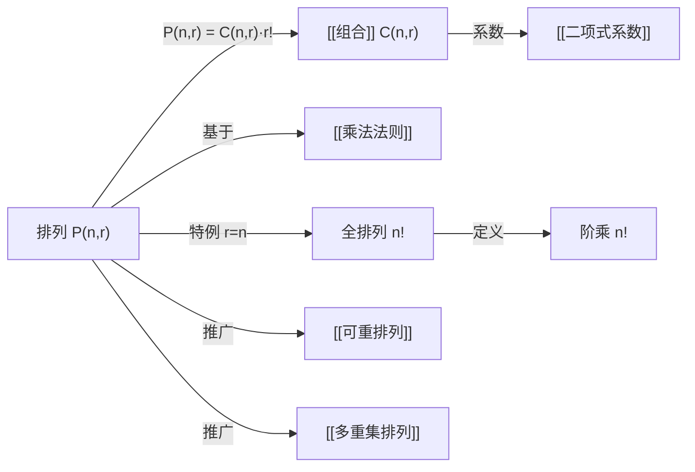

# 排列

> [!abstract]
> ==排列（Permutation）==是从 $n$ 个不同元素中选取 $r$ 个元素进行**有序排列**的计数问题。排列数记为 $P(n,r)$，其公式为：
>
> $$P(n,r) = \frac{n!}{(n-r)!}$$
>
> 当 $r = n$ 时，称为**全排列**，即 $P(n,n) = n!$。排列是[[组合]]的有序版本，二者之间满足关系 $P(n,r) = C(n,r) \cdot r!$。

## 定义

> [!def] 排列（Permutation）
> 设 $S$ 为含 $n$ 个不同元素的集合，$r$ 为满足 $0 \leq r \leq n$ 的整数。
>
> $S$ 的一个 **$r$-排列**（$r$-permutation）是从 $S$ 中选取 $r$ 个元素的**有序排列**。
>
> $S$ 的 $r$-排列的总数记为 $P(n,r)$，计算公式为：
>
> $$P(n,r) = n \cdot (n-1) \cdot (n-2) \cdots (n-r+1) = \frac{n!}{(n-r)!}$$
>
> 特别地，当 $r = n$ 时，$P(n,n) = n!$，称为 $S$ 的**全排列**。

> [!def] 阶乘（Factorial）
> 对于非负整数 $n$，其阶乘定义为：
>
> $$n! = \begin{cases} 1 & \text{若 } n = 0 \\ n \cdot (n-1)! & \text{若 } n \geq 1 \end{cases}$$
>
> 阶乘是排列公式的基础，表示将 $n$ 个不同元素排成一列的所有方式数。

## 核心性质

| 编号 | 性质 | 公式 | 说明 |
|:---:|------|------|------|
| 1 | 基本公式 | $P(n,r) = \dfrac{n!}{(n-r)!}$ | 从 $n$ 个中选 $r$ 个有序排列 |
| 2 | 全排列 | $P(n,n) = n!$ | $r = n$ 时的特例 |
| 3 | 与组合的关系 | $P(n,r) = C(n,r) \cdot r!$ | 先选后排：先无序选 $r$ 个，再对选出的元素全排列 |
| 4 | 递推关系 | $P(n,r) = P(n-1,r) + r \cdot P(n-1,r-1)$ | 元素 $n$ 不出现 + 元素 $n$ 出现在 $r$ 个位置之一 |
| 5 | 乘法结构 | $P(n,r) = n \cdot P(n-1,r-1)$ | 第一个位置有 $n$ 种选择，其余 $r-1$ 个位置从 $n-1$ 个中排列 |
| 6 | 空排列 | $P(n,0) = 1$ | 不选任何元素的排列只有一种（空排列） |
| 7 | 上界增长 | $P(n,r) \leq n^r$ | 有序选取的上界（允许重复时恰好为 $n^r$） |

## 关系网络

## 章节扩展

- **可重排列**：当元素可以重复选取时，$r$ 个位置的排列数为 $n^r$，这是[[乘法法则]]的直接应用。
- **多重集排列**：当 $n$ 个元素中有重复元素时（例如 $k$ 个相同元素），全排列数为 $\frac{n!}{k!}$，推广为 $\frac{n!}{n_1! \, n_2! \, \cdots \, n_k!}$。
- **排列与组合的关系**是理解[[二项式系数]]组合意义的关键桥梁。
- **7.1 离散概率导论**：排列数 $P(n,r)$ 用于计算有序抽样（不放回）的概率。

## 补充

> [!info] 排列的直观理解
> 想象有 $n$ 把不同的椅子排成一排，要安排 $r$ 个人入座：
>
> - 第 1 把椅子有 $n$ 种选择
> - 第 2 把椅子有 $n-1$ 种选择（已坐一人）
> - ...
> - 第 $r$ 把椅子有 $n-r+1$ 种选择
>
> 由[[乘法法则]]，总方式数为 $n \cdot (n-1) \cdots (n-r+1) = \frac{n!}{(n-r)!}$。

> [!info] 排列 vs 组合
> 排列关心**顺序**，组合不关心顺序。
>
> 例如从 $\{a, b, c\}$ 中取 2 个：
> - 排列：$(a,b), (a,c), (b,a), (b,c), (c,a), (c,b)$ —— 共 $P(3,2) = 6$ 种
> - 组合：$\{a,b\}, \{a,c\}, \{b,c\}$ —— 共 $C(3,2) = 3$ 种
>
> 每个组合对应 $r! = 2$ 个排列，即 $P(n,r) = C(n,r) \cdot r!$。

## 参见

- [[组合]] —— 不考虑顺序的选取
- [[乘法法则]] —— 排列公式的推导基础
- [[二项式系数]] —— $\binom{n}{r} = \frac{P(n,r)}{r!}$
- [[可重排列]] —— 允许重复的排列
- [[多重集排列]] —— 含重复元素的排列
