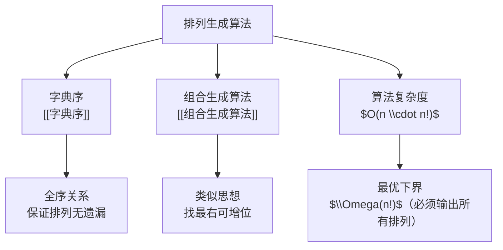

# 排列生成算法

> [!abstract]
> ==排列生成算法==按照[[字典序]]系统地生成 $\{1, 2, \ldots, n\}$ 的所有 $n!$ 个排列。该算法的核心思想是：给定当前排列，通过"找递减后缀→交换→反转"三步操作，高效地求出字典序中的下一个排列。总时间复杂度为 $O(n \cdot n!)$。

## 定义

> [!def] 字典序排列生成算法（Lexicographic Permutation Generation）
> 给定当前排列 $a = (a_1, a_2, \ldots, a_n)$，求其在[[字典序]]中的后继排列。算法步骤如下：
>
> **步骤1**：从右向左找到**最长的递减后缀**。设 $a_{i+1} > a_{i+2} > \cdots > a_n$ 为最长递减后缀，则 $a_i$ 为该后缀的直接前驱（即 $a_i < a_{i+1}$）。
>
> **步骤2**：在后缀 $a_{i+1}, a_{i+2}, \ldots, a_n$ 中，从右向左找到**大于 $a_i$ 的最小元素** $a_j$（即 $a_j > a_i$ 且 $a_{j+1} \leq a_i$）。
>
> **步骤3**：交换 $a_i$ 与 $a_j$。
>
> **步骤4**：将位置 $i+1$ 到 $n$ 的子序列**反转**（使其变为递增序，即字典序最小）。
>
> **终止条件**：当整个排列为完全递减序列 $(n, n-1, \ldots, 1)$ 时，算法终止。

## 核心性质

| 编号 | 性质 | 说明 |
|:---:|------|------|
| 1 | **完备性** | 算法恰好生成所有 $n!$ 个排列，无遗漏、无重复 |
| 2 | **字典序保证** | 生成的排列序列严格按[[字典序]]递增 |
| 3 | **单步复杂度** | 每次求后继的时间复杂度为 $O(n)$（扫描+交换+反转） |
| 4 | **总复杂度** | 生成所有排列的总复杂度为 $O(n \cdot n!)$ |
| 5 | **原地操作** | 算法可在原数组上原地执行，空间复杂度 $O(1)$（不含输出） |
| 6 | **终止判定** | 当找不到满足 $a_i < a_{i+1}$ 的位置 $i$ 时，当前排列即为字典序最后一个 |

## 关系网络



## 章节扩展

- **第6.6节**：本概念是Rosen教材第6.6节的核心算法之一，与[[组合生成算法]]并列。
- **Heap算法**：另一种生成全排列的算法，通过交换操作递归生成，不需要字典序，但实现更简洁。
- **应用场景**：暴力搜索（Brute Force）、排列测试、密码破解、旅行商问题的穷举解法。

## 补充

> [!info] 算法伪代码
> ```
> procedure NextPermutation(a[1..n])
>     // 步骤1: 找最长递减后缀的前驱
>     i ← n - 1
>     while i ≥ 1 and a[i] > a[i+1] do
>         i ← i - 1
>     if i = 0 then
>         return "无后继"  // 当前为最后一个排列
>     // 步骤2: 在后缀中找大于a[i]的最小元素
>     j ← n
>     while a[j] < a[i] do
>         j ← j - 1
>     // 步骤3: 交换
>     swap a[i] and a[j]
>     // 步骤4: 反转后缀 a[i+1..n]
>     reverse a[i+1..n]
>     return a
> ```
>
> 要生成所有排列，从 $(1, 2, \ldots, n)$ 开始，反复调用 `NextPermutation` 直到返回"无后继"。

> [!info] 执行示例（n = 4）
> 从 $1234$ 开始的字典序排列序列（部分）：
> $1234 \to 1243 \to 1324 \to 1342 \to 1423 \to 1432 \to \cdots \to 4321$
>
> 以 $1432 \to 2134$ 为例演示算法：
> - 步骤1：从右扫描，$4 > 3 > 2$，但 $1 < 4$，故 $i = 1$（$a_1 = 1$）
> - 步骤2：后缀 $\{4, 3, 2\}$ 中大于 $1$ 的最小元素为 $2$，故 $j = 4$
> - 步骤3：交换 $a_1$ 和 $a_4$，得 $2431$
> - 步骤4：反转后缀 $a_2 \ldots a_4 = \{4, 3, 1\}$，得 $2134$

## 参见

- [[字典序]] — 字典序的定义与性质
- [[组合生成算法]] — 基于字典序的组合枚举算法
- [[排列]] — 排列的基本概念与计数公式
- [[算法复杂度]] — 算法复杂度分析
