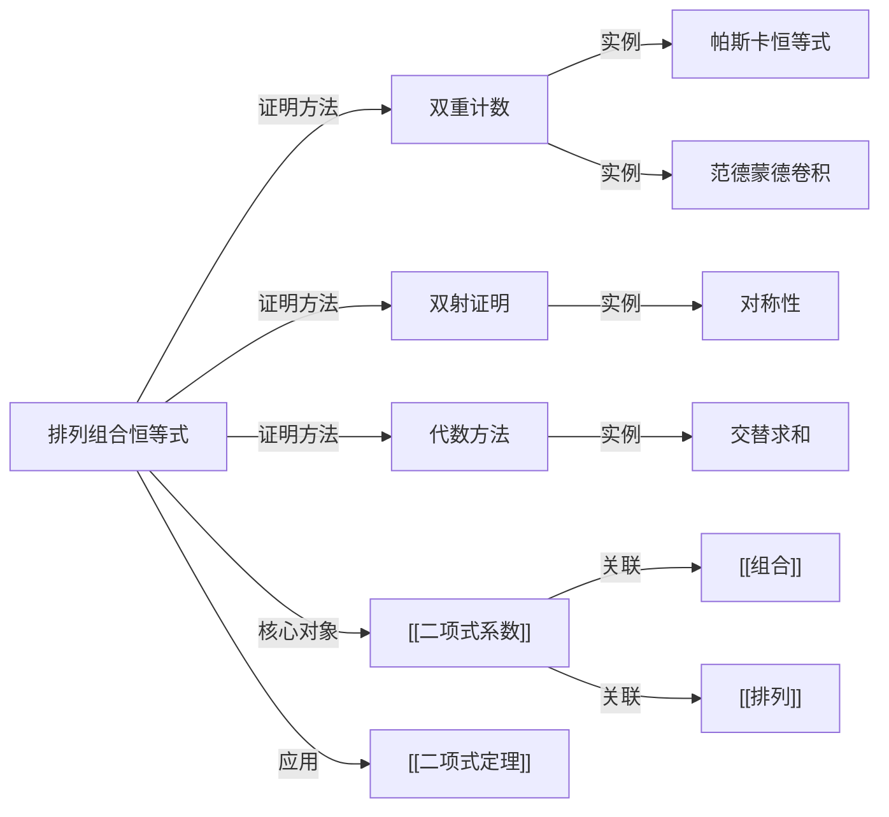

# 排列组合恒等式

> [!abstract]
> ==排列组合恒等式（Combinatorial Identities）==是关于 $\binom{n}{k}$、$P(n,r)$ 等计数函数的等式。证明这类恒等式有两种核心方法：**双重计数**（对同一集合用两种不同方式计数）和**双射证明**（建立两个集合之间的一一对应）。这些恒等式是[[二项式系数]]理论的重要组成部分，在算法分析、概率论和代数中有广泛应用。

## 定义

> [!def] 双重计数（Double Counting）
> 双重计数是证明组合恒等式的经典方法：
>
> 对同一个有限集合 $S$，用两种不同的方式计算 $|S|$，所得结果必然相等。
>
> 如果第一种计数方式得到表达式 $A$，第二种方式得到表达式 $B$，则 $A = B$ 即为要证明的恒等式。
>
> 关键在于找到合适的集合 $S$ 和两种自然的计数角度。

> [!def] 双射证明（Bijective Proof）
> 双射证明通过构造两个集合 $A$ 和 $B$ 之间的**双射**（一一对应）来证明 $|A| = |B|$。
>
> 如果能找到一个双射 $f: A \to B$，则 $|A| = |B|$。
>
> 双射证明的优势在于不仅证明了数量相等，还揭示了两个组合结构之间的深层联系。

## 核心性质

| 编号 | 恒等式名称 | 公式 | 证明方法 |
|:---:|------|------|------|
| 1 | 对称性 | $\dbinom{n}{k} = \dbinom{n}{n-k}$ | 双射：选 $k$ 个 $\leftrightarrow$ 排除 $n-k$ 个 |
| 2 | 帕斯卡恒等式 | $\dbinom{n}{k} = \dbinom{n-1}{k-1} + \dbinom{n-1}{k}$ | 双重计数：按是否含特定元素分类 |
| 3 | 全子集求和 | $\displaystyle\sum_{k=0}^{n} \dbinom{n}{k} = 2^n$ | 双重计数：$n$ 元素集合的所有子集 |
| 4 | 范德蒙德卷积 | $\displaystyle\sum_{k=0}^{r} \dbinom{m}{k}\dbinom{n}{r-k} = \dbinom{m+n}{r}$ | 双重计数：从两组元素合并后选取 |
| 5 | 曲棍球棒恒等式 | $\displaystyle\sum_{i=r}^{n} \dbinom{i}{r} = \dbinom{n+1}{r+1}$ | 双重计数 / 数学归纳法 |
| 6 | 交替求和 | $\displaystyle\sum_{k=0}^{n} (-1)^k \dbinom{n}{k} = 0$ | [[二项式定理]]中令 $x=1, y=-1$ |

## 关系网络

## 章节扩展

### 五个经典恒等式详解

**恒等式 1：对称性** $\binom{n}{k} = \binom{n}{n-k}$

> [!def] 证明（双射法）
> 构造映射 $f$：将每个 $k$ 元子集 $A$ 映射为其补集 $A^c$（$n-k$ 元子集）。
>
> 补集运算是一一对应的（$A$ 的补集的补集就是 $A$ 本身），因此 $k$ 元子集数等于 $(n-k)$ 元子集数。

**恒等式 2：帕斯卡恒等式** $\binom{n}{k} = \binom{n-1}{k-1} + \binom{n-1}{k}$

> [!def] 证明（双重计数）
> 从 $n$ 个元素中选 $k$ 个，固定元素 $x$：
>
> - 含 $x$ 的选法：从剩余 $n-1$ 个中选 $k-1$ 个，共 $\binom{n-1}{k-1}$ 种
> - 不含 $x$ 的选法：从剩余 $n-1$ 个中选 $k$ 个，共 $\binom{n-1}{k}$ 种
>
> 两者之和即为总数 $\binom{n}{k}$。

**恒等式 3：全子集求和** $\sum_{k=0}^{n} \binom{n}{k} = 2^n$

> [!def] 证明（双重计数）
> 计算 $n$ 元素集合 $S$ 的所有子集数：
>
> - 按子集大小分类：大小为 $k$ 的子集有 $\binom{n}{k}$ 个，求和得 $\sum_{k=0}^{n} \binom{n}{k}$
> - 按乘法法则：每个元素有"选入"或"不选入" 2 种选择，共 $2^n$ 种
>
> 两种方式结果相等。

**恒等式 4：范德蒙德卷积** $\sum_{k=0}^{r} \binom{m}{k}\binom{n}{r-k} = \binom{m+n}{r}$

> [!def] 证明（双重计数）
> 从 $m$ 个红球和 $n$ 个蓝球中选 $r$ 个球：
>
> - 按红球个数 $k$ 分类：选 $k$ 个红球（$\binom{m}{k}$）和 $r-k$ 个蓝球（$\binom{n}{r-k}$），求和
> - 直接从 $m+n$ 个球中选 $r$ 个：$\binom{m+n}{r}$
>
> 两种方式结果相等。

**恒等式 5：曲棍球棒恒等式** $\sum_{i=r}^{n} \binom{i}{r} = \binom{n+1}{r+1}$

> [!def] 证明（组合意义）
> 从 $\{1, 2, \ldots, n+1\}$ 中选 $r+1$ 个数 $\{a_1 < a_2 < \cdots < a_{r+1}\}$，按最大元素 $a_{r+1}$ 分类：
>
> - 若 $a_{r+1} = i+1$（其中 $i \geq r$），则前 $r$ 个数从 $\{1, \ldots, i\}$ 中选，有 $\binom{i}{r}$ 种方式
> - 对 $i$ 从 $r$ 到 $n$ 求和，得 $\sum_{i=r}^{n} \binom{i}{r}$
>
> 这等于直接从 $n+1$ 个数中选 $r+1$ 个：$\binom{n+1}{r+1}$。

## 补充

> [!info] 三种证明方法的比较
>
> | 方法 | 适用场景 | 优势 | 局限 |
> |------|---------|------|------|
> | **双重计数** | 求和式恒等式 | 提供组合直觉，证明优雅 | 需要巧妙的计数角度 |
> | **双射证明** | 两集合等势 | 揭示结构对应关系 | 构造双射可能困难 |
> | **代数方法** | 含变量的恒等式 | 直接计算，通用性强 | 可能缺乏组合直觉 |
>
> 实际应用中，三种方法往往可以交叉使用，互相验证。

> [!info] 代数方法示例
> 以帕斯卡恒等式为例，用代数方法验证：
>
> $$\binom{n-1}{k-1} + \binom{n-1}{k} = \frac{(n-1)!}{(k-1)!(n-k)!} + \frac{(n-1)!}{k!(n-1-k)!}$$
>
> $$= \frac{(n-1)! \cdot k}{k!(n-k)!} + \frac{(n-1)! \cdot (n-k)}{k!(n-k)!}$$
>
> $$= \frac{(n-1)!(k + n - k)}{k!(n-k)!} = \frac{n!}{k!(n-k)!} = \binom{n}{k}$$

## 参见

- [[二项式系数]] —— 恒等式的核心对象
- [[组合]] —— 组合数的定义与基本性质
- [[排列]] —— 排列数与组合数的关系
- [[二项式定理]] —— 代数方法证明恒等式的工具
- [[帕斯卡三角形]] —— 恒等式的几何可视化
