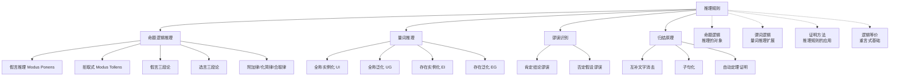

# 推理规则

> [!abstract] 概述
> ==推理规则（rules of inference）== 是从前提推出结论的==有效推理模式==，每条规则都对应一个==重言式==。命题逻辑中有 8 条基本推理规则（假言推理 Modus Ponens、拒取式 Modus Tollens、假言三段论、选言三段论等），谓词逻辑中还有 4 条量词推理规则（全称实例化 UI、全称泛化 UG、存在实例化 EI、存在泛化 EG）。==归结原理==（Resolution）是自动定理证明的核心规则，也是 Prolog 语言的逻辑基础。识别==谬误==（如肯定结论、否定假设）是避免无效推理的关键。

## 定义

> [!def] 推理规则
>
> **论证（argument）** 是一个命题序列，除最后一个命题（==结论==）外，其余均为==前提（premises）==。论证形式 $p_1, p_2, \ldots, p_n \therefore q$ 是==有效的==，当且仅当 $(p_1 \land p_2 \land \cdots \land p_n) \to q$ 是一个==重言式==。
>
> **推理规则**是经过验证的有效论证形式模板，使我们能够从已知前提出发，可靠地推导出新结论。
>
> **8 条基本推理规则：**
>
> | 规则名称 | 形式 | 对应重言式 |
> |:---------|:-----|:----------|
> | ==Modus Ponens==（假言推理） | $p \to q,\; p \;\therefore\; q$ | $(p \land (p \to q)) \to q$ |
> | ==Modus Tollens==（拒取式） | $p \to q,\; \neg q \;\therefore\; \neg p$ | $(\neg q \land (p \to q)) \to \neg p$ |
> | ==假言三段论== | $p \to q,\; q \to r \;\therefore\; p \to r$ | $((p \to q) \land (q \to r)) \to (p \to r)$ |
> | ==选言三段论== | $p \lor q,\; \neg p \;\therefore\; q$ | $((p \lor q) \land \neg p) \to q$ |
> | ==附加律== | $p \;\therefore\; p \lor q$ | $p \to (p \lor q)$ |
> | ==化简律== | $p \land q \;\therefore\; p$ | $(p \land q) \to p$ |
> | ==合取律== | $p,\; q \;\therefore\; p \land q$ | $(p \land q) \to (p \land q)$ |
> | ==归结== | $p \lor q,\; \neg p \lor r \;\therefore\; q \lor r$ | $((p \lor q) \land (\neg p \lor r)) \to (q \lor r)$ |
>
> **4 条量词推理规则：**
>
> | 规则名称 | 形式 | 说明 |
> |:---------|:-----|:-----|
> | ==全称实例化==（UI） | $\forall x\, P(x) \;\therefore\; P(c)$ | 从全称命题取出特定元素 |
> | ==全称泛化==（UG） | $P(c)$（$c$ 任意）$\;\therefore\; \forall x\, P(x)$ | 从任意元素推广到全称 |
> | ==存在实例化==（EI） | $\exists x\, P(x) \;\therefore\; P(c)$（特定 $c$） | 从存在命题取出一个 witness |
> | ==存在泛化==（EG） | $P(c)$（特定 $c$）$\;\therefore\; \exists x\, P(x)$ | 从特定元素推广到存在 |
>
> **常见谬误（无效推理）：**
>
> | 谬误名称 | 形式 | 反例赋值 |
> |:---------|:-----|:--------:|
> | 肯定结论谬误 | $p \to q,\; q \;\therefore\; p$ | $p = F, q = T$ |
> | 否定假设谬误 | $p \to q,\; \neg p \;\therefore\; \neg q$ | $p = F, q = T$ |

## 核心性质

| 性质 | 描述 | 说明 |
|:----:|:-----|:-----|
| 论证有效性 | 前提全真则结论必真 | 有效论证不保证结论为真（前提可能为假） |
| 重言式对应 | 每条推理规则对应一个重言式 | 有效性 $\iff$ 对应重言式恒真 |
| 归结完备性 | 归结原理构成完备的演绎系统 | 有效论证一定能通过有限步归结推导出矛盾 |
| 全称泛化限制 | $c$ 必须是任意选取的元素 | 不能对有特殊性质的元素使用 UG |
| 存在实例化限制 | $c$ 必须是新的名字 | 不同 $\exists$ 命题需用不同名字实例化 |
| 组合推理 | 命题规则与量词规则可组合使用 | 如全称假言推理 = UI + Modus Ponens |

## 关系网络

- **基础层**：[[命题逻辑]] 和 [[谓词逻辑]] 中的命题与量词化命题是推理规则的操作对象
- **理论支撑**：[[逻辑等价]] 中的重言式是每条推理规则有效性的保证
- **应用方向**：[[证明方法]] 将推理规则系统化地应用于数学证明

## 章节扩展

### 第1章：逻辑与证明基础

推理规则是第1章从逻辑到证明的桥梁（Rosen 第8版 1.6 节）：

- **论证与有效性**：论证的定义、论证形式、有效性与重言式的关系
- **8 条基本推理规则**：Modus Ponens、Modus Tollens、假言三段论、选言三段论、附加律、化简律、合取律、归结
- **组合推理**：多前提论证中组合使用多条规则，逐步推导结论
- **归结原理**：基于互补文字消去的推理规则，是自动定理证明和 Prolog 的基础
- **谬误识别**：肯定结论谬误和否定假设谬误——基于偶然式而非重言式的无效推理
- **量词推理规则**：全称实例化（UI）、全称泛化（UG）、存在实例化（EI）、存在泛化（EG），以及全称假言推理和全称拒取式

推理规则为 1.7 节（证明导论）和 1.8 节（证明方法与策略）中的直接证明、反证法、归纳法等提供了逻辑基础。

### 第5章：归纳与递归

- **5.5 程序正确性**：推理规则在程序验证中发挥关键作用。Hoare逻辑的推理规则（赋值规则、条件规则、循环规则等）用于构建程序正确性的形式化证明。

## 补充

> [!info] 学术背景
>
> 推理规则的思想可追溯到 **Gentzen（1935）** 提出的**自然演绎**（Natural Deduction）系统。在自然演绎中，每个逻辑联结词都由**引入规则**（introduction rules）和**消去规则**（elimination rules）来刻画。Rosen 本节中的推理规则本质上就是自然演绎系统中命题逻辑部分的子集。
>
> **Robinson（1965）** 提出的**归结原理**（Resolution Principle）是自动定理证明领域的里程碑。其核心洞察是：如果将所有命题转化为子句形式（析取式），那么仅用归结这一条推理规则就能构成一个**完备的**演绎系统——如果一个论证是有效的，归结原理一定能通过有限步推导出矛盾。这一发现直接催生了 Prolog 等逻辑编程语言，并在人工智能的自动推理领域产生了深远影响。
>
> **来源**：
> - Gentzen, G. (1935). "Untersuchungen ueber das logische Schliessen." *Mathematische Zeitschrift*, 39, 176-210, 405-431.
> - Robinson, J. A. (1965). "A Machine-Oriented Logic Based on the Resolution Principle." *Journal of the ACM*, 12(1), 23-41. https://dl.acm.org/doi/10.1145/321250.321253
> - Stanford Encyclopedia of Philosophy, "Natural Deduction Systems in Logic" — https://plato.stanford.edu/entries/natural-deduction/

## 参见

- [[命题逻辑]] — 推理规则的操作对象
- [[谓词逻辑]] — 量词推理规则的理论基础
- [[证明方法]] — 推理规则在数学证明中的系统化应用
- [[逻辑学/concepts/自然演绎]] — 自然演绎系统中的引入与消去规则
- [[逻辑学/concepts/推论规则]] — 逻辑学中的推理规则体系
- [[逻辑学/concepts/有效性]] — 论证有效性的定义与判断
