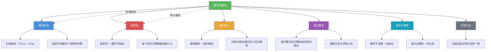

# 数学归纳法

> [!abstract] 概述
> ==数学归纳法（Mathematical Induction）==是一种证明==对所有正整数（或非负整数）成立的命题==的==核心证明技术==。由==基础步（basis step）==和==归纳步（inductive step）==两部分组成，本质是"多米诺骨牌效应"的数学形式化。基础步验证第一块骨牌倒下（$P(1)$ 为真），归纳步证明若第 $k$ 块倒下则第 $k+1$ 块也倒下（$P(k) \to P(k+1)$），由此推出所有骨牌全部倒下（$\forall n \geq 1,\ P(n)$ 为真）。数学归纳法是离散数学中处理无穷集合上命题的核心工具，也是递归定义和递归算法正确性的理论基础。

## 定义

> [!def] 数学归纳法原理（Principle of Mathematical Induction）
>
> 设 $P(n)$ 是关于正整数 $n$ 的命题。若以下两步均成立，则 $\forall n \geq 1,\ P(n)$ 为真：
>
> - **基础步（Basis Step）**：证明 $P(1)$ 为真
> - **归纳步（Inductive Step）**：证明对任意正整数 $k$，归纳假设（Inductive Hypothesis, IH）$P(k)$ 为真蕴含 $P(k+1)$ 为真
>
> 形式化表述：
> $$P(1) \wedge \forall k \geq 1\,[P(k) \to P(k+1)] \implies \forall n \geq 1,\ P(n)$$
>
> 直觉类比：一排无穷多的多米诺骨牌，第 1 块被推倒（基础步），且每块倒下时必定推倒下一块（归纳步），则所有骨牌都将倒下。

> [!def] 变体形式
>
> **1. 从 0 开始的归纳**：证明 $\forall n \geq 0,\ P(n)$
> - 基础步：$P(0)$ 为真
> - 归纳步：$\forall k \geq 0,\ P(k) \to P(k+1)$
>
> **2. 从任意整数 $b$ 开始的归纳**：证明 $\forall n \geq b,\ P(n)$
> - 基础步：$P(b)$ 为真
> - 归纳步：$\forall k \geq b,\ P(k) \to P(k+1)$
>
> **3. 向后归纳（Backward Induction / 递减归纳）**：从某个大数出发，证明对所有较小的数成立
> - 基础步：$P(n_0)$ 为真（$n_0$ 足够大）
> - 归纳步：$\forall k \leq n_0,\ P(k) \to P(k-1)$
>
> **4. 无限下降法（Infinite Descent）**：费马发明的变体，用于证明某些命题无解
> - 若假设存在一个解，则可以构造出一个更小的解，无限下降与良序性矛盾
> - 常用于证明丢番图方程无整数解

> [!def] 不等式证明模板
>
> **目标**：证明 $\forall n \geq n_0,\ f(n) \geq g(n)$（或 $\leq$）
>
> **步骤**：
> 1. **基础步**：验证 $n = n_0$ 时 $f(n_0) \geq g(n_0)$
> 2. **归纳假设**：假设对某个 $k \geq n_0$，$f(k) \geq g(k)$
> 3. **归纳步**：利用 $f(k) \geq g(k)$ 证明 $f(k+1) \geq g(k+1)$
>    - 常用技巧：将 $f(k+1)$ 用 $f(k)$ 表示，再代入归纳假设
>
> **经典示例**：证明 $\forall n \geq 1,\ 1 + \frac{1}{4} + \frac{1}{9} + \cdots + \frac{1}{n^2} \leq 2 - \frac{1}{n}$
> - 基础步：$n=1$ 时，$1 \leq 2 - 1 = 1$，成立
> - 归纳步：$\sum_{i=1}^{k+1}\frac{1}{i^2} = \sum_{i=1}^{k}\frac{1}{i^2} + \frac{1}{(k+1)^2} \leq 2 - \frac{1}{k} + \frac{1}{(k+1)^2}$
> - 需证 $2 - \frac{1}{k} + \frac{1}{(k+1)^2} \leq 2 - \frac{1}{k+1}$，即 $\frac{1}{(k+1)^2} \leq \frac{1}{k} - \frac{1}{k+1} = \frac{1}{k(k+1)}$
> - 化简：$k \leq k+1$，显然成立。$\blacksquare$

> [!def] 整除性证明模板
>
> **目标**：证明 $\forall n \geq n_0,\ d \mid f(n)$（$d$ 整除 $f(n)$）
>
> **步骤**：
> 1. **基础步**：验证 $d \mid f(n_0)$
> 2. **归纳假设**：假设 $d \mid f(k)$，即 $f(k) = d \cdot q$（$q$ 为某整数）
> 3. **归纳步**：将 $f(k+1)$ 用 $f(k)$ 表示，利用整除的线性性质证明 $d \mid f(k+1)$
>    - 关键性质：若 $d \mid a$ 且 $d \mid b$，则 $d \mid (a + b)$，$d \mid (a - b)$，$d \mid ca$
>
> **经典示例**：证明 $\forall n \geq 1,\ 6 \mid (n^3 - n)$
> - 基础步：$n=1$ 时，$1 - 1 = 0$，$6 \mid 0$，成立
> - 归纳步：假设 $6 \mid (k^3 - k)$
> - $(k+1)^3 - (k+1) = k^3 + 3k^2 + 3k + 1 - k - 1 = (k^3 - k) + 3k(k+1)$
> - 由 IH，$6 \mid (k^3 - k)$；又 $k(k+1)$ 必为偶数，故 $6 \mid 3k(k+1)$
> - 因此 $6 \mid [(k^3 - k) + 3k(k+1)] = (k+1)^3 - (k+1)$。$\blacksquare$

> [!def] 集合恒等式证明模板
>
> **目标**：证明 $\forall n \geq n_0,\ A_n = B_n$（两个集合族相等）
>
> **步骤**：
> 1. **基础步**：验证 $A_{n_0} = B_{n_0}$
> 2. **归纳假设**：假设 $A_k = B_k$
> 3. **归纳步**：利用 $A_k = B_k$ 证明 $A_{k+1} = B_{k+1}$
>    - 常用策略：分别证明 $A_{k+1} \subseteq B_{k+1}$ 和 $B_{k+1} \subseteq A_{k+1}$
>    - 或利用集合运算律（德摩根律、分配律等）化简
>
> **经典示例**：证明若 $A_1, A_2, \ldots, A_n$ 和 $B$ 为集合，则
> $$\overline{\bigcup_{i=1}^{n} A_i} = \bigcap_{i=1}^{n} \overline{A_i}$$
> （德摩根律的推广）
> - 基础步：$n=1$ 时，$\overline{A_1} = \overline{A_1}$，平凡成立
> - 归纳步：$\overline{\bigcup_{i=1}^{k+1} A_i} = \overline{\left(\bigcup_{i=1}^{k} A_i\right) \cup A_{k+1}} = \overline{\bigcup_{i=1}^{k} A_i} \cap \overline{A_{k+1}}$（二元德摩根律）
> - 由 IH $= \left(\bigcap_{i=1}^{k} \overline{A_i}\right) \cap \overline{A_{k+1}} = \bigcap_{i=1}^{k+1} \overline{A_i}$。$\blacksquare$

## 核心性质

| 性质 | 描述 | 说明 |
|------|------|------|
| ==基础步的必要性== | 缺少基础步则证明无效 | 即使归纳步成立，$P(1)$ 可能为假。反例：$P(n)$:"$n = n + 1$"，归纳步成立但基础步不成立 |
| ==归纳步的关键== | 必须证明 $\forall k \geq 1,\ P(k) \to P(k+1)$ | 不能仅验证有限个 $k$ 值就断言归纳步成立；归纳假设是"假设 $P(k)$ 为真"而非已知事实 |
| ==适用范围== | 适用于 $\mathbb{Z}^+$ 或 $\mathbb{N}$ 上的命题 | 可推广到从任意整数 $b$ 开始的命题；本质是良序性的等价表述 |
| ==与递归的关系== | 归纳法是递归定义的正确性证明工具 | 递归定义给出构造规则，归纳法验证其性质；二者是同一思想的两个方向 |
| ==不能用于实数== | 归纳法不适用于连续域上的命题 | $\mathbb{R}$ 上的归纳需要良序性，但 $\mathbb{R}$ 的标准序不是良序 |
| ==归纳假设的使用== | 归纳步中必须显式使用归纳假设 | 若归纳步的证明不需要 $P(k)$，说明该命题可能不需要归纳法 |
| ==常见错误：跳步== | 归纳步中跳过关键推导步骤 | 例如从不等式 $a < b$ 直接得出 $a + c < b + c$ 而不验证 $c > 0$ |
| ==与反证法的结合== | 归纳步中可使用反证法 | 若直接证 $P(k) \to P(k+1)$ 困难，可假设 $P(k+1)$ 为假并推出矛盾 |

## 关系网络

- [[强归纳法]] 是数学归纳法的加强版本：归纳步假设 $P(1) \wedge P(2) \wedge \cdots \wedge P(k)$ 而非仅 $P(k)$
- [[良序性]] 与数学归纳法等价：良序性是归纳法有效性的底层保证
- [[递归定义]] 的正确性通常用数学归纳法证明：基础情形对应基础步，递归规则对应归纳步
- [[递归算法]] 的正确性和复杂度分析依赖归纳法
- [[程序正确性]] 证明中，循环不变量的验证本质上是归纳法
- [[证明方法]] 中，数学归纳法是处理无穷域上全称命题的核心方法

## 章节扩展

### 第5章：归纳与递归 — 5.1节核心内容

数学归纳法是第5章第5.1节的核心主题，Rosen 第8版通过丰富的例题展示了归纳法的广泛应用。以下是14种典型例题类型概述：

1. **求和公式**：证明 $\sum_{i=1}^{n} i = \frac{n(n+1)}{2}$，$\sum_{i=1}^{n} i^2 = \frac{n(n+1)(2n+1)}{6}$，$\sum_{i=1}^{n} i^3 = \frac{n^2(n+1)^2}{4}$ 等
2. **不等式证明**：证明 $2^n > n$（$n \geq 1$），$n! > 2^n$（$n \geq 4$），调和级数不等式等
3. **整除性证明**：证明 $a \mid (b^n - c^n)$，$6 \mid (n^3 - n)$ 等
4. **集合恒等式**：德摩根律推广、分配律推广等
5. **错排公式**：证明 $D_n = (n-1)(D_{n-1} + D_{n-2})$ 及封闭公式 $D_n = n! \sum_{i=0}^{n} \frac{(-1)^i}{i!}$
6. **邮票问题**：用归纳法证明某些面额的邮票可以组合出所有足够大的邮资
7. **棋盘覆盖**：用归纳法证明 $2^n \times 2^n$ 棋盘去掉一格后可用 L 型骨牌覆盖
8. **几何证明**：凸多边形内角和为 $(n-2)\cdot 180°$，平面被 $n$ 条直线最多分成的区域数等
9. **组合恒等式**：二项式系数恒等式的归纳证明
10. **整除与模运算**：证明同余关系、整除模式等
11. **递推关系求解**：用归纳法验证递推关系的解
12. **算法正确性**：证明搜索算法、排序算法等的正确性
13. **不等式放缩技巧**：伯努利不等式、AM-GM 不等式等
14. **从特定值开始的归纳**：当命题在较小 $n$ 时不成立时，从更大的 $n_0$ 开始归纳

### 第6章：计数

- **6.4 二项式系数与恒等式**：帕斯卡恒等式 $\binom{n}{k} = \binom{n-1}{k} + \binom{n-1}{k-1}$ 可用数学归纳法证明。

### 第8章：递推关系 — 8.2节内容

- **用数学归纳法验证递推关系解的正确性**：在求解递推关系后，必须用数学归纳法验证所得封闭公式确实满足原始递推关系和初始条件。这是递推关系求解流程中不可或缺的最后一步。
- **经典示例：验证 Binet 公式满足斐波那契递推关系**。Binet 公式给出斐波那契数列的封闭形式：
  $$F_n = \frac{\phi^n - \hat{\phi}^n}{\sqrt{5}}, \quad \text{其中 } \phi = \frac{1+\sqrt{5}}{2},\ \hat{\phi} = \frac{1-\sqrt{5}}{2}$$
  **验证过程**：
  - **基础步**：$n=0$ 时，$F_0 = \frac{1 - 1}{\sqrt{5}} = 0$；$n=1$ 时，$F_1 = \frac{\phi - \hat{\phi}}{\sqrt{5}} = \frac{\sqrt{5}}{\sqrt{5}} = 1$。均满足初始条件。
  - **归纳步**：假设 $F_k = \frac{\phi^k - \hat{\phi}^k}{\sqrt{5}}$ 对 $k \leq n$ 成立，需证 $F_{n+1} = F_n + F_{n-1}$。
    $$F_n + F_{n-1} = \frac{\phi^n - \hat{\phi}^n}{\sqrt{5}} + \frac{\phi^{n-1} - \hat{\phi}^{n-1}}{\sqrt{5}} = \frac{\phi^{n-1}(\phi + 1) - \hat{\phi}^{n-1}(\hat{\phi} + 1)}{\sqrt{5}}$$
    由于 $\phi$ 和 $\hat{\phi}$ 是 $x^2 = x + 1$ 的两个根，即 $\phi + 1 = \phi^2$，$\hat{\phi} + 1 = \hat{\phi}^2$，代入得：
    $$= \frac{\phi^{n-1} \cdot \phi^2 - \hat{\phi}^{n-1} \cdot \hat{\phi}^2}{\sqrt{5}} = \frac{\phi^{n+1} - \hat{\phi}^{n+1}}{\sqrt{5}} = F_{n+1} \quad \blacksquare$$
- **一般验证模式**：对任意递推关系 $a_n = c_1 a_{n-1} + c_2 a_{n-2} + \cdots + c_k a_{n-k}$ 的封闭公式 $a_n = f(n)$，验证步骤为：(1) 检查 $f(0), f(1), \ldots, f(k-1)$ 与初始条件一致；(2) 将 $f(n), f(n-1), \ldots, f(n-k)$ 代入递推关系，验证等式成立。

### 第11章：树

数学归纳法是证明树的性质的核心工具。许多关于树的重要定理都通过归纳法证明。

**树的性质证明示例**：
- **$n$ 顶点的树有 $n-1$ 条边**：对顶点数 $n$ 进行归纳。基准 $n=1$：0条边。归纳步：删除一个叶节点得到 $n-1$ 顶点的树，由归纳假设有 $n-2$ 条边，加回叶节点的边得 $n-1$ 条边。
- **Cayley 公式**（$n^{n-2}$ 棵标记树）：可通过 Prüfer 序列建立双射来证明，其中 Prüfer 序列的构造本身可以用归纳法验证。
- **二叉树有 $n+1$ 个空指针**（$n$ 个节点的二叉树）：对 $n$ 进行归纳。

## 补充

> [!info] 数学归纳法的历史与理论基础
>
> 数学归纳法的历史可追溯到古代，但其严格表述经历了漫长的演变：
>
> - **1654年**：布莱兹·帕斯卡（Blaise Pascal）在其著作《论算术三角形》（*Traité du triangle arithmétique*）中首次系统使用了归纳法来证明与二项式系数相关的性质，这被认为是数学归纳法的首次明确应用。
> - **费马（Fermat）**：与帕斯卡同时期，费马独立使用了无限下降法（Infinite Descent），这是归纳法的一种逆向变体，常用于证明某些丢番图方程无解。
> - **皮亚诺公理（Peano Axioms, 1889）**：Giuseppe Peano 建立的自然数公理体系中，数学归纳法被作为第五条公理（归纳公理）直接纳入，成为自然数理论的基石之一。归纳公理断言：若 $0 \in S$ 且 $\forall n(n \in S \to n^+ \in S)$，则 $\mathbb{N} \subseteq S$。
> - **与良序性的等价性**：在标准自然数理论中，数学归纳法与良序性公理是等价的——可以从其中一个推出另一个。这一等价性是第5章5.2节的重要内容。
>
> **学术来源**：Rosen, K. H. (2019). *Discrete Mathematics and Its Applications* (8th ed.). McGraw-Hill, Section 5.1, pp. 329-345.
>
> **参考链接**：
> - Pascal, B. (1654). *Traité du triangle arithmétique*. https://www.gutenberg.org/ebooks/40367
> - Peano, G. (1889). *Arithmetices principia, nova methodo exposita*. https://archive.org/details/arithmeticespri00peangoog

## 参见

- [[强归纳法]] — 数学归纳法的加强版本，归纳步假设所有前例为真
- [[良序性]] — 与数学归纳法等价的基础公理，每个非空正整数集有最小元
- [[递归定义]] — 归纳法是验证递归定义正确性的核心工具
- [[递归算法]] — 递归算法的正确性和复杂度分析依赖归纳法
- [[程序正确性]] — 循环不变量的归纳验证是程序正确性证明的核心方法
- [[证明方法]] — 数学归纳法是处理无穷域上全称命题的证明方法之一
