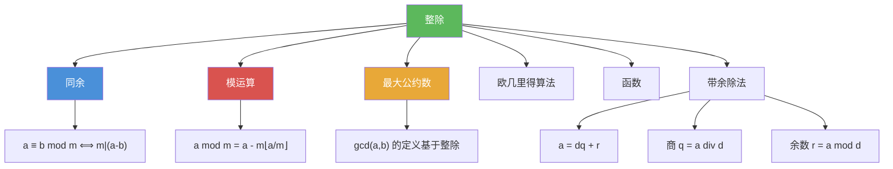

# 整除

> [!abstract] 概述
> ==整除（divisibility）==是整数之间最基本的二元关系之一：设 $a \neq 0$，若存在整数 $c$ 使得 $b = ac$，则称 $a$ ==整除== $b$，记作 $a \mid b$。整除关系满足==传递性==和==线性组合保持性==，是后续所有数论结果的基础。==带余除法==（Division Algorithm）进一步保证：对任意整数 $a$ 和正整数 $d$，存在唯一的商 $q$ 和余数 $r$（$0 \leq r < d$），使得 $a = dq + r$。

## 定义

> [!def] 整除（Divisibility）
>
> 设 $a$ 和 $b$ 为整数且 $a \neq 0$。若存在整数 $c$ 使得 $b = ac$，则称 $a$ ==整除== $b$，记作 $a \mid b$。
>
> - 此时称 $a$ 是 $b$ 的==因子==（factor）或==除数==（divisor），$b$ 是 $a$ 的==倍数==（multiple）
> - 用量词表示：$a \mid b \iff \exists c(ac = b)$，论域为整数集
> - 若 $a$ 不整除 $b$，记作 $a \nmid b$

> [!def] 带余除法（The Division Algorithm）
>
> 设 $a$ 为整数，$d$ 为正整数。则存在==唯一==的整数 $q$ 和 $r$，满足 $0 \leq r < d$，使得
>
> $$a = dq + r$$
>
> - $d$ 称为==除数==（divisor），$a$ 称为==被除数==（dividend）
> - $q$ 称为==商==（quotient），$r$ 称为==余数==（remainder）
> - 记号：$q = a \textbf{ div } d$，$r = a \bmod d$
> - 注意：$a \textbf{ div } d = \lfloor a/d \rfloor$，$a \bmod d = a - d \cdot \lfloor a/d \rfloor$

## 核心性质

| 性质 | 描述 | 说明 |
|------|------|------|
| 整除的加法保持性 | 若 $a \mid b$ 且 $a \mid c$，则 $a \mid (b + c)$ | 由 $b = as$，$c = at$ 得 $b+c = a(s+t)$ |
| 整除的乘法保持性 | 若 $a \mid b$，则对所有整数 $c$，$a \mid bc$ | 由 $b = as$ 得 $bc = a(sc)$ |
| 整除的传递性 | 若 $a \mid b$ 且 $b \mid c$，则 $a \mid c$ | 由 $b = as$，$c = bt$ 得 $c = a(st)$ |
| 线性组合保持性 | 若 $a \mid b$ 且 $a \mid c$，则 $a \mid (mb + nc)$ | 推论1，由加法保持性和乘法保持性推出 |
| 带余除法的唯一性 | 商 $q$ 和余数 $r$ 唯一确定 | $0 \leq r < d$ 保证唯一性 |
| 余数非负性 | 即使被除数为负数，余数 $r \geq 0$ | 例如 $-11 = 3 \times (-4) + 1$，$r = 1$ |

## 关系网络

- [[同余]] 建立在整除之上：$a \equiv b \pmod{m}$ 定义为 $m \mid (a - b)$
- [[模运算]] 的 $\bmod$ 函数由带余除法中的余数定义
- [[最大公约数]] 的定义依赖于整除关系：$\gcd(a,b)$ 是同时整除 $a$ 和 $b$ 的最大整数
- [[欧几里得算法]] 通过反复应用带余除法高效计算 GCD
- [[函数]] 的视角：$\text{div}$ 和 $\bmod$ 都是从 $\mathbb{Z} \times \mathbb{Z}^+$ 到 $\mathbb{Z}$ 的函数

## 章节扩展

### 第4章：数论与密码学

整除是第 4 章数论理论的起点（4.1 节）：

- **4.1 整除与模运算**：整除的定义与基本性质（Theorem 1）、线性组合的整除性（Corollary 1）、带余除法（Theorem 2），由此引出同余与模运算
- **4.3 素数与最大公约数**：素数定义依赖于整除（仅被 1 和自身整除），GCD 和 LCM 的定义基于整除关系
- **4.4 解同余方程**：线性同余方程 $ax \equiv b \pmod{m}$ 的可解性条件依赖于 $\gcd(a, m) \mid b$

### 第5章：归纳与递归

- **5.1 数学归纳法**：数学归纳法常用于证明整除性命题。典型模式：证明 $n^3 - n$ 能被 6 整除，通过对 $n$ 的归纳步中利用 $6 \mid (k^3 - k)$ 推出 $6 \mid ((k+1)^3 - (k+1))$。

## 补充

> [!info] 整除概念的学术背景
>
> 整除是数论中最基本的二元关系。带余除法（Division Algorithm）的名称虽然含有"算法"二字，但它本质上是一个==存在唯一性定理==，而非一个计算过程。该定理的证明依赖于良序原理（Well-Ordering Principle），即非负整数的每个非空子集都有最小元。整除关系的传递性使其成为一种==偏序关系==（partial order），在正整数集上构成一个格（lattice），其上确界为 LCM，下确界为 GCD。
>
> **学术来源**：Rosen, K. H. (2019). *Discrete Mathematics and Its Applications* (8th ed.). McGraw-Hill, Section 4.1.
>
> **参考链接**：Hardy, G. H., & Wright, E. M. (2008). *An Introduction to the Theory of Numbers* (6th ed.). Oxford University Press, Chapter I.

## 参见

- [[同余]] -- 建立在整除之上的等价关系，$a \equiv b \pmod{m}$ 当且仅当 $m \mid (a - b)$
- [[模运算]] -- 由带余除法定义的 $\bmod$ 函数及其运算规则
- [[最大公约数]] -- 同时整除两个整数的最大整数
- [[欧几里得算法]] -- 通过反复应用带余除法高效计算 GCD
- [[函数]] -- $\text{div}$ 和 $\bmod$ 作为从 $\mathbb{Z} \times \mathbb{Z}^+$ 到 $\mathbb{Z}$ 的函数
