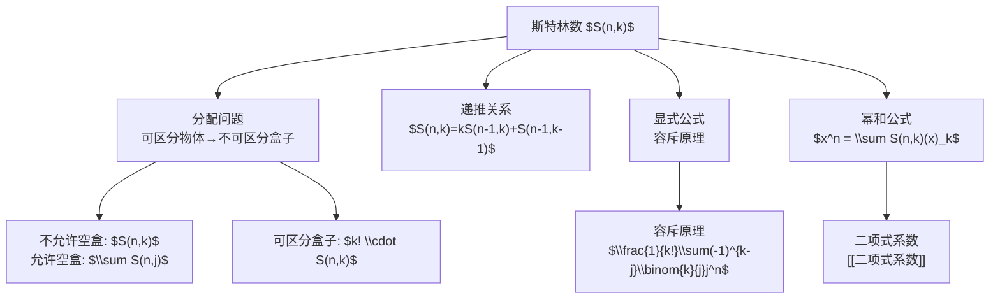

# 斯特林数

> [!abstract]
> ==斯特林数（Stirling Numbers of the Second Kind）== $S(n, k)$ 表示将 $n$ 个可区分元素划分为 $k$ 个**非空**不可区分集合（等价类）的方法数。它是[[分配问题]]中"可区分物体→不可区分盒子，不允许空盒"模型的核心工具，也是连接排列组合与集合划分的桥梁。

## 定义

> [!def] 第二类斯特林数（Stirling Numbers of the Second Kind）
> $S(n, k)$（也记作 $\left\{ \begin{matrix} n \\ k \end{matrix} \right\}$ 或 $\stirlingII{n}{k}$）定义为：将 $n$ 个元素的集合划分为恰好 $k$ 个非空、互不相交的子集（等价类）的方法数。
>
> **边界条件**：
> - $S(0, 0) = 1$（空集划分为0个非空子集，恰好1种方式）
> - $S(n, 0) = 0$（$n > 0$ 时，不可能划分为0个非空子集）
> - $S(n, 1) = 1$（所有元素放入同一个子集）
> - $S(n, n) = 1$（每个元素各自成一个子集）
> - $S(n, k) = 0$（当 $k > n$ 时，不可能）

> [!def] 递推关系（Recurrence Relation）
> $$S(n, k) = k \cdot S(n-1, k) + S(n-1, k-1), \quad 1 \leq k \leq n$$
>
> **直观理解**：考虑第 $n$ 个元素 $a_n$ 的归属：
> - **情况1**：$a_n$ 单独构成一个新的等价类，其余 $n-1$ 个元素划分为 $k-1$ 个等价类，有 $S(n-1, k-1)$ 种方式。
> - **情况2**：$a_n$ 加入已有的某个等价类，其余 $n-1$ 个元素已划分为 $k$ 个等价类，$a_n$ 有 $k$ 个选择，共 $k \cdot S(n-1, k)$ 种方式。

## 核心性质

| 编号 | 性质 | 公式 / 说明 |
|:---:|------|------------|
| 1 | **递推关系** | $S(n,k) = k \cdot S(n-1,k) + S(n-1,k-1)$，核心递推公式 |
| 2 | **与分配问题的关系** | $S(n,k)$ = 将 $n$ 个可区分物体放入 $k$ 个不可区分盒子（不允许空盒）的方案数 |
| 3 | **显式公式** | $S(n,k) = \frac{1}{k!} \sum_{j=0}^{k} (-1)^{k-j} \binom{k}{j} j^n$，由容斥原理推导 |
| 4 | **与排列的关系** | $n$ 个元素恰好有 $k$ 个轮换的排列数为 $k! \cdot S(n,k)$（即关联排列数） |
| 5 | **幂和公式** | $x^n = \sum_{k=0}^{n} S(n,k) \cdot (x)_k$，其中 $(x)_k = x(x-1)\cdots(x-k+1)$ 为下降阶乘 |
| 6 | **正交关系** | 第一类与第二类Stirling数满足正交关系：$\sum_k S(n,k) \cdot s(k,m) = \delta_{nm}$ |

## 关系网络



## 章节扩展

- **第6.5节**：本概念是Rosen教材第6.5节的核心工具之一，直接服务于[[分配问题]]的求解。
- **Stirling数三角形**：类似帕斯卡三角形，可按递推关系逐行计算：
  ```
  n\k  0   1   2   3   4   5
   0   1
   1   0   1
   2   0   1   1
   3   0   1   3   1
   4   0   1   7   6   1
   5   0   1  15  25  10   1
  ```
- **第一类Stirling数**：$s(n,k)$ 表示 $n$ 个元素恰好有 $k$ 个轮换的排列数（带符号），与第二类Stirling数互为逆矩阵。

## 补充

> [!info] 显式公式的推导（容斥原理）
> 设将 $n$ 个元素分配到 $k$ 个**可区分**盒子且不允许空盒的方案数为 $f(n,k)$。由容斥原理：
> $$f(n,k) = \sum_{j=0}^{k} (-1)^j \binom{k}{j} (k-j)^n$$
> 因为盒子不可区分时需要除以 $k!$，故：
> $$S(n,k) = \frac{1}{k!} \sum_{j=0}^{k} (-1)^{k-j} \binom{k}{j} j^n$$
> （此处将求和指标替换为 $j' = k - j$，符号随之调整。）

> [!info] 经典例题
> 将4个学生分成2个学习小组（小组无编号），有多少种分法？
> $$S(4, 2) = 2 \cdot S(3, 2) + S(3, 1) = 2 \times 3 + 1 = 7$$
> 验证：$\{1\}|{2,3,4}$, $\{2\}|{1,3,4}$, $\{3\}|{1,2,4}$, $\{4\}|{1,2,3}$, $\{1,2\}|{3,4}$, $\{1,3\}|{2,4}$, $\{1,4\}|{2,3}$，共7种。

## 参见

- [[分配问题]] — 斯特林数在分配模型中的应用
- [[可重排列]] — 隔板法与可重组合
- [[二项式系数]] — 基础计数工具
- [[排列]] — 基础排列概念
- [[组合生成算法]] — 排列与组合的系统性生成
