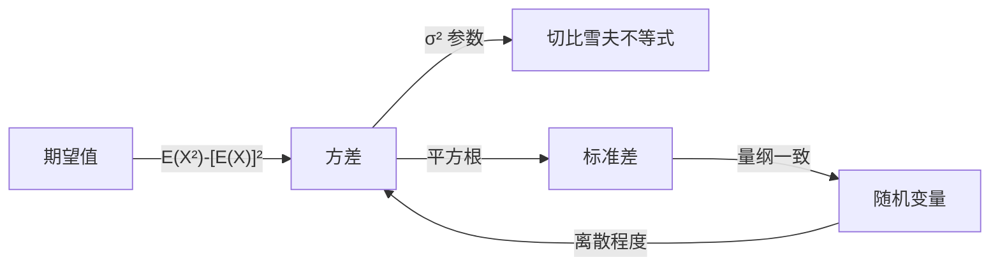

# 方差

> [!abstract]
> ==方差（Variance）==是度量[[随机变量]]取值**离散程度**的核心数字特征。对于[[随机变量]] $X$，方差定义为 $V(X) = E(X^2) - [E(X)]^2$，即 $X$ 与其[[期望值]]之差的平方的期望。方差越大，说明 $X$ 的取值越分散；方差越小，说明 $X$ 的取值越集中在期望附近。方差的平方根 $\sigma = \sqrt{V(X)}$ 称为**标准差**，与 $X$ 具有相同的量纲。

## 定义

> [!def] 方差（Variance）
> 设 $X$ 为[[随机变量]]，其[[期望值]]为 $\mu = E(X)$，则 $X$ 的**方差**定义为：
> $$V(X) = E\left[(X - \mu)^2\right] = E(X^2) - [E(X)]^2$$
>
> **推导过程**：
> $$V(X) = E\left[(X - \mu)^2\right] = E(X^2 - 2\mu X + \mu^2)$$
> $$= E(X^2) - 2\mu E(X) + \mu^2 = E(X^2) - 2\mu^2 + \mu^2 = E(X^2) - \mu^2$$
>
> 其中最后一步利用了 $E(X) = \mu$。

> [!def] 标准差（Standard Deviation）
> 方差的平方根称为**标准差**：
> $$\sigma = \sqrt{V(X)}$$
>
> **意义**：标准差与[[随机变量]] $X$ 具有相同的量纲（单位），因此比方差更直观。例如，若 $X$ 的单位为"米"，则 $V(X)$ 的单位为"平方米"，而 $\sigma$ 的单位仍为"米"。

> [!def] 方差的线性变换性质
> 对任意常数 $a, b$：
> $$V(aX + b) = a^2 V(X)$$
>
> **推导**：设 $\mu = E(X)$，则 $E(aX + b) = a\mu + b$。
> $$V(aX + b) = E\left[(aX + b - a\mu - b)^2\right] = E\left[a^2(X - \mu)^2\right] = a^2 V(X)$$
>
> **注意**：平移（加常数 $b$）不改变方差，只有缩放（乘常数 $a$）才影响方差，且影响是**平方级**的。

> [!def] Bienayme公式（独立随机变量方差的可加性）
> 若 $X$ 和 $Y$ 是**相互独立**的[[随机变量]]，则：
> $$V(X + Y) = V(X) + V(Y)$$
>
> **推导**：
> $$V(X + Y) = E\left[(X+Y)^2\right] - [E(X+Y)]^2$$
> $$= E(X^2) + 2E(XY) + E(Y^2) - [E(X)]^2 - 2E(X)E(Y) - [E(Y)]^2$$
> $$= V(X) + V(Y) + 2[E(XY) - E(X)E(Y)]$$
>
> 由于 $X, Y$ 独立，$E(XY) = E(X)E(Y)$，故最后一项为零。
>
> **注意**：与期望的线性性质不同，方差的**可加性要求独立性**。

> [!def] 伯努利随机变量的方差
> 设 $X$ 服从参数为 $p$ 的伯努利分布（$P(X=1) = p$，$P(X=0) = 1-p$），则：
> - $E(X) = p$
> - $E(X^2) = 1^2 \cdot p + 0^2 \cdot (1-p) = p$
> - $V(X) = E(X^2) - [E(X)]^2 = p - p^2 = p(1-p)$
>
> 当 $p = 1/2$ 时，$V(X) = 1/4$，达到最大值。

## 核心性质

| 编号 | 性质 | 公式/说明 |
|:---:|------|------|
| P1 | **非负性** | $V(X) \geq 0$，且 $V(X) = 0$ 当且仅当 $X$ 几乎必然为常数 |
| P2 | **定义等价形式** | $V(X) = E(X^2) - [E(X)]^2$，计算时通常比定义式更方便 |
| P3 | **平移不变性** | $V(X + b) = V(X)$，加常数不改变离散程度 |
| P4 | **缩放性质** | $V(aX) = a^2 V(X)$，缩放对方差的影响是平方级的 |
| P5 | **独立可加性** | $V(X + Y) = V(X) + V(Y)$（要求 $X, Y$ 独立，Bienayme公式） |
| P6 | **标准差量纲一致** | $\sigma = \sqrt{V(X)}$ 与 $X$ 具有相同量纲 |
| P7 | **切比雪夫不等式的桥梁** | 方差是[[切比雪夫不等式]]的核心参数，刻画了偏离期望的概率上界 |

## 关系网络

## 章节扩展

- **期望值**：[[期望值]]是方差计算的基础，$V(X) = E(X^2) - [E(X)]^2$
- **切比雪夫不等式**：[[切比雪夫不等式]]利用方差给出[[随机变量]]偏离期望的概率上界：$P(|X - \mu| \geq r) \leq \sigma^2/r^2$
- **几何分布**：[[几何分布]]的方差为 $V(X) = (1-p)/p^2$

## 补充

> [!info] 生活类比
> 想象两个射手射击靶心。射手A每次都打在靶心附近，弹着点很集中；射手B有时打中靶心，有时偏离很远，弹着点很分散。虽然两人的"平均"命中位置可能都是靶心（期望值相同），但射手B的"方差"明显更大——他的表现更不稳定。方差就是用来量化这种"波动大小"的指标。

> [!info] 为什么方差要用平方？
> 直接计算 $E(X - \mu)$ 会得到零（正负偏差相互抵消），所以需要先平方再求期望。平方确保了所有偏差都贡献正值。当然也可以用绝对值 $E(|X - \mu|)$ 来度量离散程度（称为平均绝对偏差），但方差在数学上有更好的性质（如可加性），因此更常用。

> [!info] Bienayme公式的重要性
> Bienayme公式（独立随机变量方差的可加性）在统计学中有广泛应用。例如，若 $X_1, X_2, \ldots, X_n$ 是 $n$ 个独立的同分布随机变量，每个方差为 $\sigma^2$，则它们的和 $S_n = X_1 + X_2 + \cdots + X_n$ 的方差为 $V(S_n) = n\sigma^2$，标准差为 $\sigma\sqrt{n}$。这一结论是[[切比雪夫不等式]]证明大数定律的关键。

## 参见

- [[期望值]]：方差计算的基础，$V(X) = E(X^2) - [E(X)]^2$
- [[随机变量]]：方差是随机变量的核心数字特征
- [[切比雪夫不等式]]：利用方差给出概率上界的重要不等式
- [[几何分布]]：方差为 $(1-p)/p^2$ 的离散分布
