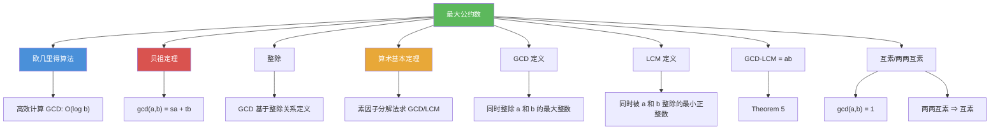

# 最大公约数

> [!abstract] 概述
> ==最大公约数（Greatest Common Divisor, GCD）==是同时整除两个整数 $a$ 和 $b$ 的最大整数，记作 $\gcd(a, b)$。当 $\gcd(a, b) = 1$ 时，称 $a$ 和 $b$ ==互素==（relatively prime）。==最小公倍数（Least Common Multiple, LCM）==是同时被 $a$ 和 $b$ 整除的最小正整数，记作 $\operatorname{lcm}(a, b)$。GCD 和 LCM 满足核心关系 $\gcd(a,b) \cdot \operatorname{lcm}(a,b) = ab$。通过[[离散数学/theorems/算术基本定理]]的素因子分解，GCD 取各素因子指数的==最小值==，LCM 取==最大值==。

## 定义

> [!def] 最大公约数（Definition 2）
>
> 设 $a$ 和 $b$ 是不全为零的整数。同时整除 $a$ 和 $b$ 的最大整数 $d$ 称为 $a$ 和 $b$ 的==最大公约数==，记作 $\gcd(a, b)$。

> [!def] 互素与两两互素（Definition 3 & 4）
>
> - $\gcd(a, b) = 1$ 时，称 $a$ 和 $b$ ==互素==（relatively prime）
> - 对一组整数 $a_1, a_2, \ldots, a_n$，若对所有 $1 \leq i < j \leq n$ 都有 $\gcd(a_i, a_j) = 1$，则称它们==两两互素==（pairwise relatively prime）
> - 注意：两两互素 $\Rightarrow$ 互素，但反之不成立（反例：$\{6, 10, 15\}$ 的 $\gcd = 1$ 但非两两互素）

> [!def] 最小公倍数（Definition 5）
>
> 正整数 $a$ 和 $b$ 的==最小公倍数==是同时被 $a$ 和 $b$ 整除的最小正整数，记作 $\operatorname{lcm}(a, b)$。

> [!def] 素因子分解法求 GCD 和 LCM
>
> 设 $a = p_1^{a_1} p_2^{a_2} \cdots p_n^{a_n}$，$b = p_1^{b_1} p_2^{b_2} \cdots p_n^{b_n}$，则：
> $$\gcd(a, b) = p_1^{\min(a_1,b_1)} p_2^{\min(a_2,b_2)} \cdots p_n^{\min(a_n,b_n)}$$
> $$\operatorname{lcm}(a, b) = p_1^{\max(a_1,b_1)} p_2^{\max(a_2,b_2)} \cdots p_n^{\max(a_n,b_n)}$$

## 核心性质

| 性质 | 描述 | 说明 |
|------|------|------|
| GCD-LCM 关系 | $\gcd(a,b) \cdot \operatorname{lcm}(a,b) = ab$ | Theorem 5，对正整数成立 |
| 素因子分解求 GCD | 取各素因子指数的 $\min$ | 依赖于算术基本定理 |
| 素因子分解求 LCM | 取各素因子指数的 $\max$ | 依赖于算术基本定理 |
| 互素 | $\gcd(a, b) = 1$ | 不意味着没有公因子以外的关系 |
| 两两互素 | 任意两个数的 GCD 都为 1 | 比互素更强的条件 |
| GCD 的对称性 | $\gcd(a, b) = \gcd(b, a)$ | GCD 是交换的 |
| GCD 与线性组合 | $\gcd(a,b)$ 是 $sa + tb$ 中的最小正整数 | 贝祖定理的推论 |
| $\gcd(a, 0) = |a|$ | 任何数整除 0 | GCD 定义的特殊情况 |

## 关系网络

- [[欧几里得算法]] 通过辗转相除高效计算 GCD，复杂度 $O(\log b)$，无需先分解素因子
- [[贝祖定理]] 揭示了 GCD 的代数本质：$\gcd(a,b)$ 是 $sa + tb$ 中的最小正整数
- [[整除]] 是 GCD 的定义基础：GCD 是同时整除 $a$ 和 $b$ 的最大整数
- [[离散数学/theorems/算术基本定理]] 保证了素因子分解法求 GCD/LCM 的正确性

## 章节扩展

### 第4章：数论与密码学

最大公约数是第 4 章 4.3 节的核心概念：

- **4.3 素数与最大公约数**：GCD 定义（Definition 2）、LCM 定义（Definition 5）、互素（Definition 3）、两两互素（Definition 4）、GCD-LCM 关系（Theorem 5）、素因子分解法
- **4.3 欧几里得算法**：辗转相除法是计算 GCD 的高效方法
- **4.4 解同余方程**：线性同余方程 $ax \equiv b \pmod{m}$ 有解当且仅当 $\gcd(a, m) \mid b$
- **4.5 密码学应用**：RSA 中需要选择与 $\phi(n)$ 互素的公钥指数 $e$

## 补充

> [!info] GCD 的数学本质与计算方法
>
> GCD 不仅是数论的基本概念，更在抽象代数中有深刻推广。在整数环 $\mathbb{Z}$ 中，GCD 的存在性由==整环的唯一分解性==（即算术基本定理）保证。计算 GCD 有两种主要方法：(1) ==素因子分解法==：先分解 $a$ 和 $b$ 为素因子乘积，再取各指数的最小值——但素因子分解本身是计算困难的；(2) ==欧几里得算法==：通过反复带余除法，在 $O(\log b)$ 时间内高效计算 GCD，无需分解素因子。GCD-LCM 关系 $\gcd(a,b) \cdot \operatorname{lcm}(a,b) = ab$ 可以通过素因子分解直接验证：对每个素因子 $p_i$，$\min(a_i, b_i) + \max(a_i, b_i) = a_i + b_i$。
>
> **学术来源**：Rosen, K. H. (2019). *Discrete Mathematics and Its Applications* (8th ed.). McGraw-Hill, Section 4.3.
>
> **参考链接**：Hardy, G. H., & Wright, E. M. (2008). *An Introduction to the Theory of Numbers* (6th ed.). Oxford University Press, Chapter V.

## 参见

- [[欧几里得算法]] -- 通过辗转相除高效计算 GCD 的经典算法，复杂度 $O(\log b)$
- [[贝祖定理]] -- $\gcd(a,b) = sa + tb$，GCD 的线性组合表示
- [[整除]] -- GCD 的定义基础，基于整除关系
- [[离散数学/theorems/算术基本定理]] -- 素因子分解法求 GCD/LCM 的理论基础
