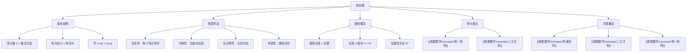

# 有向图

> [!abstract] 概述
> ==有向图==（directed graph / digraph）由==顶点==集 $V$ 和==有向边==集 $E$ 组成，其中 $E$ 是 $V$ 中有序对的集合。有向图是表示有限集上==二元关系==的直观工具：顶点对应集合元素，有向边对应有序对，==环==（loop）对应 $(a,a)$ 形式的有序对。关系的自反性、对称性、反对称性和传递性都可以通过有向图的视觉特征直接判定：自反性要求每个顶点都有环，对称性要求边成对出现，反对称性要求无双向边，传递性要求路径可闭合为三角形。

## 定义

> [!def] 有向图（Directed Graph / Digraph）
>
> 一个==有向图==（digraph）由==顶点==（vertices/nodes）集 $V$ 和==边==（edges/arcs）集 $E$ 组成，其中 $E$ 是 $V$ 中有序对的集合。边 $(a, b)$ 中，$a$ 称为==初始顶点==（initial vertex），$b$ 称为==终端顶点==（terminal vertex）。
>
> - 形如 $(a, a)$ 的边称为==环==（loop），表示从顶点 $a$ 回到自身的边
> - 集合 $A$ 上的关系 $R$ 对应一个有向图：以 $A$ 的元素为顶点，以 $R$ 中的有序对为边
> - 关系与有向图之间存在==一一对应==关系

> [!def] 路径（Path）与回路（Circuit/Cycle）
>
> 在有向图 $G$ 中，从顶点 $a$ 到顶点 $b$ 的一条==路径==是一个边序列 $(x_0, x_1), (x_1, x_2), \ldots, (x_{n-1}, x_n)$，其中 $x_0 = a$，$x_n = b$。这条路径的==长度==为 $n$（即边的条数）。
>
> - 长度为 0 的路径（空边集）是从 $a$ 到 $a$ 的路径
> - 长度为 1 且起点等于终点的路径称为==回路==（circuit）或==环==（cycle）
> - 路径可以经过同一顶点多次，同一条边也可以在路径中出现多次

> [!def] 有向图判定关系性质
>
> 设 $R$ 是集合 $A$ 上的关系，$G$ 是其对应的有向图，则：
>
> | 性质 | 有向图判定条件 |
> |------|----------------|
> | ==自反性== | 每个顶点都有==环==（loop） |
> | ==对称性== | 任意两个不同顶点之间，若有边则必有==反向边== |
> | ==反对称性== | 任意两个不同顶点之间，==不能同时存在双向边== |
> | ==传递性== | 若存在从 $x$ 到 $y$ 的边和从 $y$ 到 $z$ 的边，则必存在从 $x$ 到 $z$ 的边（==三角形闭合==） |

## 核心性质

| 性质 | 图论特征 | 矩阵对应 |
|:-----|:---------|:---------|
| ==自反性== | 每个顶点都有环 | 主对角线全为 1 |
| ==对称性== | 不同顶点间的边成对出现 | 矩阵关于主对角线对称 |
| ==反对称性== | 不同顶点间无双向边 | 非对角线无 $(1,1)$ 对 |
| ==传递性== | 所有长度为 2 的路径可闭合 | $M_R \odot M_R \leq M_R$（逐元素） |
| ==路径与关系幂== | 长度为 $n$ 的路径 | $(a,b) \in R^n$ |
| ==连通性关系== | 任意长度的路径（长度 $\geq 1$） | $R^* = \bigcup_{k=1}^{\infty} R^k$ |
| ==环== | 从顶点到自身的边 | $(a,a) \in R$，即 $m_{aa} = 1$ |

## 关系网络

- **前置知识**：[[离散数学/concepts/二元关系]]（有向图是关系的图形表示）
- **核心关联**：有向图、零一矩阵和有序对集合是同一关系的三种等价表示。有向图便于直观理解关系性质，零一矩阵便于计算机处理
- **后继概念**：[[离散数学/concepts/传递闭包]]（有向图中的路径概念是传递闭包的理论基础）

## 章节扩展

### 第09章：关系

有向图是 Rosen 第8版第9章第9.3节的核心内容之一，与零一矩阵共同构成关系表示的两大工具。

**有向图与无向图的关系**：对称关系可以用无向图（undirected graph）来表示，因为对称关系中的每条有向边 $(a,b)$ 都伴随反向边 $(b,a)$，可以简化为一条无向边 $\{a, b\}$。有向图是更一般的表示方式，可以表示任意二元关系。

**传递性判定的复杂性**：传递性要求所有满足条件的路径都必须闭合，而非只检查某几条。即使大部分路径都闭合了，只要存在一条 $x \to y \to z$ 但没有 $x \to z$，关系就不是传递的。判定传递性需要穷举检查所有长度为 2 的路径，对于 $n$ 个元素的关系，最多需要检查 $n^2(n-1)$ 种情况。

**实际应用**：有向图广泛用于建模网页之间的超链接（PageRank 的基础）、社交网络中的关注关系、程序中的函数调用关系、编译器中的数据流分析等。

### 第10章：图论

> [!info] 有向图在图论中的角色
> 在第10章图论中，有向图从关系的可视化工具扩展为独立的数学对象：
>
> - ==入度==（in-degree）与==出度==（out-degree）：有向图中顶点的度分为入度 $\deg^-(v)$ 和出度 $\deg^+(v)$
> - ==强连通==（strongly connected）：任意两个顶点之间互相可达
> - ==弱连通==（weakly connected）：忽略方向后图是连通的
> - ==邻接矩阵==：有向图的邻接矩阵 $A$ 不一定对称，$A[i][j]=1$ 表示存在从 $v_i$ 到 $v_j$ 的边
> - 有向图的==强连通分量==可通过 Warshall 算法（传递闭包）计算

### 第11章：树

有向树（rooted tree）是有向图中的一类重要结构。一棵有向树的根节点到所有其他节点都存在唯一的有向路径。有向树在文件系统、HTML DOM、组织架构等领域有广泛应用。

**有向生成树**：在有向图中，一棵有向生成树（arborescence）是从根出发可以到达所有顶点的生成子树。有向图的最短路径树（shortest path tree）就是一棵以源点为根的有向生成树。

## 补充

> [!info] 有向图在计算机科学中的应用
>
> 有向图是计算机科学中最基础的数据结构之一：
>
> - **网页排名**：Google 的 PageRank 算法基于网页之间的超链接有向图
> - **社交网络**：Twitter/X 的关注关系、Instagram 的关注关系都是有向图
> - **编译器**：函数调用图（call graph）是有向图，用于死代码消除和内联优化
> - **版本控制**：Git 的提交历史是有向无环图（DAG）
> - **依赖管理**：软件包依赖关系构成有向图，用于拓扑排序

> [!warning] 常见误区
>
> - 传递性在有向图中的判定需要检查所有长度为 2 的路径，不能只检查部分路径
> - 对称性与反对称性不互斥：恒等关系既是对称的又是反对称的
> - 一个关系可以既不是对称的也不是反对称的
> - 路径可以经过同一顶点多次，这与简单路径（simple path）不同

## 参见

- [[离散数学/concepts/二元关系]] -- 有向图所表示的对象
- [[离散数学/concepts/零一矩阵]] -- 关系的另一种等价表示（矩阵形式）
- [[离散数学/concepts/传递闭包]] -- 基于有向图路径概念的闭包运算
