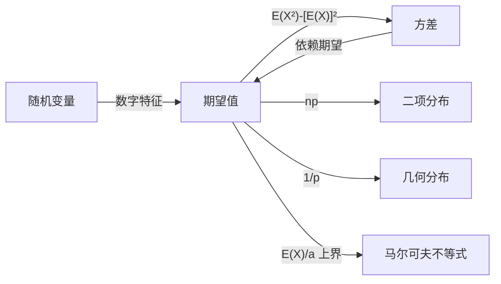

# 期望值

> [!abstract]
> ==期望值（Expected Value）==是概率论中最重要的数字特征之一，它度量了[[随机变量]]在大量重复试验中取值的**加权平均**。对于离散[[随机变量]] $X$，其期望值定义为 $E(X) = \sum_x x \cdot p(x)$，其中求和遍历 $X$ 的所有可能取值，$p(x)$ 为对应概率。期望值具有**线性性质**，是解决概率问题、分析算法平均性能的核心工具。

## 定义

> [!def] 期望值（Expected Value）
> 设 $X$ 为离散[[随机变量]]，其取值集合为 $\{x_1, x_2, \ldots, x_n\}$（或可数无穷集），则 $X$ 的**期望值**定义为：
> $$E(X) = \sum_x x \cdot p(x) = x_1 p(x_1) + x_2 p(x_2) + \cdots + x_n p(x_n)$$
>
> 其中 $p(x_i) = P(X = x_i)$ 为 $X$ 取值 $x_i$ 的概率。
>
> **直观含义**：期望值是 $X$ 所有可能取值以其概率为权重的**加权平均**，代表在大量重复试验中 $X$ 取值的"中心位置"。

> [!def] 期望值的线性性质（Linearity of Expectation）
> 对任意[[随机变量]] $X, Y$ 及常数 $a, b$：
> $$E(aX + bY) = aE(X) + bE(Y)$$
>
> **重要特性**：该性质**不要求** $X$ 和 $Y$ 相互独立，这是期望值最强大的性质之一。
>
> 推广到 $n$ 个随机变量：$E\left(\sum_{i=1}^n X_i\right) = \sum_{i=1}^n E(X_i)$。

> [!def] 指示随机变量的期望
> 设事件 $A$ 的指示随机变量 $I_A$ 定义为：
> $$I_A = \begin{cases} 1, & \text{若事件 } A \text{ 发生} \\ 0, & \text{若事件 } A \text{ 不发生} \end{cases}$$
>
> 则 $E(I_A) = 1 \cdot P(A) + 0 \cdot (1 - P(A)) = P(A)$。
>
> **应用意义**：将复杂计数问题分解为若干指示随机变量之和，利用线性性质求期望，是解决复杂期望问题的核心技巧。

> [!def] 经典应用：帽子检查问题（Hat-Check Problem）
> $n$ 位宾客参加宴会，随机取回帽子。设 $X$ 为取回自己帽子的宾客人数，求 $E(X)$。
>
> **解法**：定义指示随机变量 $X_i$ 表示第 $i$ 位宾客取回自己的帽子，则 $X = X_1 + X_2 + \cdots + X_n$。
> - $P(X_i = 1) = 1/n$（在随机排列中第 $i$ 个位置恰好是 $i$ 的概率）
> - $E(X_i) = 1/n$
> - 由线性性质：$E(X) = \sum_{i=1}^n E(X_i) = n \cdot \frac{1}{n} = 1$
>
> **结论**：无论 $n$ 多大，平均恰好有1人取回自己的帽子。

> [!def] 经典应用：逆序数期望
> 设 $\sigma$ 是 $\{1, 2, \ldots, n\}$ 的一个均匀随机排列，$X$ 为 $\sigma$ 中的逆序对数量，求 $E(X)$。
>
> **解法**：对每一对 $(i, j)$（$i < j$），定义指示随机变量 $X_{ij}$：
> $$X_{ij} = \begin{cases} 1, & \text{若 } \sigma(i) > \sigma(j) \\ 0, & \text{否则} \end{cases}$$
>
> 则 $X = \sum_{1 \leq i < j \leq n} X_{ij}$，共有 $\binom{n}{2}$ 对。
> - $P(X_{ij} = 1) = 1/2$（$\sigma(i)$ 和 $\sigma(j)$ 大小关系对称）
> - $E(X_{ij}) = 1/2$
> - $E(X) = \binom{n}{2} \cdot \frac{1}{2} = \frac{n(n-1)}{4}$

## 核心性质

| 编号 | 性质 | 公式/说明 |
|:---:|------|------|
| P1 | **加权平均** | $E(X) = \sum_x x \cdot p(x)$，是取值以概率为权重的平均 |
| P2 | **线性性质** | $E(aX + bY) = aE(X) + bE(Y)$，不要求独立性 |
| P3 | **期望的期望** | 若 $X \leq Y$，则 $E(X) \leq E(Y)$（单调性） |
| P4 | **常数的期望** | $E(c) = c$，其中 $c$ 为常数 |
| P5 | **乘积的期望** | 若 $X, Y$ 独立，则 $E(XY) = E(X) \cdot E(Y)$ |
| P6 | **指示变量技巧** | $E\left(\sum I_{A_i}\right) = \sum P(A_i)$，将计数转化为概率求和 |
| P7 | **函数的期望** | $E(g(X)) = \sum_x g(x) \cdot p(x)$，可直接对函数求期望 |

## 关系网络

## 章节扩展

- **方差**：[[方差]]定义为 $V(X) = E(X^2) - [E(X)]^2$，是度量[[随机变量]]离散程度的数字特征，完全依赖期望值
- **几何分布**：[[几何分布]]的期望值为 $E(X) = 1/p$，是期望值在特定分布中的直接应用
- **马尔可夫不等式**：[[马尔可夫不等式]]利用期望值给出概率的上界，是期望值的重要应用方向

## 补充

> [!info] 生活类比
> 想象你反复掷一枚公平的骰子，记录每次的点数。如果你掷了10000次，把所有点数加起来除以10000，结果会非常接近3.5——这就是掷骰子的"期望值"。期望值不是"最可能出现的结果"（骰子不可能掷出3.5），而是大量重复试验后的**平均趋势**。就像天气预报说某天平均温度25度，并不意味着温度一定是25度，而是长期来看围绕25度波动。

> [!info] 线性性质的威力
> 期望值的线性性质之所以强大，在于它**不需要随机变量之间独立**。例如在帽子检查问题中，各个 $X_i$ 之间显然不独立（如果第1个人拿了自己的帽子，第2个人拿自己帽子的概率就变了），但我们仍然可以直接对期望求和。这使得"指示变量+线性性质"成为解决复杂期望问题的通用策略。

> [!info] 几何分布的期望推导
> 设 $X$ 服从参数为 $p$ 的[[几何分布]]，则：
> $$E(X) = \sum_{k=1}^{\infty} k \cdot (1-p)^{k-1} p$$
> 利用求和技巧（令 $q = 1-p$，对几何级数求导）：
> $$E(X) = p \sum_{k=1}^{\infty} k q^{k-1} = p \cdot \frac{1}{(1-q)^2} = p \cdot \frac{1}{p^2} = \frac{1}{p}$$
>
> **直观理解**：如果每次试验成功概率为 $p$，平均需要 $1/p$ 次试验才能首次成功。例如抛硬币首次出现正面的期望次数为 $1/(1/2) = 2$ 次。

## 参见

- [[随机变量]]：期望值是随机变量的核心数字特征
- [[方差]]：基于期望值定义的离散程度度量
- [[几何分布]]：期望值为 $1/p$ 的重要离散分布
- [[马尔可夫不等式]]：利用期望值给出概率上界的不等式
