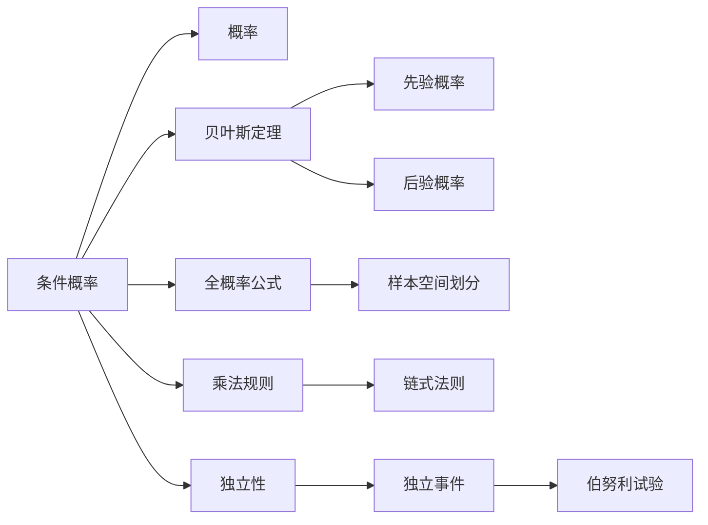

# 条件概率

> [!abstract]
> ==条件概率（Conditional Probability）==是在已知某些附加信息（某事件已发生）的条件下，对另一事件发生概率的重新评估。条件概率是概率论中最重要的概念之一，它将静态的概率度量转化为动态的信息更新机制，是[[离散数学/concepts/贝叶斯定理]]与[[离散数学/concepts/全概率公式]]的理论基石。

## 定义

> [!def] 条件概率
> 设 $E$ 和 $F$ 是[[样本空间]] $S$ 上的两个事件，且 $P(F) > 0$。在事件 $F$ 已发生的条件下，事件 $E$ 发生的**条件概率**定义为：
> $$P(E \mid F) = \frac{P(E \cap F)}{P(F)}$$
>
> **直观理解**：已知 $F$ 已经发生，样本空间从 $S$ "缩小"为 $F$。条件概率就是在新的样本空间 $F$ 中，$E$ 和 $F$ 同时发生的那部分（即 $E \cap F$）所占的比例。

> [!def] 乘法规则（Multiplication Rule）
> 由条件概率的定义可直接得到**乘法规则**：
> $$P(E \cap F) = P(F) \cdot P(E \mid F)$$
>
> **推广到多个事件**：
> $$P(E_1 \cap E_2 \cap \cdots \cap E_n) = P(E_1) \cdot P(E_2 \mid E_1) \cdot P(E_3 \mid E_1 \cap E_2) \cdots P(E_n \mid E_1 \cap \cdots \cap E_{n-1})$$
>
> 乘法规则将联合概率分解为一系列条件概率的乘积，是计算多个事件同时发生概率的基本工具。

> [!def] 缩减样本空间法
> 在等可能有限样本空间中，条件概率可以通过缩减样本空间直接计算：
> $$P(E \mid F) = \frac{|E \cap F|}{|F|}$$
>
> 这等价于将 $F$ 视为新的样本空间，在其中重新计算 $E$ 发生的概率。

## 核心性质

| 编号 | 性质名称 | 数学表达 | 说明 |
|:---:|:---:|:---:|:---|
| 1 | 概率公理继承 | $P(E \mid F) \geq 0$ | 条件概率满足非负性 |
| 2 | 归一性 | $P(S \mid F) = 1$ | 在 $F$ 已发生条件下，必然事件的概率为 1 |
| 3 | 可加性 | $P(E_1 \cup E_2 \mid F) = P(E_1 \mid F) + P(E_2 \mid F)$（$E_1, E_2$ 关于 $F$ 互斥） | 条件概率满足可加性 |
| 4 | 补事件 | $P(\bar{E} \mid F) = 1 - P(E \mid F)$ | 条件概率下的互补律 |
| 5 | 乘法规则 | $P(E \cap F) = P(F) \cdot P(E \mid F)$ | 联合概率的分解公式 |
| 6 | 全概率公式 | $P(E) = \sum_{i=1}^{n} P(F_i) \cdot P(E \mid F_i)$（$F_i$ 为划分） | 利用条件概率计算无条件概率 |
| 7 | 链式法则 | $P(E_1 \cap \cdots \cap E_n) = \prod_{i=1}^{n} P(E_i \mid E_1 \cap \cdots \cap E_{i-1})$ | 多事件联合概率的链式分解 |

## 关系网络

## 章节扩展

- **第7.2节**：条件概率的定义、乘法规则及其应用
- **第7.3节**：[[离散数学/concepts/贝叶斯定理]] — 条件概率的"逆向推理"应用
- **第7.3节**：[[离散数学/concepts/全概率公式]] — 利用条件概率将复杂问题分解为简单子问题

## 补充

> [!info] 条件概率的直观类比
> 想象一个班级有 100 名学生，其中 40 人选修数学，30 人选修物理，20 人同时选修两门。
> - $P(\text{数学}) = 40/100 = 0.4$
> - $P(\text{物理}) = 30/100 = 0.3$
> - $P(\text{数学} \mid \text{物理}) = 20/30 \approx 0.667$
>
> 已知某人选修物理，他同时选修数学的概率从 0.4 上升到 0.667。条件概率反映了**附加信息如何改变我们的判断**。

> [!info] 条件概率与因果关系的区别
> 条件概率 $P(E \mid F)$ 仅仅表示在 $F$ 发生的条件下 $E$ 的概率，**不意味着 $F$ 导致了 $E$**。因果关系需要额外的领域知识来判定。例如，"下雨"和"地面湿"的条件概率很高，但真正的原因是下雨导致地面湿，而非反过来。

## 参见

- [[离散数学/concepts/概率]] — 条件概率的基础，无条件概率度量
- [[离散数学/concepts/独立性]] — 当 $P(E \mid F) = P(E)$ 时的特殊情形
- [[离散数学/concepts/贝叶斯定理]] — 利用条件概率进行逆向推理
- [[离散数学/concepts/全概率公式]] — 通过划分样本空间计算概率
