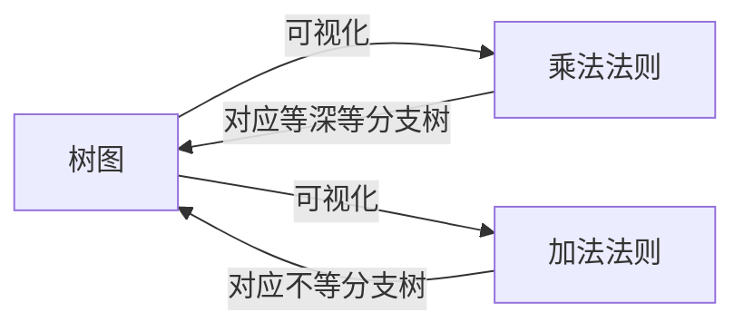

# 树图

> [!abstract]
> ==树图（Tree Diagram）==是一种用**树形结构**可视化计数过程的工具。树的**根节点**代表初始状态，每一**层**代表一个决策步骤，每条**分支**代表一种选择。从根到叶的每条路径代表一种完整的完成方案。树图是[[乘法法则]]和[[加法法则]]的直观图形表示。

## 定义

> [!def] 树图（基本定义）
> 树图是一种**根树**（rooted tree）结构，用于系统地列举所有可能的计数方案：
> - **根节点**：代表计数的起点（初始状态）
> - **内部节点**：代表决策过程中的中间状态
> - **边（分支）**：代表一种具体的选择
> - **叶节点**：代表一种完整的完成方案
>
> 从根节点到每个叶节点的路径对应一种独特的完成方案。

> [!def] 树图与计数法则的关系
> - **体现乘法法则**：若树中每个内部节点有相同数量的子节点（$n$ 个），树有 $k$ 层（不含根），则叶节点总数为 $n^k$，这正是乘法法则的结果
> - **体现加法法则**：若根节点有不同数量的分支（各类互斥方式），叶节点总数为各分支子树叶节点数之和，这正是加法法则的结果
> - **混合使用**：在同一棵树中，不同层可以有不同的分支数，某些分支还可以进一步细分

> [!def] 典型应用场景
> 1. **位串枚举**：画一棵深度为 $n$ 的二叉树，每层左分支标0、右分支标1，叶节点即为所有 $2^n$ 个位串
> 2. **多步决策**：如"先选颜色（3种），再选尺寸（2种），再选材质（4种）"，树图清晰展示 $3 \times 2 \times 4 = 24$ 种方案
> 3. **条件计数**：当后续步骤的选择依赖于前面步骤的结果时，树图可以直观展示不同条件下的不同分支数

## 核心性质

| 编号 | 性质 | 说明 |
|:---:|------|------|
| P1 | **完备性** | 树图穷举了所有可能的完成方案，不会遗漏任何一种 |
| P2 | **路径唯一性** | 从根到每个叶的路径是唯一的，每种方案恰好被计数一次 |
| P3 | **层数对应步骤** | 树的深度（层数）等于决策步骤的数量 |
| P4 | **分支数对应选择数** | 每个节点的出度（子节点数）等于该步骤的可选方案数 |
| P5 | **指数增长** | 当每步选择数 $\geq 2$ 时，叶节点数随层数指数增长，因此树图仅适用于步骤较少的情况 |

## 关系网络

## 章节扩展

- **乘法法则**：[[乘法法则]]的计数过程可以用树图完美可视化，树的每层对应一个步骤
- **加法法则**：[[加法法则]]的分类计数对应树图中根节点下不同分支的汇总
- **排列与组合**：在排列组合问题中，树图常用于列举小规模实例的所有可能情况，帮助理解计数逻辑

### 第11章：树

==树==（Tree）在图论中是==连通且无环==的无向图，是==树图==（tree diagram）概念在图论中的推广和严格化。

**树的等价刻画**：

以下四个命题等价（设 $G$ 是 $n$ 个顶点的简单图）：
1. $G$ 是一棵树（连通且无环）
2. $G$ 连通且有 $n-1$ 条边
3. $G$ 无环且有 $n-1$ 条边
4. $G$ 中任意两点之间存在唯一路径

**Cayley 公式**：$n$ 个标记顶点上的不同树共有 $n^{n-2}$ 棵。

**生成树与最小生成树**：

连通图 $G$ 的==生成树==是包含 $G$ 所有顶点的树（子图）。生成树有 $n-1$ 条边。对于加权连通图，==最小生成树==（MST）是总权重最小的生成树，由 Prim 算法或 Kruskal 算法求解。

## 补充

> [!info] 生活类比
> 想象你在玩一个"决策冒险"游戏：每个岔路口需要做一个选择，不同的选择通向不同的后续岔路口。把所有岔路口和路径画出来，就形成了一棵树图。从起点到终点的每条路径就是一种完整的游戏通关方式，路径总数就是通关方案的总数。

> [!info] 树图的局限性
> - **规模爆炸**：当步骤数或每步选择数较大时，树图的节点数急剧增长，手工绘制不现实
> - **仅适用于小规模**：树图主要用于理解计数原理和解决小规模问题，大规模问题需要借助公式
> - **优势在于直观**：树图的最大价值在于帮助建立对计数过程的直觉理解，而非作为实际计算工具

## 参见

- [[乘法法则]]：树图可视化的核心计数法则
- [[加法法则]]：树图中分类分支对应的计数法则
