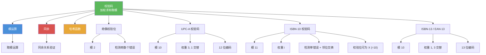

# 校验码

> [!abstract] 概述
> ==校验码==（check digit）是通过在标识号码末尾附加一位校验数字来检测传输或录入错误的编码技术。校验码的核心原理是对各位数字进行==加权求和后取模==，使有效编码满足特定的同余关系。常见方案包括：==奇偶校验位==（检测奇数个错误）、==UPC-A 校验码==（12 位，模 10）、==ISBN-10 校验码==（加权求和模 11，可检测单错误和邻位交换错误）以及 ==ISBN-13/EAN-13==（交替权重 $1, 3$，模 10）。ISBN-10 选择模 $11$ 是精妙的数学设计——因为 $11$ 是素数，能保证检测所有邻位交换错误。

## 定义

> [!def] 奇偶校验位（Parity Check Bit）
>
> 对于 $n$ 位比特串 $x_1 x_2 \ldots x_n$，==奇偶校验位==定义为：
>
> $$x_{n+1} = (x_1 + x_2 + \cdots + x_n) \bmod 2$$
>
> - 可以检测==奇数个==错误，但不能检测偶数个错误
> - 是最简单的校验码方案

> [!def] UPC-A 校验码（Universal Product Code）
>
> UPC 是 12 位十进制数字 $x_1 x_2 \ldots x_{12}$，其中前 11 位标识商品，第 12 位为==校验位==。校验位满足：
>
> $$3x_1 + x_2 + 3x_3 + x_4 + \cdots + 3x_{11} + x_{12} \equiv 0 \pmod{10}$$
>
> 即奇数位乘以 $3$，偶数位不变，加权求和后模 $10$ 应为 $0$。

> [!def] ISBN-10 校验码
>
> ISBN-10 是 10 位编码 $x_1 x_2 \ldots x_{10}$，其中 $x_{10}$ 为校验位（可以是 $0$--$9$ 或 $X$，$X$ 代表 $10$）。校验位满足：
>
> $$\sum_{i=1}^{10} ix_i \equiv 0 \pmod{11}$$
>
> 即第 $i$ 位乘以权重 $i$，加权求和后模 $11$ 应为 $0$。
>
> ISBN-10 能检测所有==单错误==和所有==邻位交换错误==。

> [!def] ISBN-13 / EAN-13 校验码
>
> ISBN-13（2007 年引入，基于 EAN-13 标准）使用交替权重 $1, 3$：
>
> $$x_1 + 3x_2 + x_3 + 3x_4 + \cdots + 3x_{12} + x_{13} \equiv 0 \pmod{10}$$
>
> 校验位 $x_{13} \equiv -\sum_{i=1}^{12} w_i x_i \pmod{10}$，其中权重 $w_i$ 交替为 $1, 3$。

## 核心性质

| 性质 | 描述 | 说明 |
|------|------|------|
| 奇偶校验 | 检测奇数个错误 | 不能检测偶数个错误 |
| UPC 模数 | 模 $10$ | 能检测所有单错误 |
| ISBN-10 模数 | 模 $11$ | 能检测单错误和邻位交换错误 |
| ISBN-13 模数 | 模 $10$，权重 $1, 3$ 交替 | 通过复杂权重弥补模 $10$ 的不足 |
| 单错误检测 | 所有方案都能检测 | 加权求和中权重非零即可 |
| 邻位交换检测 | ISBN-10 能检测所有 | 模 $11$ 是素数，保证 $(j-k)(x_j-x_k) \not\equiv 0$ |
| UPC 交换检测 | 不保证检测所有 | 模 $10$ 下差为 $10$ 的倍数时失效 |

## 关系网络

- [[模运算]] 是所有校验码方案的数学基础：加权求和后取模验证
- [[同余]] 提供了校验码验证的理论框架：有效编码满足特定的同余关系
- [[哈希函数]] 与校验码共享"将大范围映射到小范围"的思想，但目标不同

## 章节扩展

### 第4章：数论与密码学

校验码是第 4.5 节"同余的应用"中的第三个应用实例，展示了模运算在日常生活中的广泛应用：

- **4.5 同余的应用**：校验码是模运算在错误检测中的典型应用
- **4.5 ISBN-10 错误检测证明**：利用模 $11$ 的素数性质证明单错误和邻位交换错误的可检测性
- **4.6 密码学**：校验码是数据完整性保护的简单形式，密码学中的消息认证码（MAC）和数字签名提供了更强的完整性保证

## 补充

> [!info] 校验码的学术背景与数学原理
>
> 校验码的概念在信息论和编码理论中有深厚的理论基础。ISBN-10 选择模 $11$ 而非模 $10$ 是一个精妙的数学选择：模 $10$ 的校验码（如 UPC）能检测所有单错误，但不能检测所有邻位交换错误——当被交换的两位之差为 $10$ 的倍数时，模 $10$ 的校验和不变。而模 $11$ 中，因为 $11$ 是素数，只要 $|j - k| < 11$ 且 $|x_j - x_k| < 11$（对 ISBN-10 总是成立），就能保证 $(j-k)(x_j - x_k) \not\equiv 0 \pmod{11}$，从而检测到所有邻位交换。ISBN-13（2007 年引入）改用模 $10$，但通过更复杂的权重方案（$1, 3$ 交替）弥补了这一不足（GS1, 2005）。除了 ISBN 和 UPC，其他常见的校验码方案还包括：信用卡号（Luhn 算法，模 10）、身份证号（中国 GB 11643-1999，模 11，权重为 $2^{i-1} \bmod 11$）、银行账号（IBAN 校验码，模 97）等。
>
> **学术来源**：Rosen, K. H. (2019). *Discrete Mathematics and Its Applications* (8th ed.). McGraw-Hill, Section 4.5.
>
> **参考链接**：[Check Digit Schemes (Math Pages)](https://www.mathpages.com/home/kmath476/kmath476.htm)

## 参见

- [[模运算]] -- 所有校验码方案的数学基础
- [[同余]] -- 校验码验证的理论框架
- [[哈希函数]] -- 与校验码共享"映射压缩"的思想
