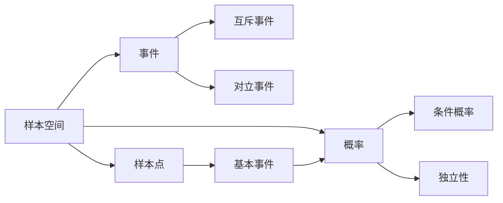

# 样本空间

> [!abstract]
> ==样本空间（Sample Space）==是随机试验所有可能结果构成的集合，记为 $S$。样本空间是概率论的出发点——先明确"所有可能发生什么"，才能进一步度量"某个结果发生的可能性有多大"。

## 定义

> [!def] 样本空间
> 一个随机试验的所有可能结果组成的集合称为**样本空间**，记为 $S$。样本空间中的每个元素称为一个**样本点**（sample point）。
>
> **示例**：
> - 掷一枚硬币：$S = \{H, T\}$（正面、反面）
> - 掷两枚硬币：$S = \{HH, HT, TH, TT\}$
> - 掷一颗骰子：$S = \{1, 2, 3, 4, 5, 6\}$

> [!def] 离散样本空间与连续样本空间
> - **离散样本空间**：样本空间 $S$ 是有限集或可数无限集。例如掷骰子的结果集 $\{1,2,3,4,5,6\}$。
> - **连续样本空间**：样本空间 $S$ 是不可数集。例如在区间 $[0,1]$ 上随机取一个实数。
>
> 离散数学主要关注**离散样本空间**，其中每个样本点可被逐一枚举。

> [!def] 有限样本空间的概率赋值
> 设有限样本空间 $S = \{s_1, s_2, \ldots, s_n\}$，为每个样本点 $s_i$ 分配一个概率 $p_i$，满足：
> $$p_i \geq 0 \quad (i = 1, 2, \ldots, n)$$
> $$\sum_{i=1}^{n} p_i = 1$$
> 则事件 $E \subseteq S$ 的概率为：
> $$P(E) = \sum_{s_i \in E} p_i$$
> 当所有样本点等可能时，$p_i = 1/n$，此时退化为拉普拉斯定义 $P(E) = |E|/|S|$。

## 核心性质

| 编号 | 性质名称 | 数学表达 | 说明 |
|:---:|:---:|:---:|:---|
| 1 | 非空性 | $S \neq \emptyset$ | 样本空间至少包含一个样本点 |
| 2 | 全概率归一 | $P(S) = 1$ | 所有样本点的概率之和恒为 1 |
| 3 | 有限可加性 | $P(\{s_i\}) \geq 0$ | 每个基本事件（样本点）的概率非负 |
| 4 | 互斥基本事件 | $s_i \neq s_j \Rightarrow \{s_i\} \cap \{s_j\} = \emptyset$ | 不同样本点构成互斥的基本事件 |
| 5 | 事件概率求和 | $P(E) = \sum_{s_i \in E} P(\{s_i\})$ | 任意事件的概率等于其所含样本点概率之和 |

## 关系网络

## 章节扩展

- **第7.1节**：样本空间的基本定义与概率赋值方法
- **第7.2节**：在样本空间上定义[[条件概率]]，引入信息更新机制
- **第7.4节**：样本空间上的[[概率分布]]，将样本点映射为数值

## 补充

> [!info] 样本空间的构造方法
> 构造样本空间的关键在于明确"一次试验"的含义。同一实际问题，试验定义不同，样本空间也不同：
> - 掷两枚硬币（不区分顺序）：$S = \{0H, 1H, 2H\}$（按正面数量）
> - 掷两枚硬币（区分顺序）：$S = \{HH, HT, TH, TT\}$（按逐次结果）
>
> 选择哪种构造方式取决于具体问题需求。通常**区分顺序**的构造更便于计算等可能概率。

> [!info] 乘积样本空间
> 若试验 1 的样本空间为 $S_1$，试验 2 的样本空间为 $S_2$，则两个试验联合进行的样本空间为笛卡尔积：
> $$S = S_1 \times S_2 = \{(s_1, s_2) \mid s_1 \in S_1, s_2 \in S_2\}$$
> 例如掷两颗骰子：$S = \{1,\ldots,6\} \times \{1,\ldots,6\}$，共 $36$ 个样本点。

## 参见

- [[概率]] — 在样本空间上定义的度量函数
- [[事件]] — 样本空间的子集，概率的作用对象
