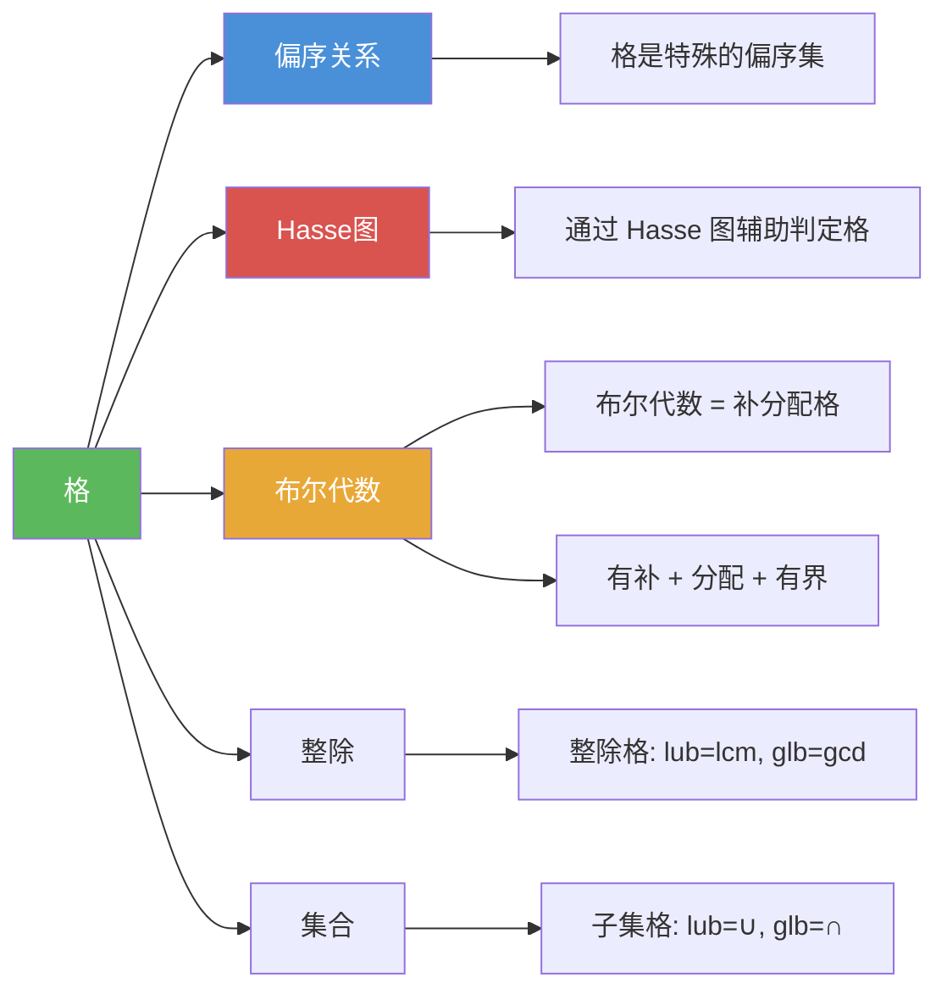

# 格

> [!abstract] 概述
> ==格==（lattice）是一类特殊的==偏序集==，要求==每对元素都存在最小上界（lub）和最大下界（glb）==。格是连接序理论与代数理论的桥梁：一方面，格可以通过偏序集定义（序论视角）；另一方面，格也可以通过满足特定恒等式的代数运算定义（代数视角）。经典实例包括[[离散数学/concepts/整除|整除]]格 $(\mathbb{Z}^+, \mid)$（其中 lub = lcm，glb = gcd）和子集格 $(\mathcal{P}(S), \subseteq)$（其中 lub = 并集，glb = 交集）。[[离散数学/concepts/布尔代数|布尔代数]]是补分配格的重要特例。

## 定义

> [!def] 格（Lattice）
>
> ==偏序集== $(S, \preceq)$ 如果满足：==每对元素都有最小上界和最大下界==，则称 $(S, \preceq)$ 为==格==。
>
> 即：对任意 $a, b \in S$，$\operatorname{lub}(a, b)$ 和 $\operatorname{glb}(a, b)$ 都存在。
>
> 等价代数定义：集合 $S$ 上有两个二元运算 $\vee$（join，对应 lub）和 $\wedge$（meet，对应 glb），满足交换律、结合律、吸收律和幂等律。

> [!def] 有界格（Bounded Lattice）
>
> 若格 $(S, \preceq)$ 同时存在==最大元==（记作 $1$ 或 $\top$）和==最小元==（记作 $0$ 或 $\bot$），则称其为==有界格==。
>
> - 最大元 $1$ 满足：对任意 $a \in S$，$a \preceq 1$
> - 最小元 $0$ 满足：对任意 $a \in S$，$0 \preceq a$
>
> 有限格一定是有界格。

> [!def] 分配格（Distributive Lattice）
>
> 若格 $(S, \preceq)$ 满足以下==分配律==之一（二者等价），则称其为==分配格==：
>
> 1. $a \vee (b \wedge c) = (a \vee b) \wedge (a \vee c)$（$\vee$ 对 $\wedge$ 的分配律）
> 2. $a \wedge (b \vee c) = (a \wedge b) \vee (a \wedge c)$（$\wedge$ 对 $\vee$ 的分配律）
>
> 分配格是[[离散数学/concepts/布尔代数|布尔代数]]的定义前提之一。

> [!def] 格的判定方法
>
> 给定偏序集 $(S, \preceq)$，判定其是否为格：
>
> 1. 对 $S$ 中==每一对==元素 $(a, b)$，检查 $\operatorname{lub}(a, b)$ 和 $\operatorname{glb}(a, b)$ 是否都存在
> 2. 如果存在==任何一对==元素缺少 lub 或 glb，则该偏序集不是格
> 3. 如果所有元素对都有 lub 和 glb，则该偏序集是格
>
> 注意：格的定义是代数性质的，与 [[离散数学/concepts/Hasse图|Hasse 图]]的图形外观无关。例如一条链（Hasse 图是直线）也是格。

## 核心性质

| 性质 | 描述 | 说明 |
|------|------|------|
| lub 存在性 | 每对元素都有最小上界 | 这是格定义的核心条件 |
| glb 存在性 | 每对元素都有最大下界 | 这是格定义的核心条件 |
| 交换律 | $a \vee b = b \vee a$，$a \wedge b = b \wedge a$ | lub 和 glb 与顺序无关 |
| 结合律 | $(a \vee b) \vee c = a \vee (b \vee c)$ | 可推广到任意有限子集 |
| 吸收律 | $a \vee (a \wedge b) = a$，$a \wedge (a \vee b) = a$ | 区分格与一般代数结构 |
| 幂等律 | $a \vee a = a$，$a \wedge a = a$ | 由偏序的自反性保证 |
| 有限格有界 | 有限格必有最大元和最小元 | 有限格一定是有界格 |
| 链是格 | 全序集（链）一定是格 | lub = max，glb = min |
| 子集格 | $(\mathcal{P}(S), \subseteq)$ 是格 | lub = $\cup$，glb = $\cap$ |
| 整除格 | $(\mathbb{Z}^+, \mid)$ 是格 | lub = lcm，glb = gcd |

## 关系网络

- [[离散数学/concepts/偏序关系|偏序关系]] 是格的基础：格是满足额外条件（每对元素都有 lub 和 glb）的偏序集
- [[离散数学/concepts/Hasse图|Hasse 图]] 可辅助判定格：通过图形检查每对元素是否都有 lub 和 glb
- [[离散数学/concepts/布尔代数|布尔代数]] 是格的重要特例：布尔代数是有补的分配格
- [[离散数学/concepts/整除|整除]] 格 $(\mathbb{Z}^+, \mid)$ 中，lub 对应 lcm，glb 对应 gcd
- 子集格 $(\mathcal{P}(S), \subseteq)$ 中，lub 对应并集 $\cup$，glb 对应交集 $\cap$

## 章节扩展

### 第09章：关系

格是第 9 章偏序关系（9.6 节）中的重要概念：

- **9.6 偏序关系**：格的定义（每对元素都有 lub 和 glb）、格的判定、整除格与子集格实例、信息流的格模型

### 第12章：布尔代数

- **12.1~12.3 布尔代数**：[[离散数学/concepts/布尔代数|布尔代数]]是补分配格，是格理论的重要应用。布尔代数在数字电路设计和逻辑设计中起核心作用。

## 补充

> [!info] 格的常见实例与反例
>
> **是格的实例：**
> - $(\mathbb{Z}^+, \mid)$：整除格，$\operatorname{lub}(a, b) = \operatorname{lcm}(a, b)$，$\operatorname{glb}(a, b) = \gcd(a, b)$
> - $(\mathcal{P}(S), \subseteq)$：子集格，$\operatorname{lub}(A, B) = A \cup B$，$\operatorname{glb}(A, B) = A \cap B$
> - $(\{1, 2, 4, 8, 16\}, \mid)$：链（全序集），$\operatorname{lub}(a, b) = \max(a, b)$，$\operatorname{glb}(a, b) = \min(a, b)$
> - $(\{1, 5, 25, 125\}, \mid)$：链，同样是格
>
> **不是格的反例：**
> - $(\{1, 2, 3, 4, 5\}, \mid)$：$2$ 和 $3$ 没有上界（没有同时被 $2$ 和 $3$ 整除的元素），因此不是格
> - $(\{1, 3, 6, 9, 12\}, \mid)$：$6$ 和 $9$ 的上界需要 $\operatorname{lcm}(6, 9) = 18$ 的倍数，但 $18 \notin S$，因此不是格
>
> **信息流的格模型：**
> 在安全信息流策略中，每个安全类表示为有序对 $(A, C)$，其中 $A$ 是权限级别，$C$ 是类别。定义 $(A_1, C_1) \preceq (A_2, C_2)$ 当且仅当 $A_1 \leq A_2$ 且 $C_1 \subseteq C_2$。则 $\operatorname{lub}((A_1, C_1), (A_2, C_2)) = (\max(A_1, A_2), C_1 \cup C_2)$，$\operatorname{glb}((A_1, C_1), (A_2, C_2)) = (\min(A_1, A_2), C_1 \cap C_2)$。安全类的集合构成一个格。
>
> **学术来源**：Rosen, K. H. (2019). *Discrete Mathematics and Its Applications* (8th ed.). McGraw-Hill, Section 9.6.

## 参见

- [[离散数学/concepts/偏序关系]] -- 格是特殊的偏序集，要求每对元素都有 lub 和 glb
- [[离散数学/concepts/Hasse图]] -- 通过 Hasse 图可以辅助判定偏序集是否为格
- [[离散数学/concepts/布尔代数]] -- 布尔代数是补分配格，是格理论的重要应用
