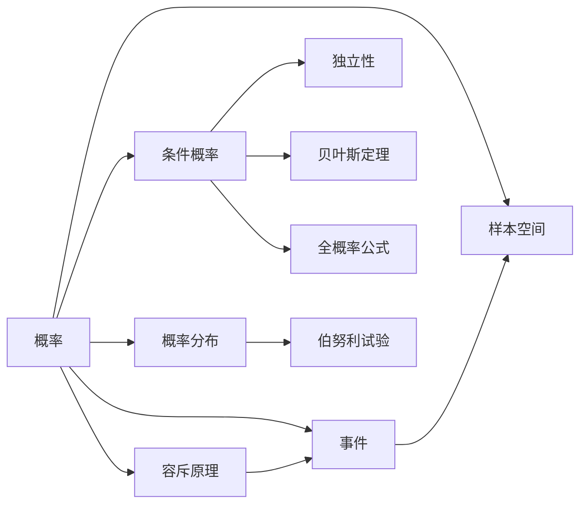

# 概率

> [!abstract]
> ==概率（Probability）==是度量随机事件发生可能性的数值，其取值范围为 $[0,1]$。概率论为离散数学中计数技术与组合分析提供了重要的应用场景，是分析随机现象的数学基础。

## 定义

> [!def] 拉普拉斯等可能定义（古典概率）
> 设样本空间 $S$ 包含 $n$ 个等可能的结果，事件 $E$ 包含其中 $k$ 个结果，则事件 $E$ 的概率为：
> $$P(E) = \frac{|E|}{|S|} = \frac{k}{n}$$
> 其中 $|E|$ 表示事件 $E$ 中包含的样本点个数，$|S|$ 表示样本空间中样本点的总数。

> [!def] 概率公理（Kolmogorov 公理体系）
> 设 $S$ 为样本空间，概率函数 $P$ 是从事件集合到实数的映射，满足以下三条公理：
> 1. **非负性**：对于任意事件 $E$，有 $P(E) \geq 0$
> 2. **规范性**：$P(S) = 1$
> 3. **可加性**：若事件 $E_1, E_2, \ldots$ 两两互斥（即 $E_i \cap E_j = \emptyset$，$i \neq j$），则
> $$P\left(\bigcup_{i=1}^{\infty} E_i\right) = \sum_{i=1}^{\infty} P(E_i)$$

## 核心性质

| 编号 | 性质名称 | 数学表达 | 说明 |
|:---:|:---:|:---:|:---|
| 1 | 不可能事件概率 | $P(\emptyset) = 0$ | 空集（不可能事件）的概率为零 |
| 2 | 互补律 | $P(\bar{E}) = 1 - P(E)$ | 对立事件的概率之和为 1 |
| 3 | 单调性 | 若 $E \subseteq F$，则 $P(E) \leq P(F)$ | 子集事件的概率不超过母集事件 |
| 4 | 有界性 | $0 \leq P(E) \leq 1$ | 任意事件的概率均在 $[0,1]$ 之间 |
| 5 | 加法公式 | $P(E \cup F) = P(E) + P(F) - P(E \cap F)$ | 两事件并集的概率（容斥原理） |
| 6 | 全空间分解 | $\sum_{i} P(\{s_i\}) = 1$ | 有限样本空间中所有基本事件概率之和为 1 |
| 7 | Boole 不等式 | $P\left(\bigcup_{i=1}^{n} E_i\right) \leq \sum_{i=1}^{n} P(E_i)$ | 并集概率不超过各事件概率之和 |

## 关系网络

## 章节扩展

- **第7.1节**：概率的基本概念，包括拉普拉斯定义与概率公理
- **第7.2节**：[[离散数学/concepts/条件概率]] 与 [[离散数学/concepts/独立性]]，引入乘法规则与贝叶斯定理
- **第7.3节**：[[离散数学/concepts/贝叶斯定理]] 与全概率公式的应用
- **第7.4节**：期望值与方差等数字特征

## 补充

> [!info] 概率论的历史发展
> 概率论起源于17世纪，帕斯卡（Pascal）和费马（Fermat）在解决赌博问题时奠定了基础。拉普拉斯在1812年出版的《概率的分析理论》中系统化了古典概率定义。1933年，柯尔莫哥洛夫（Kolmogorov）建立了公理化概率论，将概率论建立在严格的数学基础之上，成为现代概率论的基石。

> [!info] 概率的频率解释
> 当试验次数 $n$ 趋近于无穷大时，事件 $E$ 发生的频率 $f_n(E) = n_E / n$ 趋近于概率 $P(E)$：
> $$P(E) = \lim_{n \to \infty} \frac{n_E}{n}$$
> 这被称为概率的**大数定律**（Law of Large Numbers），是频率学派解释概率的理论基础。

## 参见

- [[样本空间]] — 概率定义的基础，所有可能结果的集合
- [[事件]] — 样本空间的子集，概率的直接作用对象
- [[容斥原理]] — 计算事件并集概率的核心工具
- [[离散数学/concepts/条件概率]] — 在已知信息下重新评估事件概率
- [[离散数学/concepts/概率分布]] — 随机变量取各值的概率规律
