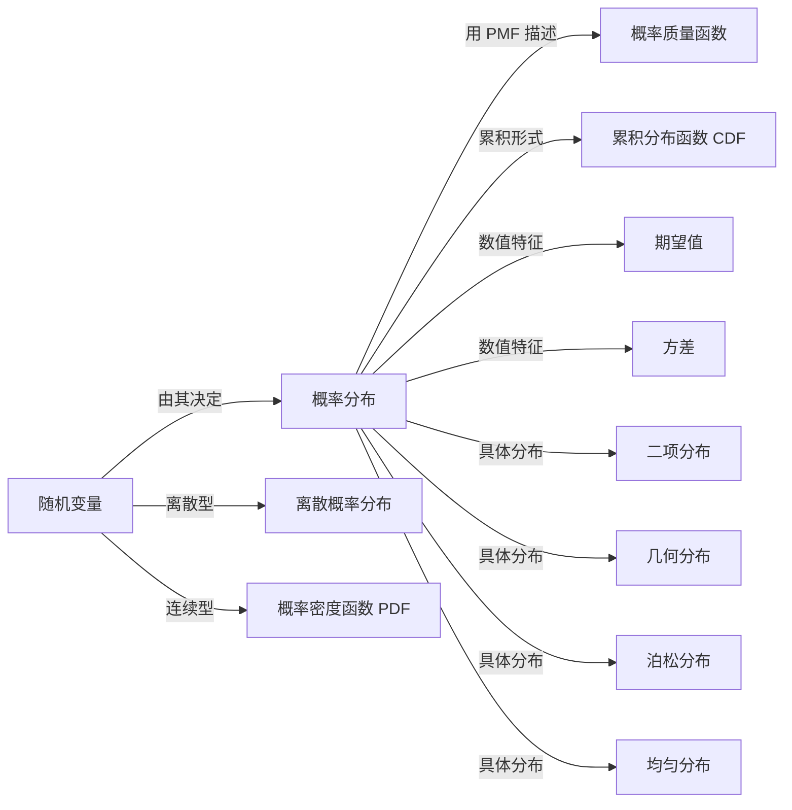

# 概率分布

> [!abstract]
> ==概率分布（Probability Distribution）==描述[[离散数学/concepts/随机变量]]取各个可能值的概率规律。对于离散随机变量，概率分布由**概率质量函数**（Probability Mass Function, PMF）完全刻画：$p(x_k) = P(X = x_k)$。概率分布是概率论的核心概念，是连接随机变量与具体概率计算的桥梁。

## 定义

> [!def] 概率分布（离散情形）
> 设 $X$ 是一个定义在样本空间 $S$ 上的**离散[[离散数学/concepts/随机变量]]**，
> 其可能取值为 $x_1, x_2, x_3, \ldots$（有限或可列无限个）。
> $X$ 的**概率分布**由其**概率质量函数**（PMF）给出：
> $$
> p(x_k) = P(X = x_k), \quad k = 1, 2, 3, \ldots
> $$
>
> > [!def] 概率质量函数的基本要求
> > 概率质量函数 $p(x)$ 必须满足以下两个条件：
> > 1. **非负性**：对所有 $x$，$p(x) \geq 0$
> > 2. **归一性**：$\sum_{\text{所有 } x} p(x) = 1$
> >
> > 这两个条件保证了 $p(x)$ 确实构成一个合法的概率分配。

## 核心性质

| 编号 | 性质 | 数学表达 / 说明 |
|:---:|------|----------------|
| 1 | **非负性** | 对所有 $x$，$p(x) = P(X = x) \geq 0$ |
| 2 | **归一性** | $\sum_{\text{所有 } x} p(x) = 1$，所有可能取值的概率之和为 1 |
| 3 | **累积分布函数** | $F(x) = P(X \leq x) = \sum_{x_k \leq x} p(x_k)$，单调不减、右连续 |
| 4 | **期望值** | $E(X) = \sum_{\text{所有 } x} x \cdot p(x)$，描述分布的"中心位置" |
| 5 | **方差** | $V(X) = E[(X - E(X))^2] = \sum_{\text{所有 } x} (x - \mu)^2 p(x)$，描述分布的"离散程度" |
| 6 | **唯一性** | 概率质量函数 $p(x)$ 完全确定了随机变量 $X$ 的概率特性 |

## 关系网络

## 章节扩展

- **常见离散分布**：
  - [[离散数学/concepts/二项分布]]：$B(n, p)$，描述 $n$ 次独立伯努利试验中的成功次数
  - 几何分布：首次成功所需的试验次数
  - 泊松分布：单位时间/空间内稀有事件发生的次数
  - 均匀分布：各取值等概率
- **累积分布函数（CDF）**：$F(x) = P(X \leq x)$ 给出随机变量不超过某值的概率，是概率分布的另一种等价描述方式。
- **概率密度函数（PDF）**：对于连续随机变量，概率分布由概率密度函数 $f(x)$ 描述，$P(a \leq X \leq b) = \int_a^b f(x) dx$。

## 补充

> [!info] 概率分布 vs 概率密度
> - **离散随机变量**：使用**概率质量函数**（PMF），$p(x) = P(X = x)$ 直接给出取某值的概率
> - **连续随机变量**：使用**概率密度函数**（PDF），$f(x)$ 本身不是概率，需通过积分得到概率
> - 两者的统一框架是**累积分布函数**（CDF），对离散和连续情形都适用
>
> [!info] 生活类比
> 概率分布就像一张"成绩分布表"：列出每个可能分数出现的概率。
> 例如掷两枚骰子，点数之和 $X$ 的概率分布为：
> $P(X=2) = 1/36$，$P(X=3) = 2/36$，$P(X=7) = 6/36$，……
> 这张表完整地描述了 $X$ 的所有概率信息。

## 参见

- [[离散数学/concepts/随机变量]]：概率分布所描述的对象
- [[离散数学/concepts/概率]]：概率分布中每个概率值的基本定义
- [[离散数学/concepts/二项分布]]：最重要的离散概率分布之一
- [[离散数学/concepts/期望值]]：概率分布的数字特征——中心位置
- [[离散数学/concepts/方差]]：概率分布的数字特征——离散程度
- [[离散数学/concepts/伯努利试验]]：二项分布的产生来源
