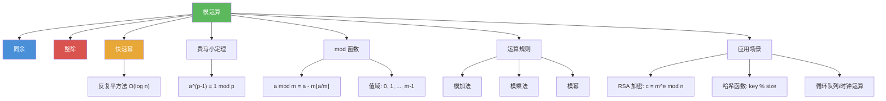

# 模运算

> [!abstract] 概述
> ==模运算（modular arithmetic）==是以==模函数== $\bmod$ 为核心的运算体系。模函数 $a \bmod m$ 返回 $a$ 除以 $m$ 的非负余数，即 $a \bmod m = a - m\lfloor a/m \rfloor$。模运算的关键性质在于：加法、乘法和幂运算都可以"先取模再运算"，即 $(a + b) \bmod m = ((a \bmod m) + (b \bmod m)) \bmod m$，这使得即使操作数非常大，中间结果也不会溢出，是==密码学==和==计算机科学==中不可或缺的计算工具。

## 定义

> [!def] 模函数（Mod Function）
>
> 设 $a$ 为整数，$m$ 为正整数。$a$ 模 $m$ 的值定义为
>
> $$a \bmod m = a - m \cdot \lfloor a/m \rfloor$$
>
> - $a \bmod m$ 是一个==函数==（function），返回值范围为 $\{0, 1, \ldots, m-1\}$
> - 与同余关系的区别：$a \equiv b \pmod{m}$ 是一个==关系==（relation），而 $a \bmod m$ 是一个==函数==
> - 联系：$a \equiv b \pmod{m} \iff a \bmod m = b \bmod m$

## 核心性质

| 性质 | 公式 | 说明 |
|------|------|------|
| 模加法 | $(a + b) \bmod m = ((a \bmod m) + (b \bmod m)) \bmod m$ | 先取模再相加，结果不变 |
| 模减法 | $(a - b) \bmod m = ((a \bmod m) - (b \bmod m)) \bmod m$ | 注意结果可能为负，需再取模 |
| 模乘法 | $(a \cdot b) \bmod m = ((a \bmod m) \cdot (b \bmod m)) \bmod m$ | 先取模再相乘，结果不变 |
| 模幂 | $a^k \bmod m = ((a \bmod m)^k) \bmod m$ | 底数可先取模 |
| 模分配律 | $a \cdot (b + c) \bmod m = (a \cdot b + a \cdot c) \bmod m$ | 乘法对加法的分配律在模意义下成立 |
| 值域 | $a \bmod m \in \{0, 1, \ldots, m-1\}$ | 余数始终非负且小于模数 |
| 周期性 | $(a + km) \bmod m = a \bmod m$ | 每隔 $m$ 个整数余数循环 |

## 关系网络

- [[同余]] 与模运算密切相关：$a \equiv b \pmod{m}$ 当且仅当 $a \bmod m = b \bmod m$
- [[整除]] 是模运算的理论基础：带余除法保证了余数的存在性和唯一性
- [[快速幂]] 利用模运算的"先取模再运算"性质，高效计算 $b^n \bmod m$
- [[费马小定理]] $a^{p-1} \equiv 1 \pmod{p}$ 是模幂运算的重要理论基础

## 章节扩展

### 第4章：数论与密码学

模运算是第 4 章的核心计算工具（4.1 节）：

- **4.1 整除与模运算**：$\bmod$ 函数的定义、运算规则（Corollary 2）、$\mathbb{Z}_m$ 上的加法与乘法运算
- **4.2 整数表示与算法**：模幂算法（快速幂）利用模运算的封闭性高效计算大数幂取模
- **4.4 解同余方程**：线性同余方程 $ax \equiv b \pmod{m}$ 的求解
- **4.5 密码学应用**：RSA 加密 $c = m^e \bmod n$ 和解密 $m = c^d \bmod n$ 都依赖模幂运算

## 补充

> [!info] 模运算在计算机科学中的核心地位
>
> 模运算在计算机科学中无处不在。在编程语言中，`%` 运算符（C/C++/Java/Python）或 `mod` 运算符（BASIC/SQL）实现了模运算。但需注意：不同语言对负数的模运算结果可能不同。例如，Python 中 $-11 \bmod 3 = 1$（数学定义），而 C/C++ 中 $-11 \% 3 = -2$（截断除法）。在密码学中，RSA 加密的核心运算 $c = m^e \bmod n$ 依赖模幂运算；在哈希表中，`hash(key) = key % table_size` 是最常用的哈希函数；在循环队列、时钟运算、日历计算中，模运算同样是基础工具。
>
> **学术来源**：Rosen, K. H. (2019). *Discrete Mathematics and Its Applications* (8th ed.). McGraw-Hill, Section 4.1.
>
> **参考链接**：Knuth, D. E. (1997). *The Art of Computer Programming* (Vol. 2, 3rd ed.). Addison-Wesley, Section 4.3.2.

## 参见

- [[同余]] -- 模 $m$ 的等价关系，$a \equiv b \pmod{m}$ 当且仅当 $a \bmod m = b \bmod m$
- [[整除]] -- 带余除法是模函数的定义基础
- [[快速幂]] -- 利用模运算性质高效计算 $b^n \bmod m$ 的算法
- [[费马小定理]] -- $a^{p-1} \equiv 1 \pmod{p}$，模运算中的重要定理
