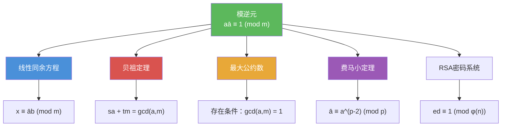

# 模逆元

> [!abstract] 概述
> ==模逆元==（modular inverse）是模运算中"除法"的对应概念：若整数 $\bar{a}$ 满足 $a\bar{a} \equiv 1 \pmod{m}$，则称 $\bar{a}$ 为 $a$ 模 $m$ 的逆元。模逆元存在的充要条件是 $\gcd(a, m) = 1$，此时逆元在模 $m$ 下==唯一==。模逆元可通过==扩展欧几里得算法==高效计算，是求解==线性同余方程==、构造==中国剩余定理==解、以及 RSA 密码系统正确运行的关键数学基础。

## 定义

> [!def] 模逆元（Modular Inverse）
>
> 若整数 $\bar{a}$ 满足
>
> $$a\bar{a} \equiv 1 \pmod{m}$$
>
> 则称 $\bar{a}$ 为 $a$ 的==模 $m$ 的逆元==（modular inverse of $a$ modulo $m$）。
>
> 模逆元存在的充要条件是 $\gcd(a, m) = 1$，此时逆元在模 $m$ 下唯一。

> [!def] 逆元存在与唯一性定理
>
> 若 $\gcd(a, m) = 1$ 且 $m > 1$，则 $a$ 的模 $m$ 逆元存在，且在模 $m$ 下唯一。
>
> **证明**：由 [[贝祖定理]]，因为 $\gcd(a, m) = 1$，存在整数 $s$ 和 $t$ 使得
>
> $$sa + tm = 1$$
>
> 两边取模 $m$：$sa + tm \equiv 1 \pmod{m}$。因为 $tm \equiv 0 \pmod{m}$，所以 $sa \equiv 1 \pmod{m}$。
>
> 因此 $s$ 是 $a$ 的模 $m$ 逆元。唯一性：若 $s_1, s_2$ 都是逆元，则 $s_1 \equiv s_1 \cdot 1 \equiv s_1 \cdot (a s_2) \equiv (s_1 a) \cdot s_2 \equiv 1 \cdot s_2 \equiv s_2 \pmod{m}$。
>
> $\blacksquare$

> [!def] 扩展欧几里得算法求逆元
>
> 利用扩展欧几里得算法求 $a$ 模 $m$ 的逆元的步骤：
>
> 1. 用欧几里得算法计算 $\gcd(a, m)$，记录每一步的除法等式
> 2. 若 $\gcd(a, m) \neq 1$，则逆元不存在
> 3. 若 $\gcd(a, m) = 1$，从最后一步反向代入，将 $1$ 表示为 $sa + tm$ 的形式
> 4. $s$ 即为逆元；若 $s < 0$，取 $s \bmod m$ 得到正逆元

## 核心性质

| 性质 | 描述 | 说明 |
|------|------|------|
| 存在条件 | $\gcd(a, m) = 1$ | $a$ 与 $m$ 互素时逆元存在 |
| 唯一性 | 模 $m$ 下唯一 | 若 $\bar{a}_1 \equiv \bar{a}_2 \pmod{m}$ 则视为同一逆元 |
| 自逆性 | 若 $\bar{a}$ 是 $a$ 的逆元，则 $a$ 是 $\bar{a}$ 的逆元 | 逆元关系是对称的 |
| 乘积逆元 | $(ab)^{-1} \equiv \bar{b} \cdot \bar{a} \pmod{m}$ | 类比矩阵逆的转置性质 |
| 求解方法 | 扩展欧几里得算法 | 时间复杂度 $O(\log(\min(a, m)))$ |
| 特殊情况 | $p$ 为素数时，$\bar{a} \equiv a^{p-2} \pmod{p}$ | 由费马小定理推导 |

## 关系网络

- [[线性同余方程]] 的求解依赖于模逆元：$ax \equiv b \pmod{m}$ 的解为 $x \equiv \bar{a}b \pmod{m}$
- [[贝祖定理]] 是模逆元存在的理论基础：$\gcd(a, m) = 1 \iff$ 存在 $s$ 使 $sa + tm = 1$
- [[最大公约数]] 决定逆元是否存在：$\gcd(a, m) = 1$ 是充要条件
- [[费马小定理]] 提供了素数模下求逆元的替代方法：$\bar{a} \equiv a^{p-2} \pmod{p}$
- [[RSA密码系统]] 中需要计算 $e$ 模 $\varphi(n)$ 的逆元 $d$ 来确定解密密钥

## 章节扩展

### 第4章：数论与密码学

模逆元是第 4.4 节的核心概念，贯穿整个同余方程求解体系：

- **4.4 解同余方程**：模逆元是求解线性同余方程 $ax \equiv b \pmod{m}$ 的关键步骤
- **4.4 中国剩余定理**：CRT 构造法中需要计算 $M_k$ 模 $m_k$ 的逆元 $y_k$
- **4.4 费马小定理**：在素数模下，$a^{p-2}$ 即为 $a$ 的逆元
- **4.6 密码学**：RSA 系统中 $ed \equiv 1 \pmod{\varphi(n)}$，需要求 $e$ 模 $\varphi(n)$ 的逆元 $d$

## 补充

> [!info] 模逆元的学术背景与计算方法
>
> 模逆元的概念是抽象代数中==乘法群==理论的直接应用：当 $\gcd(a, m) = 1$ 时，$a$ 属于模 $m$ 的==简化剩余系== $\mathbb{Z}_m^*$（即与 $m$ 互素的剩余类构成的乘法群），而逆元就是群中 $a$ 的乘法逆元素。扩展欧几里得算法的效率为 $O(\log(\min(a, m)))$，是实际计算中最常用的方法。对于素数模 $p$，费马小定理给出 $\bar{a} \equiv a^{p-2} \pmod{p}$，但这种方法需要计算大幂，效率通常不如扩展欧几里得算法。在密码学中，模逆元的计算是 RSA、ElGamal、椭圆曲线密码等公钥密码系统正确运行的基础操作。
>
> **学术来源**：Rosen, K. H. (2019). *Discrete Mathematics and Its Applications* (8th ed.). McGraw-Hill, Section 4.4, Theorem 1.
>
> **参考链接**：Knuth, D. E. (1997). *The Art of Computer Programming, Vol. 2: Seminumerical Algorithms* (3rd ed.). Addison-Wesley, Section 4.5.2.

## 参见

- [[线性同余方程]] -- 模逆元用于求解 $ax \equiv b \pmod{m}$
- [[贝祖定理]] -- 模逆元存在的理论依据
- [[最大公约数]] -- $\gcd(a, m) = 1$ 是逆元存在的充要条件
- [[费马小定理]] -- 素数模下求逆元的替代方法
- [[RSA密码系统]] -- RSA 解密需要计算模逆元
