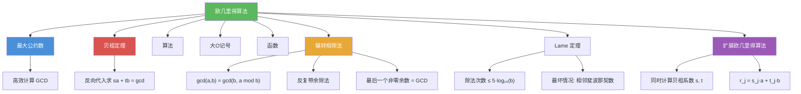

# 欧几里得算法

> [!abstract] 概述
> ==欧几里得算法（Euclidean Algorithm）==也称==辗转相除法==，是计算两个正整数最大公约数 $\gcd(a, b)$ 的高效算法。其核心是引理 $\gcd(a, b) = \gcd(b, a \bmod b)$：通过反复执行带余除法，将问题规模不断缩小，直到余数为 0，最后一个非零余数即为 GCD。算法只需 $O(\log b)$ 次除法（==Lame 定理==：除法次数不超过 $5 \cdot \log_{10} b$），总位运算复杂度为 $O(\log^2 b)$。欧几里得算法是已知最古老的算法之一，也是高效算法设计的经典范例。

## 定义

> [!def] 欧几里得算法的核心引理（Lemma 1）
>
> 设 $a = bq + r$，其中 $a, b, q, r$ 为整数，则
> $$\gcd(a, b) = \gcd(b, r)$$
>
> **证明**：只需证明 $\{a, b\}$ 的公因子集合与 $\{b, r\}$ 的公因子集合相同。
> - 若 $d \mid a$ 且 $d \mid b$，则 $d \mid (a - bq) = r$
> - 若 $d \mid b$ 且 $d \mid r$，则 $d \mid (bq + r) = a$
>
> 因此 $\gcd(a, b) = \gcd(b, r)$。

> [!def] 欧几里得算法（Algorithm 1: The Euclidean Algorithm）
>
> **输入**：正整数 $a, b$（设 $a \geq b$）
>
> **步骤**：反复应用带余除法
> $$r_0 = r_1 q_1 + r_2, \quad 0 \leq r_2 < r_1$$
> $$r_1 = r_2 q_2 + r_3, \quad 0 \leq r_3 < r_2$$
> $$\cdots$$
> $$r_{n-2} = r_{n-1} q_{n-1} + r_n, \quad 0 \leq r_n < r_{n-1}$$
> $$r_{n-1} = r_n q_n$$
>
> 其中 $r_0 = a$，$r_1 = b$。由 Lemma 1：
> $$\gcd(a, b) = \gcd(r_0, r_1) = \gcd(r_1, r_2) = \cdots = \gcd(r_{n-1}, r_n) = r_n$$
>
> **结论**：最后一个非零余数 $r_n$ 即为 $\gcd(a, b)$。

> [!def] Lame 定理
>
> 用欧几里得算法计算 $\gcd(a, b)$（$a \geq b$）所需的除法次数不超过 $5 \cdot \log_{10} b$，即不超过 $b$ 的十进制位数的 5 倍。
>
> - 最坏情况出现在 $a$ 和 $b$ 是==相邻的斐波那契数==时
> - 更精确的界：除法次数 $\leq \log_\phi(b) \times 5$，其中 $\phi = (1+\sqrt{5})/2$ 为黄金比例

## 核心性质

| 性质 | 描述 | 说明 |
|------|------|------|
| 核心引理 | $\gcd(a, b) = \gcd(b, a \bmod b)$ | Lemma 1，算法正确性的基础 |
| 除法次数 | $O(\log b)$ 次 | Lame 定理 |
| 位运算复杂度 | $O(\log^2 b)$ | 每次除法涉及 $O(\log b)$ 位数 |
| 最坏情况 | $a$ 和 $b$ 为相邻斐波那契数 | $\gcd(F_{n+1}, F_n) = 1$ 恰好需要 $n-1$ 次除法 |
| 无需素因子分解 | 直接通过带余除法计算 | 比素因子分解法高效得多 |
| 终止性保证 | 余数严格递减且非负 | 必在有限步内终止 |
| 历史地位 | 已知最古老的算法之一 | 公元前 300 年欧几里得《几何原本》 |

## 关系网络

- [[最大公约数]] 是欧几里得算法的计算目标：高效求 $\gcd(a, b)$
- [[贝祖定理]] 可通过欧几里得算法的反向代入（扩展欧几里得算法）来证明和计算
- [[算法]] 的框架为欧几里得算法提供了精确描述：有限性、确定性、有效性
- [[大O记号]] 用于量化欧几里得算法的效率：$O(\log b)$ 次除法
- [[函数]] 的视角：欧几里得算法实现了一个从 $\mathbb{Z}^+ \times \mathbb{Z}^+$ 到 $\mathbb{Z}^+$ 的函数

## 章节扩展

### 第4章：数论与密码学

欧几里得算法是第 4 章 4.3 节的核心算法：

- **4.3 素数与最大公约数**：欧几里得算法（Algorithm 1）、核心引理（Lemma 1）、Lame 定理的复杂度分析
- **4.3 扩展欧几里得算法**：在计算 GCD 的同时求出贝祖系数 $s, t$
- **4.4 解同余方程**：扩展欧几里得算法用于求模逆元，从而求解线性同余方程
- **4.5 密码学应用**：RSA 中用扩展欧几里得算法计算私钥 $d = e^{-1} \bmod \phi(n)$

### 第5章：归纳与递归

- **5.3 递归定义**：欧几里得算法具有自然的递归表述：$\gcd(a, b) = \gcd(b, a \bmod b)$（基础情形：$\gcd(a, 0) = a$）。Lamé定理的证明也使用了斐波那契数列的递归定义。

## 补充

> [!info] 欧几里得算法与斐波那契数列
>
> 欧几里得算法的效率分析是算法复杂度理论的经典案例。1845 年，法国数学家 ==Gabriel Lame== 证明了除法次数不超过 $\log_\phi(b) \times 5$，其中 $\phi = (1+\sqrt{5})/2$ 为黄金比例。最坏情况出现在 $a$ 和 $b$ 是==相邻的斐波那契数==时：$\gcd(F_{n+1}, F_n) = 1$ 恰好需要 $n-1$ 次除法。欧几里得算法是已知最古老的算法之一，记载于公元前 300 年欧几里得的《几何原本》（Book VII, Propositions 1-2）。该算法的优美之处在于：它将"求最大公约数"这一看似需要枚举所有公因子的问题，转化为简单的"反复取余"操作，体现了算法设计中"分而治之"和"问题归约"的核心思想。
>
> **学术来源**：Rosen, K. H. (2019). *Discrete Mathematics and Its Applications* (8th ed.). McGraw-Hill, Section 4.3.
>
> **参考链接**：Knuth, D. E. (1997). *The Art of Computer Programming* (Vol. 2, 3rd ed.). Addison-Wesley, Section 4.5.2.

## 参见

- [[最大公约数]] -- 欧几里得算法的计算目标，GCD 的定义与性质
- [[贝祖定理]] -- 通过扩展欧几里得算法（反向代入）求出 $\gcd(a,b) = sa + tb$
- [[算法]] -- 算法的定义与特性，欧几里得算法是经典范例
- [[大O记号]] -- 度量欧几里得算法效率的渐近记号，$O(\log b)$ 次除法
- [[函数]] -- 欧几里得算法作为从 $\mathbb{Z}^+ \times \mathbb{Z}^+$ 到 $\mathbb{Z}^+$ 的函数
