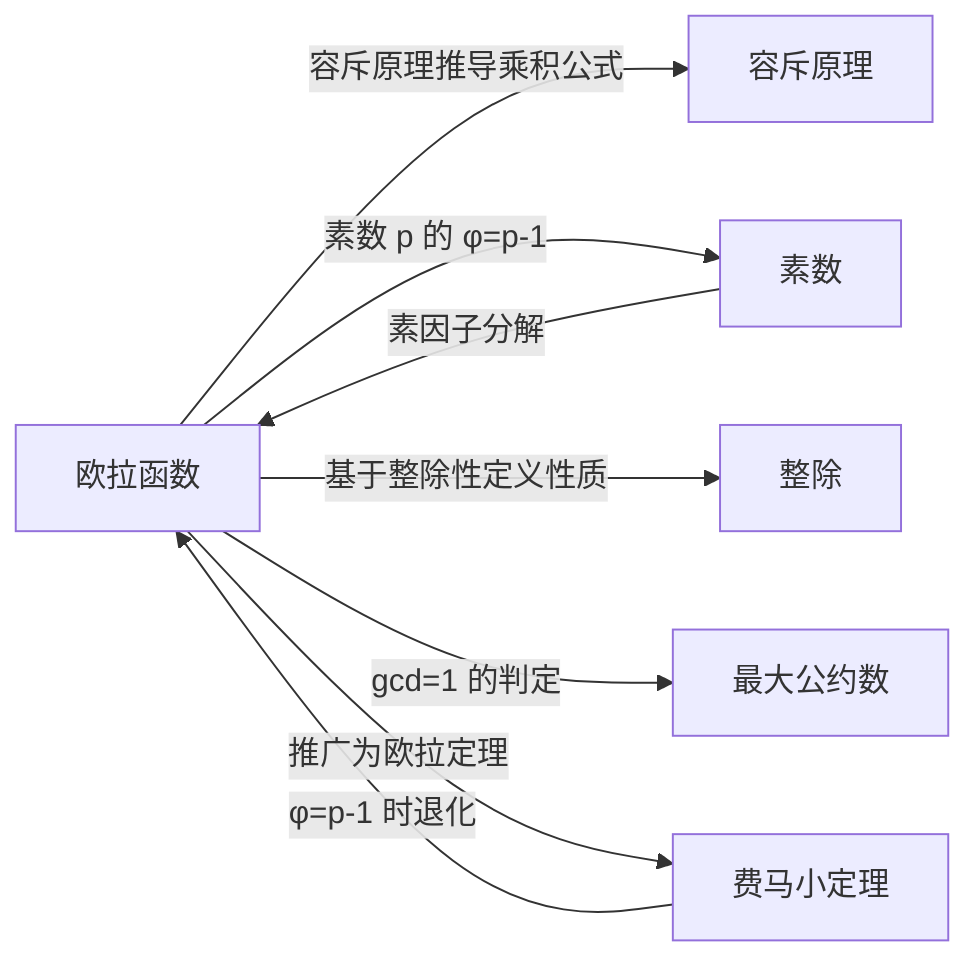

# 欧拉函数

> [!abstract]
> ==欧拉函数（Euler's Totient Function）== $\phi(n)$ 表示不超过 $n$ 且与 $n$ 互素的正整数个数。利用[[离散数学/concepts/容斥原理|容斥原理]]可以推导出其乘积公式 $\phi(n) = n\prod_{p|n}(1 - 1/p)$，该函数在数论和密码学中有核心地位，是[[离散数学/concepts/费马小定理|费马小定理]]到欧拉定理的推广基础。

## 定义

> [!def] 欧拉函数（Euler's Totient Function）
> 设 $n$ 为正整数，**欧拉函数** $\phi(n)$ 定义为不超过 $n$ 且与 $n$ 互素的正整数个数：
> $$\phi(n) = |\{k \in \mathbb{Z}^+ : 1 \leq k \leq n, \gcd(k, n) = 1\}|$$

> [!def] 欧拉函数的乘积公式
> 设 $n = p_1^{a_1} p_2^{a_2} \cdots p_k^{a_k}$ 为 $n$ 的素因子分解，则
> $$\phi(n) = n\left(1 - \frac{1}{p_1}\right)\left(1 - \frac{1}{p_2}\right) \cdots \left(1 - \frac{1}{p_k}\right) = n \prod_{p \mid n}\left(1 - \frac{1}{p}\right)$$

> [!def] 欧拉定理
> 若 $\gcd(a, n) = 1$，则 $a^{\phi(n)} \equiv 1 \pmod{n}$。
>
> 当 $n$ 为素数 $p$ 时，$\phi(p) = p - 1$，欧拉定理退化为[[离散数学/concepts/费马小定理|费马小定理]]：$a^{p-1} \equiv 1 \pmod{p}$。

## 核心性质

| 编号 | 性质 | 公式 / 说明 |
|:---:|------|------|
| P1 | **乘积公式** | $\phi(n) = n\displaystyle\prod_{p\mid n}\left(1 - \frac{1}{p}\right)$，$p$ 遍历 $n$ 的所有不同素因子 |
| P2 | **素数的欧拉函数** | 若 $p$ 为素数，则 $\phi(p) = p - 1$ |
| P3 | **素数幂** | $\phi(p^k) = p^k - p^{k-1} = p^k(1 - 1/p)$ |
| P4 | **积性函数** | 若 $\gcd(m, n) = 1$，则 $\phi(mn) = \phi(m)\phi(n)$ |
| P5 | **两素数乘积** | $\phi(pq) = (p-1)(q-1)$（$p, q$ 为不同素数） |
| P6 | **与费马小定理的关系** | 欧拉定理 $a^{\phi(n)} \equiv 1 \pmod{n}$ 是费马小定理的推广 |
| P7 | **求和恒等式** | $\displaystyle\sum_{d\mid n}\phi(d) = n$（对所有正因子 $d$ 求和） |

## 关系网络

## 章节扩展

- **容斥原理**：欧拉函数的乘积公式可通过[[离散数学/concepts/容斥原理|容斥原理]]的补集形式严格推导
- **素数**：[[离散数学/concepts/素数|素数]]的欧拉函数值 $\phi(p) = p - 1$ 是最简单的特殊情况
- **整除**：欧拉函数的定义依赖于[[离散数学/concepts/整除|整除]]性和素因子分解
- **最大公约数**：$\phi(n)$ 的定义核心是 $\gcd(k, n) = 1$，与[[离散数学/concepts/最大公约数|最大公约数]]直接相关
- **费马小定理**：[[离散数学/concepts/费马小定理|费马小定理]]是欧拉定理（$a^{\phi(n)} \equiv 1 \pmod{n}$）在 $n$ 为素数时的特例

## 补充

> [!info] 容斥原理推导乘积公式
> 设 $n = p_1^{a_1} p_2^{a_2} \cdots p_k^{a_k}$ 为 $n$ 的素因子分解。定义性质 $P_i$ 为"整数能被 $p_i$ 整除"（$i = 1, 2, \ldots, k$）。不超过 $n$ 且能被 $p_{i_1} p_{i_2} \cdots p_{i_m}$ 整除的整数有 $\frac{n}{p_{i_1} p_{i_2} \cdots p_{i_m}}$ 个（因为 $n$ 是这些素数的幂的乘积，所以整除结果为整数）。
>
> 由容斥原理的补集形式：
> $$\phi(n) = n - \sum_{i} \frac{n}{p_i} + \sum_{i<j} \frac{n}{p_i p_j} - \sum_{i<j<l} \frac{n}{p_i p_j p_l} + \cdots + (-1)^k \frac{n}{p_1 p_2 \cdots p_k}$$
>
> 因式分解即得乘积公式：
> $$\phi(n) = n\left(1 - \frac{1}{p_1}\right)\left(1 - \frac{1}{p_2}\right) \cdots \left(1 - \frac{1}{p_k}\right) = n \prod_{p \mid n}\left(1 - \frac{1}{p}\right)$$

> [!info] 计算示例
> - $\phi(12) = \phi(2^2 \cdot 3) = 12\left(1 - \frac{1}{2}\right)\left(1 - \frac{1}{3}\right) = 12 \cdot \frac{1}{2} \cdot \frac{2}{3} = 4$
>
> 验证：不超过12且与12互素的正整数为 1, 5, 7, 11，共4个。
>
> - $\phi(30) = \phi(2 \cdot 3 \cdot 5) = 30 \cdot \frac{1}{2} \cdot \frac{2}{3} \cdot \frac{4}{5} = 8$
>
> 验证：1, 7, 11, 13, 17, 19, 23, 29，共8个。
>
> - $\phi(pq)$（$p, q$ 为不同素数）$= pq\left(1 - \frac{1}{p}\right)\left(1 - \frac{1}{q}\right) = (p-1)(q-1)$

> [!info] RSA 密码系统中的应用
> 欧拉函数是 RSA 公钥密码系统的数学基础。在 RSA 中，选取两个大素数 $p$ 和 $q$，计算 $n = pq$ 和 $\phi(n) = (p-1)(q-1)$。公钥 $e$ 和私钥 $d$ 满足 $ed \equiv 1 \pmod{\phi(n)}$，从而保证加密解密的正确性。$\phi(n)$ 的难计算性（需要知道 $n$ 的素因子分解）是 RSA 安全性的基础。

## 参见

- [[离散数学/concepts/容斥原理]]：欧拉函数乘积公式的推导工具
- [[离散数学/concepts/素数]]：素数的欧拉函数值及素因子分解
- [[离散数学/concepts/整除]]：欧拉函数定义的基础——整除性与素因子
- [[离散数学/concepts/最大公约数]]：$\gcd(k, n) = 1$ 的判定
- [[离散数学/concepts/费马小定理]]：欧拉定理在素数模下的特例
