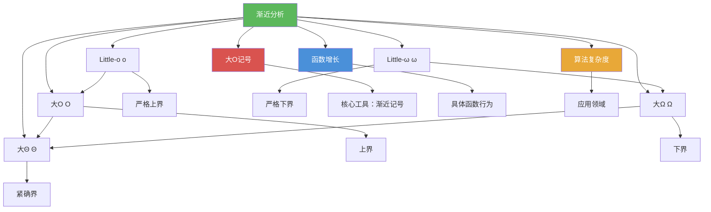

# 渐近分析

> [!abstract] 概述
> ==渐近分析（Asymptotic Analysis）==是一种通过==忽略常数因子和低阶项==，关注函数在自变量趋于无穷时的==增长趋势==来比较函数行为的方法论。渐近分析的核心工具是五种渐近记号：==大O（$O$）==、==大$\Omega$==、==大$\Theta$==、==Little-o（$o$）==和==Little-$\omega$==，它们分别提供上界、下界、紧确界、严格上界和严格下界的描述。渐近分析是==算法复杂度==比较的统一理论框架，使我们能够在不依赖具体硬件和实现细节的前提下评估算法的内在效率。

## 定义

> [!def] 渐近分析（Asymptotic Analysis）
>
> ==渐近分析==是研究函数在自变量趋于无穷时的行为的方法。其核心思想是：
>
> - ==忽略常数因子==：不同硬件平台和编程语言之间的常数差异可达 10-100 倍，但无法改变算法的渐近阶
> - ==忽略低阶项==：当 $n$ 足够大时，低阶项的影响被最高次项完全主导
> - ==关注增长趋势==：比较的是函数增长速率的"阶"，而非精确值
>
> 渐近分析使我们能够用简洁的数学语言回答核心问题：当输入规模趋于无穷时，算法的运行时间属于哪个增长阶？

> [!def] 五种渐近记号体系
>
> | 记号 | 名称 | 含义 | 数学定义 |
> |------|------|------|---------|
> | $O(g(x))$ | 大O（Big-O） | ==上界==：增长不超过 $g$ 的常数倍 | $\exists C, k, \forall x > k: \|f(x)\| \le C\|g(x)\|$ |
> | $\Omega(g(x))$ | 大Omega（Big-Omega） | ==下界==：增长不低于 $g$ 的常数倍 | $\exists C, k, \forall x > k: \|f(x)\| \ge C\|g(x)\|$ |
> | $\Theta(g(x))$ | 大Theta（Big-Theta） | ==紧确界==：与 $g$ 同阶增长 | $f = O(g)$ 且 $f = \Omega(g)$ |
> | $o(g(x))$ | Little-o | ==严格上界==：增长严格小于 $g$ | $\lim_{x \to \infty} \frac{f(x)}{g(x)} = 0$ |
> | $\omega(g(x))$ | Little-omega | ==严格下界==：增长严格大于 $g$ | $\lim_{x \to \infty} \frac{f(x)}{g(x)} = \infty$ |
>
> **蕴含关系**：
> - $f = o(g) \Rightarrow f = O(g)$，但反之不成立
> - $f = \omega(g) \Rightarrow f = \Omega(g)$，但反之不成立
> - $f = \Theta(g) \iff f = O(g)$ 且 $g = O(f)$

> [!def] 渐近分析在算法比较中的应用
>
> 渐近分析在算法比较中的核心价值：
>
> - **统一度量**：消除硬件和实现差异，提供跨平台的算法效率比较标准
> - **可扩展性预测**：通过增长阶预测算法在大规模输入下的表现
> - **算法分类**：将算法按复杂度分为常数 $O(1)$、对数 $O(\log n)$、线性 $O(n)$、线性对数 $O(n\log n)$、多项式 $O(n^b)$、指数 $O(b^n)$、阶乘 $O(n!)$ 等类别
> - **可行性判断**：指数复杂度和阶乘复杂度的算法在大规模输入下不可行，多项式复杂度（特别是 $O(n\log n)$ 及以下）是实际可用的

## 核心性质

| 性质 | 描述 | 公式/条件 |
|------|------|----------|
| 忽略常数因子 | 常数因子不影响渐近阶 | $C \cdot f(n) = \Theta(f(n))$（$C > 0$ 为常数） |
| 忽略低阶项 | 低阶项被高阶项主导 | $f(n) + o(f(n)) = \Theta(f(n))$ |
| 多项式阶唯一性 | 多项式的紧确界唯一 | $a_n x^n + \cdots + a_0 = \Theta(x^n)$（$a_n \neq 0$） |
| 传递性 | 渐近关系可传递 | $f = O(g)$ 且 $g = O(h)$ $\Rightarrow$ $f = O(h)$ |
| 对偶性 | 上下界互为对偶 | $f = \Omega(g)$ $\iff$ $g = O(f)$ |
| 对称性 | $\Theta$ 关系对称 | $f = \Theta(g)$ $\iff$ $g = \Theta(f)$ |
| 和的封闭性 | 同阶函数之和保持阶 | $f_1 = O(g)$，$f_2 = O(g)$ $\Rightarrow$ $f_1 + f_2 = O(g)$ |
| 积的封闭性 | 函数之积的阶为阶之积 | $f_1 = O(g_1)$，$f_2 = O(g_2)$ $\Rightarrow$ $f_1 \cdot f_2 = O(g_1 \cdot g_2)$ |
| 严格蕴含非严格 | Little-o 蕴含大O | $f = o(g)$ $\Rightarrow$ $f = O(g)$ |
| 紧确界的等价条件 | $\Theta$ 的多种等价定义 | $f = \Theta(g)$ $\iff$ $f = O(g)$ 且 $f = \Omega(g)$ $\iff$ $f = O(g)$ 且 $g = O(f)$ |

## 关系网络

- [[大O记号]] -- 渐近分析的核心工具，提供 $O$、$\Omega$、$\Theta$、$o$、$\omega$ 五种渐近记号的精确定义与运算规则
- [[函数增长]] -- 渐近分析的具体研究对象，提供常见增长函数的层级关系（$1 < \log n < n < n^2 < 2^n < n!$）
- [[算法复杂度]] -- 渐近分析的主要应用领域，通过渐近记号度量算法的时间复杂度和空间复杂度

## 章节扩展

### 第3章：算法

渐近分析是第 3 章的理论主线，贯穿 3.2 节和 3.3 节：

- **3.1 算法**：算法的伪代码描述与基本概念，定义了被分析的对象
- **3.2 函数的增长**：建立渐近分析的理论基础，系统介绍五种渐近记号的定义、性质与运算规则，以及常见增长函数的层级比较
- **3.3 算法复杂度分析**：将渐近分析应用于具体算法，通过最坏情况、平均情况和最好情况三种视角评估算法效率，并引入可解性、易解性、NP 完全等计算复杂性理论的基本概念

## 补充

> [!info] 渐近分析的理论意义与局限
>
> 渐近分析的理论意义在于提供了一种与硬件无关、与实现无关的算法效率度量方法。正如 Cormen 等人在《算法导论》（CLRS, 2009, Ch.3）中所强调的：渐近记号刻画的是"增长率的界"，而非精确运行时间。然而，渐近分析也有其局限性：(1) 当输入规模较小时，常数因子和低阶项的影响可能超过渐近阶的优势；(2) 渐近分析只关注最坏情况或平均情况，无法刻画特定输入下的精确行为；(3) 某些算法（如 Strassen 矩阵乘法）虽然渐近更优，但常数因子较大，实际加速仅在 $n$ 足够大时才显现。
>
> 在实际工程中，渐近分析应与 profiling 工具（如 Python 的 `cProfile`、C++ 的 `perf`）结合使用：先用渐近分析选择正确的算法，再用 profiling 定位实际瓶颈进行针对性优化。
>
> **学术来源**：
> - Rosen, K. H. (2019). *Discrete Mathematics and Its Applications* (8th ed.). McGraw-Hill. Section 3.2.
> - Cormen, T. H., Leiserson, C. E., Rivest, R. L., & Stein, C. (2009). *Introduction to Algorithms* (3rd ed.). MIT Press. Chapter 3.
> - Sedgewick, R. & Wayne, K. (2011). *Algorithms* (4th ed.). Addison-Wesley.

## 参见

- [[大O记号]] -- 渐近分析的核心工具，五种渐近记号（$O$、$\Omega$、$\Theta$、$o$、$\omega$）的定义与性质
- [[函数增长]] -- 渐近分析的具体研究对象，常见增长函数的层级关系与比较
- [[算法复杂度]] -- 渐近分析的主要应用领域，时间复杂度与空间复杂度的分析方法
