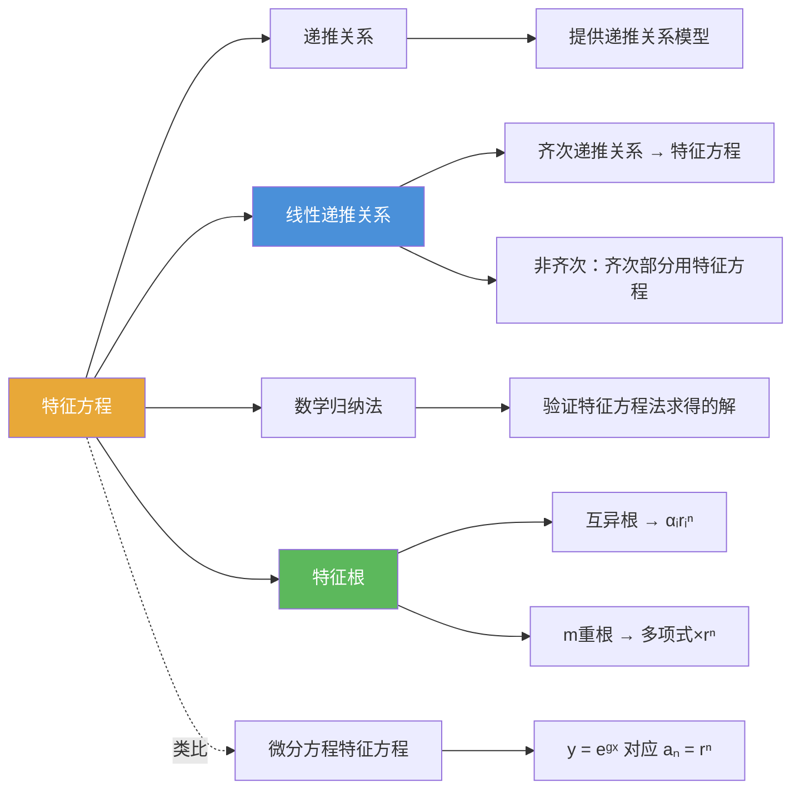

# 特征方程

> [!abstract] 概述
> ==特征方程（Characteristic Equation）==是将常系数线性齐次递推关系转化为代数方程的工具。通过假设解的形式为 $a_n = r^n$，将递推关系 $a_n = c_1 a_{n-1} + \cdots + c_k a_{n-k}$ 转化为关于 $r$ 的 $k$ 次多项式方程 $r^k - c_1 r^{k-1} - \cdots - c_k = 0$，从而将递推关系的求解问题转化为==多项式求根==问题。

## 定义

> [!def] 特征方程（Characteristic Equation）
>
> 对于阶为 $k$ 的常系数线性齐次递推关系
> $$a_n = c_1 a_{n-1} + c_2 a_{n-2} + \cdots + c_k a_{n-k}$$
>
> 假设解的形式为 $a_n = r^n$（$r \neq 0$），代入得：
> $$r^n = c_1 r^{n-1} + c_2 r^{n-2} + \cdots + c_k r^{n-k}$$
>
> 两边除以 $r^{n-k}$，整理得：
> $$r^k - c_1 r^{k-1} - c_2 r^{k-2} - \cdots - c_{k-1} r - c_k = 0$$
>
> 这个关于 $r$ 的 $k$ 次方程称为递推关系的==特征方程==，其解称为==特征根==（characteristic roots）。
>
> 关键性质：==线性齐次递推关系解的线性组合仍为解==。即若 $\{s_n\}$ 和 $\{t_n\}$ 都是解，则 $\{b_1 s_n + b_2 t_n\}$ 也是解（$b_1, b_2$ 为常数）。这一性质是特征方程法有效的根本原因。

> [!def] 特征根（Characteristic Roots）
>
> 特征方程的解 $r_1, r_2, \ldots$ 称为==特征根==。特征根的性质决定了通解的形式：
> - **互异根** $r_i$：每个根贡献一项 $\alpha_i r_i^n$
> - **$m$ 重根** $r$：贡献 $m$ 项 $(\alpha_0 + \alpha_1 n + \cdots + \alpha_{m-1} n^{m-1}) r^n$

## 核心性质

| 性质 | 描述 | 说明 |
|------|------|------|
| ==构造方法== | 将 $a_n = r^n$ 代入递推关系，除以 $r^{n-k}$ | 系数符号取反：$r^k - c_1 r^{k-1} - \cdots - c_k = 0$ |
| ==互异根通解== | $a_n = \alpha_1 r_1^n + \alpha_2 r_2^n + \cdots + \alpha_k r_k^n$ | 由初始条件确定 $\alpha_1, \ldots, \alpha_k$ |
| ==重根通解== | $m$ 重根 $r$ 贡献 $(\alpha_0 + \alpha_1 n + \cdots + \alpha_{m-1} n^{m-1}) r^n$ | 与微分方程中 $e^{rx}, xe^{rx}, \ldots$ 完全类似 |
| ==线性组合性质== | 解的线性组合仍为解 | 这是特征方程法有效的根本保证 |
| ==符号易错== | 特征方程系数符号与递推关系相反 | $a_n = c_1 a_{n-1} + c_2 a_{n-2}$ 对应 $r^2 - c_1 r - c_2 = 0$ |
| ==与微分方程类比== | 递推 $r^n$ 对应微分 $e^{rx}$，结构高度平行 | 两者都是通过指数函数的线性组合构造解空间 |

## 关系网络

- [[离散数学/concepts/递推关系]] 是特征方程的适用对象，特征方程为线性递推关系提供系统化求解方法
- [[离散数学/concepts/线性递推关系]] 的齐次部分通过特征方程求解，非齐次部分在齐次通解基础上叠加特解
- [[离散数学/concepts/数学归纳法]] 用于验证由特征方程法求得的显式公式的正确性

## 章节扩展

### 第8章：高级计数技术 — 8.2节核心工具

特征方程是8.2节求解线性递推关系的核心工具。其求解步骤如下：

**第一步：写出特征方程**

将递推关系 $a_n = c_1 a_{n-1} + \cdots + c_k a_{n-k}$ 转化为特征方程 $r^k - c_1 r^{k-1} - \cdots - c_k = 0$。注意系数符号取反。

**第二步：求特征根**

通过因式分解或求根公式确定特征方程的所有根及其重数。

**第三步：根据特征根写出通解形式**

- **互异根**（Theorem 1/3）：$k$ 个互异根 $r_1, \ldots, r_k$ 对应通解 $a_n = \alpha_1 r_1^n + \cdots + \alpha_k r_k^n$
- **重根**（Theorem 2/4）：$m$ 重根 $r$ 贡献 $(\alpha_0 + \alpha_1 n + \cdots + \alpha_{m-1} n^{m-1}) r^n$

**第四步：代入初始条件确定待定常数**

将初始条件代入通解形式，解线性方程组确定所有 $\alpha$ 值。

**经典示例——斐波那契数列的 Binet 公式**：

递推关系 $f_n = f_{n-1} + f_{n-2}$，特征方程 $r^2 - r - 1 = 0$，特征根 $r_1 = \frac{1+\sqrt{5}}{2}$（黄金比例 $\varphi$），$r_2 = \frac{1-\sqrt{5}}{2}$。代入初始条件 $f_0 = 0, f_1 = 1$，解得 Binet 公式：

$$f_n = \frac{1}{\sqrt{5}}\left(\frac{1+\sqrt{5}}{2}\right)^n - \frac{1}{\sqrt{5}}\left(\frac{1-\sqrt{5}}{2}\right)^n$$

## 补充

> [!info] 特征方程法与微分方程的类比
>
> 常系数线性递推关系的特征方程法与常系数线性微分方程的求解方法高度类似：
>
> | | 递推关系 | 微分方程 |
> |---|---------|---------|
> | 基本形式 | $a_n = c_1 a_{n-1} + \cdots + c_k a_{n-k}$ | $y^{(k)} = c_1 y^{(k-1)} + \cdots + c_k y$ |
> | 试解形式 | $a_n = r^n$ | $y = e^{rx}$ |
> | 特征方程 | $r^k - c_1 r^{k-1} - \cdots - c_k = 0$ | $r^k - c_1 r^{k-1} - \cdots - c_k = 0$ |
> | 互异根通解 | $\sum \alpha_i r_i^n$ | $\sum C_i e^{r_i x}$ |
> | 重根处理 | $r^n, nr^n, n^2 r^n, \ldots$ | $e^{rx}, xe^{rx}, x^2 e^{rx}, \ldots$ |
> | 非齐次 | 特解 + 齐次通解 | 特解 + 齐次通解 |
>
> 这种类比有助于理解方法的本质：两者都是通过"指数函数/幂函数"的线性组合来构造解空间。

> [!info] 特征方程的符号易错点
>
> 将递推关系 $a_n = c_1 a_{n-1} + c_2 a_{n-2}$ 转化为特征方程时，正确写法是 $r^2 - c_1 r - c_2 = 0$（系数取反），而非 $r^2 + c_1 r + c_2 = 0$。规则：将所有项移到左边，$a_n$ 的系数为 $1$，其余项系数取反。

## 参见

- [[离散数学/concepts/递推关系]] — 特征方程的适用对象
- [[离散数学/concepts/线性递推关系]] — 线性递推关系的完整理论，包含齐次与非齐次情形
- [[离散数学/concepts/数学归纳法]] — 验证特征方程法求得的解的正确性
