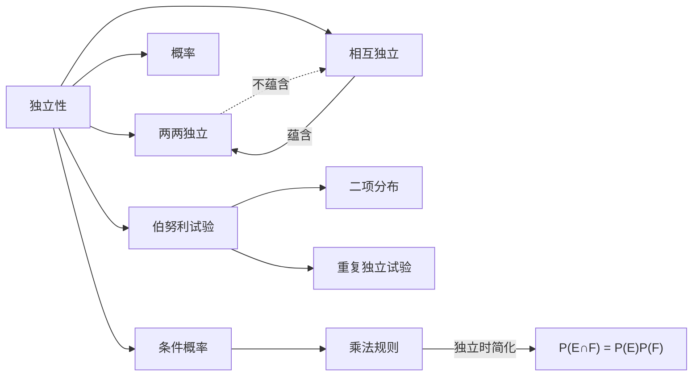

# 独立性

> [!abstract]
> ==独立性（Independence）==描述两个事件之间"互不影响"的关系：一个事件的发生与否不改变另一个事件发生的概率。独立性是概率论中最核心的结构性假设之一，它极大地简化了联合概率的计算，是[[离散数学/concepts/伯努利试验]]等概率模型的理论基础。

## 定义

> [!def] 两个事件的独立性
> 设 $E$ 和 $F$ 是[[样本空间]] $S$ 上的两个事件。若满足
> $$P(E \cap F) = P(E) \cdot P(F)$$
> 则称 $E$ 和 $F$ 是**独立事件**（independent events）。
>
> **等价条件**（当 $P(F) > 0$ 时）：
> $$P(E \mid F) = P(E)$$
>
> 即：$F$ 的发生不改变 $E$ 发生的概率。对称地，当 $P(E) > 0$ 时也有 $P(F \mid E) = P(F)$。

> [!def] 两两独立与相互独立
> 设 $E_1, E_2, \ldots, E_n$ 是 $n$ 个事件：
>
> **两两独立（Pairwise Independent）**：任意两个事件独立，即对所有 $i \neq j$，
> $$P(E_i \cap E_j) = P(E_i) \cdot P(E_j)$$
>
> **相互独立（Mutually Independent）**：任意子集的交集概率等于各事件概率的乘积，即对任意 $1 \leq i_1 < i_2 < \cdots < i_k \leq n$，
> $$P(E_{i_1} \cap E_{i_2} \cap \cdots \cap E_{i_k}) = P(E_{i_1}) \cdot P(E_{i_2}) \cdots P(E_{i_k})$$
>
> **重要**：相互独立 $\Rightarrow$ 两两独立，但两两独立 $\not\Rightarrow$ 相互独立。

> [!def] 独立事件的概率计算
> 若 $E_1, E_2, \ldots, E_n$ 相互独立，则：
> - **全部发生的概率**：
> $$P(E_1 \cap E_2 \cap \cdots \cap E_n) = \prod_{i=1}^{n} P(E_i)$$
> - **全部不发生的概率**：
> $$P(\bar{E}_1 \cap \bar{E}_2 \cap \cdots \cap \bar{E}_n) = \prod_{i=1}^{n} P(\bar{E}_i) = \prod_{i=1}^{n} (1 - P(E_i))$$
> - **至少一个发生的概率**：
> $$P\left(\bigcup_{i=1}^{n} E_i\right) = 1 - \prod_{i=1}^{n} (1 - P(E_i))$$

## 核心性质

| 编号 | 性质名称 | 数学表达 | 说明 |
|:---:|:---:|:---:|:---|
| 1 | 独立与条件概率等价 | $P(E \cap F) = P(E)P(F) \Leftrightarrow P(E \mid F) = P(E)$（$P(F)>0$） | 独立意味着条件概率等于无条件概率 |
| 2 | 补事件独立性 | $E$ 与 $F$ 独立 $\Leftrightarrow$ $E$ 与 $\bar{F}$ 独立 $\Leftrightarrow$ $\bar{E}$ 与 $F$ 独立 | 独立性在取补运算下保持 |
| 3 | 独立事件的交 | $E$ 与 $F$ 独立且 $E$ 与 $G$ 独立 $\not\Rightarrow$ $E$ 与 $(F \cap G)$ 独立 | 两两独立不能自动推广 |
| 4 | 必然/不可能事件 | 若 $P(E) = 0$ 或 $P(E) = 1$，则 $E$ 与任意事件独立 | 概率为 0 或 1 的事件与一切事件独立 |
| 5 | 互斥与独立的关系 | 若 $P(E) > 0$ 且 $P(F) > 0$，则 $E$ 与 $F$ 互斥 $\Rightarrow$ $E$ 与 $F$ 不独立 | 互斥事件（概率均正时）不是独立事件 |
| 6 | 相互独立可分解 | 相互独立的事件组中，任意子集也相互独立 | 相互独立具有"遗传性" |

## 关系网络

## 章节扩展

- **第7.2节**：独立性的定义、判定与应用
- **第7.2节**：[[离散数学/concepts/伯努利试验]] — 独立重复试验的最重要模型
- **第7.4节**：独立随机变量的期望与方差性质（$E(XY) = E(X)E(Y)$）

## 补充

> [!info] 独立性不传递
> 独立性**不具有传递性**：即使 $E$ 与 $F$ 独立，$F$ 与 $G$ 独立，也不能推出 $E$ 与 $G$ 独立。
>
> **反例**：设均匀掷两枚公平硬币，定义事件：
> - $E$ = 第一枚为正面
> - $F$ = 两枚结果相同
> - $G$ = 第二枚为正面
>
> 可以验证 $E$ 与 $F$ 独立，$F$ 与 $G$ 独立，但 $E$ 与 $G$ 也独立（此例恰好三者两两独立）。然而通过构造更复杂的例子，可以找到 $E$ 与 $F$ 独立、$F$ 与 $G$ 独立，但 $E$ 与 $G$ **不独立**的情形。

> [!info] 两两独立不蕴含相互独立的经典反例
> 设均匀掷一枚公平骰子，定义事件：
> - $E_1$ = 结果为 $\{1,2,3,4\}$（偶数或 1、3）
> - $E_2$ = 结果为 $\{1,3,5,6\}$
> - $E_3$ = 结果为 $\{1,2,5,6\}$
>
> 可以验证 $P(E_1) = P(E_2) = P(E_3) = 2/3$，且 $P(E_i \cap E_j) = 1/3 = (2/3)^2$，故两两独立。
> 但 $P(E_1 \cap E_2 \cap E_3) = P(\{1\}) = 1/6 \neq (2/3)^3 = 8/27$，故不相互独立。

## 参见

- [[离散数学/concepts/条件概率]] — 独立性的定义依赖于条件概率的概念
- [[离散数学/concepts/概率]] — 独立性是概率乘法简化的前提
- [[离散数学/concepts/伯努利试验]] — 独立性假设下的核心概率模型
