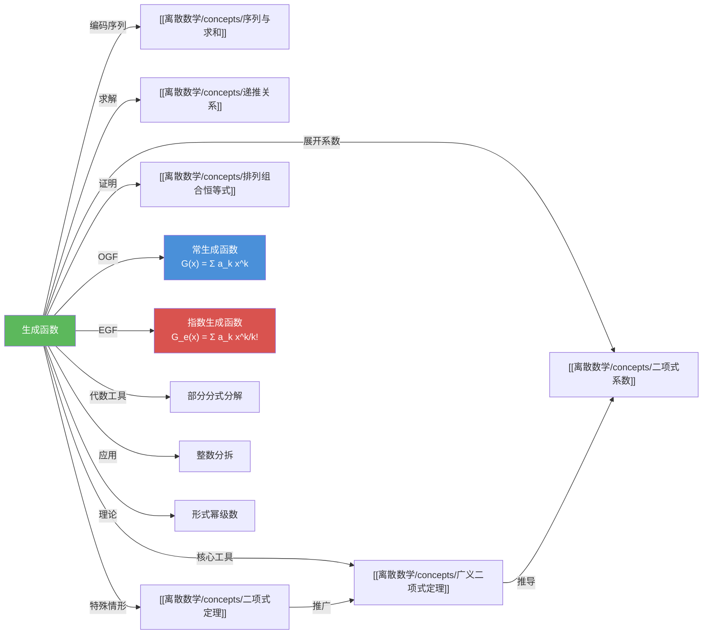

# 生成函数

> [!abstract]
> ==生成函数（Generating Function）==将序列 $\{a_k\}$ 的各项编码为形式幂级数 $G(x) = \sum_{k=0}^{\infty} a_k x^k$ 的系数，从而将计数问题转化为代数问题。通过幂级数的加法、乘法、求导等运算，可以解决组合计数、[[离散数学/concepts/递推关系]]求解和[[离散数学/concepts/排列组合恒等式]]证明等问题。核心工具包括[[离散数学/concepts/广义二项式定理]]和部分分式分解。

## 定义

> [!def] 常生成函数（Ordinary Generating Function, OGF）
> 实数序列 $\{a_k\}_{k=0}^{\infty}$ 的==生成函数==是无穷级数
>
> $$G(x) = \sum_{k=0}^{\infty} a_k x^k = a_0 + a_1 x + a_2 x^2 + \cdots$$
>
> 对于有限序列 $a_0, a_1, \ldots, a_n$，通过令 $a_{n+1} = a_{n+2} = \cdots = 0$ 将其扩展为无穷序列，其生成函数为多项式：
>
> $$G(x) = a_0 + a_1 x + \cdots + a_n x^n$$
>
> 在组合数学中，生成函数被当作==形式幂级数==（formal power series）处理，$x$ 只是一个占位符，其作用是将序列的项编码为系数，无需关心收敛性。

> [!def] 生成函数的运算规则（Theorem 1）
> 设 $f(x) = \sum_{k=0}^{\infty} a_k x^k$ 和 $g(x) = \sum_{k=0}^{\infty} b_k x^k$，则
>
> **加法**：$f(x) + g(x) = \sum_{k=0}^{\infty} (a_k + b_k) x^k$
>
> **乘法**（Cauchy 乘积 / 卷积）：
>
> $$f(x) \cdot g(x) = \sum_{k=0}^{\infty} \left(\sum_{j=0}^{k} a_j b_{k-j}\right) x^k$$
>
> 乘法公式表明：两个生成函数乘积的第 $k$ 个系数，等于两个序列前 $k+1$ 项的==卷积==。

> [!def] 指数生成函数（Exponential Generating Function, EGF）
> 序列 $\{a_n\}_{n=0}^{\infty}$ 的==指数生成函数==是
>
> $$G_e(x) = \sum_{n=0}^{\infty} a_n \frac{x^n}{n!}$$
>
> EGF 的乘法对应于==排列的复合==（有序选择），适用于排列计数等场景。经验法则：如果问题涉及"选若干个"（组合），用 OGF；如果涉及"排列"或"标签分配"，用 EGF。

## 核心性质

### 核心幂级数公式表

| 编号 | 生成函数 $G(x)$ | 展开式 $\sum a_k x^k$ | 系数 $a_k$ |
|:---:|:--|:--|:--|
| 1 | $(1+x)^n$ | $\sum_{k=0}^{n} C(n,k) x^k$ | $C(n,k)$ |
| 2 | $\dfrac{1}{1-x}$ | $\sum_{k=0}^{\infty} x^k$ | $1$ |
| 3 | $\dfrac{1}{1-ax}$ | $\sum_{k=0}^{\infty} a^k x^k$ | $a^k$ |
| 4 | $\dfrac{1}{(1-x)^2}$ | $\sum_{k=0}^{\infty} (k+1) x^k$ | $k+1$ |
| 5 | $\dfrac{1}{(1-x)^n}$ | $\sum_{k=0}^{\infty} C(n+k-1,k) x^k$ | $C(n+k-1, k)$ |
| 6 | $\dfrac{1}{(1+x)^n}$ | $\sum_{k=0}^{\infty} (-1)^k C(n+k-1,k) x^k$ | $(-1)^k C(n+k-1, k)$ |
| 7 | $\dfrac{1}{(1-ax)^n}$ | $\sum_{k=0}^{\infty} C(n+k-1,k) a^k x^k$ | $C(n+k-1, k) a^k$ |
| 8 | $e^x$ | $\sum_{k=0}^{\infty} \dfrac{x^k}{k!}$ | $1/k!$ |
| 9 | $\ln(1+x)$ | $\sum_{k=1}^{\infty} \dfrac{(-1)^{k+1}}{k} x^k$ | $(-1)^{k+1}/k$ |

### 计数问题的因式对应关系

| 约束条件 | 对应因式 | 说明 |
|---------|---------|------|
| 可选 $0, 1, 2, \ldots$ 个（无上限） | $\dfrac{1}{1-x} = 1 + x + x^2 + \cdots$ | 最常见的情况 |
| 可选 $0$ 或 $1$ 个 | $1 + x$ | 每种物品至多选一个 |
| 至少选 $1$ 个 | $\dfrac{x}{1-x} = x + x^2 + x^3 + \cdots$ | 每种物品必须选 |
| 可选 $a$ 到 $b$ 个 | $x^a + x^{a+1} + \cdots + x^b$ | 有上下限约束 |

## 关系网络

## 章节扩展

### 第08章 高级计数技术 -- 8.4 生成函数

生成函数是 8.4 节的核心主题，涵盖以下内容：

### 用生成函数解决计数问题

核心思路是"编码-代数-解码"三步法：
1. **编码**：将每种选择用一个多项式因式表示，$x^e$ 的系数表示选择 $e$ 个该类物品的方式数
2. **代数**：将所有因式相乘，利用代数工具求出乘积的闭式
3. **解码**：从闭式中提取目标幂次的系数，即为答案

**典型应用**：
- 方程解的计数：$e_1 + e_2 + e_3 = 17$（有上下界约束）$\to$ 构造因式乘积，提取 $x^{17}$ 的系数
- 分配问题：将 8 个相同饼干分给 3 个不同孩子（每人 2-4 个）$\to$ $G(x) = (x^2+x^3+x^4)^3$，提取 $x^8$ 的系数
- 允许重复的组合数：$G(x) = (1-x)^{-n}$，由[[离散数学/concepts/广义二项式定理]]得系数 $C(n+r-1, r)$

### 用生成函数求解递推关系

1. 设 $G(x) = \sum_{k=0}^{\infty} a_k x^k$ 为序列的生成函数
2. 将递推关系两边乘以 $x^k$ 并求和，利用递推关系消去部分项
3. 解关于 $G(x)$ 的方程，得到 $G(x)$ 的闭式（有理函数形式）
4. 将 $G(x)$ 用部分分式分解展开为幂级数，提取系数 $a_k$

**示例**：$a_k = 3a_{k-1} + 2$，$a_0 = 1$ $\to$ $G(x) = \frac{1+x}{(1-x)(1-3x)}$ $\to$ 部分分式分解 $\to$ $a_k = 2 \cdot 3^k - 1$

### 用生成函数证明组合恒等式

找到同一个生成函数的两种展开方式，比较同次幂的系数即可证明恒等式。例如 $(1+x)^{2n} = [(1+x)^n]^2$ 中 $x^n$ 的系数，既等于 $C(2n,n)$，又等于 $\sum_{k=0}^{n} C(n,k)^2$，由此证明 $\sum_{k=0}^{n} C(n,k)^2 = C(2n,n)$。

## 补充

> [!info] 生成函数为什么有效
> 生成函数的威力在于它将==计数问题==转化为==代数问题==。复杂的约束条件被自然地编码为多项式的因式结构，而幂级数的乘法自动处理了"不同选择之间的组合"这一计数核心操作。这种方法的理论基础可追溯到 18 世纪 Euler 对整数分拆问题的研究，后经 Laplace 在概率论中的应用而广泛传播。现代组合数学中，生成函数是核心工具之一（Wilf, 2006, *generatingfunctionology*）。

> [!info] 常生成函数 vs 指数生成函数
> | 特性 | 常生成函数 OGF | 指数生成函数 EGF |
> |:--|:--|:--|
> | 定义 | $G(x) = \sum a_n x^n$ | $G_e(x) = \sum a_n \frac{x^n}{n!}$ |
> | 乘法含义 | 无序选择（组合） | 有序选择（排列） |
> | 典型应用 | 组合计数、方程解数 | 排列计数、分配问题 |
> | 核心公式 | $\frac{1}{(1-x)^n}$ | $e^{nx}$ |

## 参见

- [[离散数学/concepts/递推关系]] -- 生成函数可用于求解递推关系
- [[离散数学/concepts/广义二项式定理]] -- 生成函数核心公式的推导基础
- [[离散数学/concepts/二项式系数]] -- 生成函数展开中的核心系数
- [[离散数学/concepts/二项式定理]] -- 广义二项式定理的正整数特例
- [[离散数学/concepts/排列组合恒等式]] -- 可用生成函数证明的恒等式
- [[离散数学/concepts/序列与求和]] -- 生成函数所编码的对象
