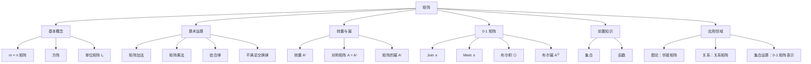

# 矩阵

> [!abstract] 概述
> ==矩阵==（matrix）是按行和列排列的==矩形数组==，是离散数学中表示集合元素间关系的核心工具。矩阵加法要求==同型==，矩阵乘法要求左矩阵的列数等于右矩阵的行数，且==不满足交换律==。==转置矩阵==通过互换行列得到，满足三大性质：对合性、和的转置、积的转置（顺序反转）。==0-1 矩阵==的布尔运算（Join $\vee$、Meet $\wedge$、布尔积 $\odot$）是图论中==邻接矩阵==与路径计数的基础。

## 定义

> [!def] 矩阵（Matrix）
>
> ==矩阵==是一个==矩形阵列==（rectangular array）的数。一个有 $m$ 行 $n$ 列的矩阵称为 $m \times n$ 矩阵，其第 $(i,j)$ 处的元素记为 $a_{ij}$，简记 $\mathbf{A} = [a_{ij}]$。行数等于列数的矩阵称为==方阵==（square matrix）。两个矩阵==相等==当且仅当它们同型且所有对应元素相等。

> [!def] 矩阵加法
>
> 设 $\mathbf{A} = [a_{ij}]$ 和 $\mathbf{B} = [b_{ij}]$ 都是 $m \times n$ 矩阵，则==和== $\mathbf{A} + \mathbf{B} = [a_{ij} + b_{ij}]$，通过对应位置元素相加得到。不同大小的矩阵不能相加。

> [!def] 矩阵乘法
>
> 设 $\mathbf{A}$ 是 $m \times k$ 矩阵，$\mathbf{B}$ 是 $k \times n$ 矩阵，则==积== $\mathbf{AB}$ 是 $m \times n$ 矩阵，其 $(i,j)$ 处元素为：
>
> $$c_{ij} = \sum_{l=1}^{k} a_{il} b_{lj}$$
>
> 即 $\mathbf{A}$ 的第 $i$ 行与 $\mathbf{B}$ 的第 $j$ 列的==点积==。矩阵乘法**仅当** $\mathbf{A}$ 的列数等于 $\mathbf{B}$ 的行数时有定义。

> [!def] 单位矩阵（Identity Matrix）
>
> $n$ 阶==单位矩阵== $\mathbf{I}_n = [\delta_{ij}]$，其中 $\delta_{ij}$ 是 Kronecker delta：
>
> $$\delta_{ij} = \begin{cases} 1 & \text{若 } i = j \\ 0 & \text{若 } i \neq j \end{cases}$$
>
> 单位矩阵是矩阵乘法的"单位元"：$\mathbf{A}\mathbf{I}_n = \mathbf{I}_m\mathbf{A} = \mathbf{A}$（$\mathbf{A}$ 为 $m \times n$ 矩阵）。

> [!def] 转置矩阵（Transpose）
>
> 设 $\mathbf{A} = [a_{ij}]$ 是 $m \times n$ 矩阵，则==转置== $\mathbf{A}^t$ 是 $n \times m$ 矩阵，通过互换行和列得到：$(\mathbf{A}^t)_{ij} = a_{ji}$。若 $\mathbf{A} = \mathbf{A}^t$，则称 $\mathbf{A}$ 为==对称矩阵==（symmetric matrix）。

> [!def] 0-1 矩阵（Zero-One Matrix）
>
> ==0-1 矩阵==是所有元素都等于 0 或 1 的矩阵，常用于表示离散结构。基于布尔运算 $\wedge$（与）和 $\vee$（或）定义：
>
> - ==Join==：$\mathbf{A} \vee \mathbf{B} = [a_{ij} \vee b_{ij}]$
> - ==Meet==：$\mathbf{A} \wedge \mathbf{B} = [a_{ij} \wedge b_{ij}]$
> - ==布尔积==：$(\mathbf{A} \odot \mathbf{B})_{ij} = \bigvee_{l=1}^{k}(a_{il} \wedge b_{lj})$
> - ==布尔幂==：$\mathbf{A}^{[r]} = \underbrace{\mathbf{A} \odot \mathbf{A} \odot \cdots \odot \mathbf{A}}_{r \text{ 个因子}}$

## 核心性质

| 性质 | 公式/规则 | 说明 |
|:-----|:----------|:-----|
| ==矩阵加法== | $(\mathbf{A}+\mathbf{B})_{ij} = a_{ij} + b_{ij}$ | 要求 $\mathbf{A}, \mathbf{B}$ 同型 |
| ==矩阵乘法== | $(\mathbf{AB})_{ij} = \sum_{l} a_{il} b_{lj}$ | $\mathbf{A}$ 的列数 $=$ $\mathbf{B}$ 的行数 |
| ==乘法维度== | $(m \times k)(k \times n) = m \times n$ | 中间维度必须匹配 |
| ==乘法结合律== | $\mathbf{A}(\mathbf{BC}) = (\mathbf{AB})\mathbf{C}$ | 成立 |
| ==乘法不满足交换律== | $\mathbf{AB} \neq \mathbf{BA}$（一般） | 即使两者都有定义 |
| ==矩阵的幂== | $\mathbf{A}^r = \underbrace{\mathbf{A} \cdots \mathbf{A}}_{r}$，$\mathbf{A}^0 = \mathbf{I}_n$ | 仅对方阵定义 |
| ==转置对合性== | $(\mathbf{A}^t)^t = \mathbf{A}$ | 转置两次还原 |
| ==和的转置== | $(\mathbf{A}+\mathbf{B})^t = \mathbf{A}^t + \mathbf{B}^t$ | 逐元素操作 |
| ==积的转置== | $(\mathbf{AB})^t = \mathbf{B}^t \mathbf{A}^t$ | 注意顺序反转 |
| ==对称矩阵== | $\mathbf{A} = \mathbf{A}^t$，即 $a_{ij} = a_{ji}$ | 关于主对角线对称 |
| ==Join== | $(\mathbf{A} \vee \mathbf{B})_{ij} = a_{ij} \vee b_{ij}$ | 0-1 矩阵的布尔或 |
| ==Meet== | $(\mathbf{A} \wedge \mathbf{B})_{ij} = a_{ij} \wedge b_{ij}$ | 0-1 矩阵的布尔与 |
| ==布尔积== | $(\mathbf{A} \odot \mathbf{B})_{ij} = \bigvee_l (a_{il} \wedge b_{lj})$ | 用 $\vee$ 替代加法，$\wedge$ 替代乘法 |
| ==布尔幂== | $\mathbf{A}^{[r]}$ 的 $(i,j)$ 元素为 1 $\Leftrightarrow$ 长度 $r$ 的路径存在 | 图论路径计数 |

## 关系网络

- **前置知识**：[[集合]]（矩阵表示集合元素间的关系）、[[函数]]（矩阵乘法是线性变换的复合）、[[集合运算]]（0-1 矩阵的 Join/Meet 对应并/交运算）
- **核心关联**：0-1 矩阵的布尔幂 $\mathbf{A}^{[r]}$ 的 $(i,j)$ 元素为 1 表示图中顶点 $i$ 到顶点 $j$ 存在长度为 $r$ 的路径
- **后继概念**：邻接矩阵（第9章图论）、关系矩阵（第9章关系）

## 章节扩展

### 第2章：基本结构

矩阵是 Rosen 第8版第2章第2.6节的核心内容，为后续图论（第9章）中邻接矩阵和关系矩阵的讨论奠定基础。

**矩阵乘法的维度分析**：$m \times k$ 矩阵乘以 $k \times n$ 矩阵得 $m \times n$ 矩阵。若 $\mathbf{A}$ 是 $m \times n$，$\mathbf{B}$ 是 $r \times s$，则 $\mathbf{AB}$ 有定义当且仅当 $n = r$；$\mathbf{BA}$ 有定义当且仅当 $s = m$；两者都有定义且同型当且仅当 $m = n = r = s$（同阶方阵）。

**转置的三大性质**：
1. $(\mathbf{A}^t)^t = \mathbf{A}$（对合性）
2. $(\mathbf{A} + \mathbf{B})^t = \mathbf{A}^t + \mathbf{B}^t$（和的转置）
3. $(\mathbf{AB})^t = \mathbf{B}^t \mathbf{A}^t$（积的转置，注意顺序反转）

**0-1 矩阵与图论**：给定 $n$ 个顶点的图 $G$，其邻接矩阵 $\mathbf{A}$ 是 $n \times n$ 的 0-1 矩阵，$a_{ij} = 1$ 当且仅当存在从顶点 $i$ 到顶点 $j$ 的边。布尔幂 $\mathbf{A}^{[r]}$ 的 $(i,j)$ 元素为 1 表示存在长度为 $r$ 的路径。进一步地，$\mathbf{A} \vee \mathbf{A}^{[2]} \vee \cdots \vee \mathbf{A}^{[n-1]}$ 可判断图的连通性。

### 第9章：关系

- **9.3 零一矩阵表示关系**：设 $R$ 是从 $A = \{a_1, \ldots, a_m\}$ 到 $B = \{b_1, \ldots, b_n\}$ 的关系，则 $R$ 可以用 $m \times n$ 的==零一矩阵== $\mathbf{M}_R$ 表示，其中 $m_{ij} = 1$ 当且仅当 $(a_i, b_j) \in R$。零一矩阵使得关系的复合、逆关系等运算可以通过矩阵的布尔运算来实现：
  - **复合关系**：$\mathbf{M}_{S \circ R} = \mathbf{M}_R \odot \mathbf{M}_S$（布尔积）
  - **逆关系**：$\mathbf{M}_{R^{-1}} = \mathbf{M}_R^t$（==矩阵转置==）
  - **关系的并/交**：$\mathbf{M}_{R \cup S} = \mathbf{M}_R \vee \mathbf{M}_S$，$\mathbf{M}_{R \cap S} = \mathbf{M}_R \wedge \mathbf{M}_S$

  矩阵转置与逆关系的对应关系是这一节的核心洞察：转置矩阵 $\mathbf{A}^t$ 的 $(i,j)$ 元素为 $a_{ji}$，恰好对应逆关系 $R^{-1}$ 中 $(b_j, a_i) \in R^{-1}$ 当且仅当 $(a_i, b_j) \in R$。

### 第10章：图论

> [!info] 邻接矩阵在图论中的应用
> 在第10章图论中，矩阵成为图论的核心工具：
>
> - ==邻接矩阵== $A$：$A[i][j]=1$ 当且仅当 $v_i$ 与 $v_j$ 之间有边
> - ==路径计数定理==：$A^k[i][j]$ 等于从 $v_i$ 到 $v_j$ 长度为 $k$ 的路径数
> - ==连通性判定==：通过计算 $A + A^2 + \cdots + A^{n-1}$ 的非零元素判定连通性
> - 邻接矩阵是==零一矩阵==的典型应用

### 第11章：树

矩阵与树有深刻的联系，特别是通过邻接矩阵和==Kirchhoff 矩阵树定理==。

**邻接矩阵与路径计数**：图的邻接矩阵 $A$ 的 $k$ 次幂 $A^k$ 中，$(i,j)$ 元素等于从顶点 $i$ 到顶点 $j$ 的长度为 $k$ 的路径数。

**Kirchhoff 矩阵树定理**：设 $L = D - A$ 是图的拉普拉斯矩阵（$D$ 是度矩阵，$A$ 是邻接矩阵），则 $L$ 的任何余子式都等于图的生成树数目。这一定理将线性代数与图论优雅地联系在一起。

**关联矩阵**：图的关联矩阵 $M$（顶点×边）满足 $\text{rank}(M) = n - c$，其中 $n$ 是顶点数，$c$ 是连通分量数。对于连通图，$\text{rank}(M) = n - 1$。

## 补充

> [!info] 学术参考
>
> - **Rosen, K. H.** *Discrete Mathematics and Its Applications*, 8th ed., McGraw-Hill, Section 2.6.
>   URL: https://www.mheducation.com/highered/product/discrete-mathematics-applications-rosen/M9781259676512.html
> - **Cayley, A.** (1855). "A Memoir on the Theory of Matrices." *Philosophical Transactions of the Royal Society of London*, 148, 17-37（矩阵代数体系的奠基性论文）。
>   URL: https://doi.org/10.1098/rstl.1858.0002
> - **Bondy, J. A. & Murty, U. S. R.** (2008). *Graph Theory* (2nd ed.). Springer（邻接矩阵与路径矩阵的理论）。
>   URL: https://doi.org/10.1007/978-1-84628-970-5
> - **Hawkins, T.** (1975). "Cauchy and the spectral theory of matrices." *Historia Mathematica*, 2(1), 1-29（矩阵理论的历史发展）。

## 参见

- [[集合]] — 矩阵表示集合元素间的关系
- [[函数]] — 矩阵乘法是线性变换的复合
- [[集合运算]] — 0-1 矩阵的 Join/Meet 对应并/交运算
