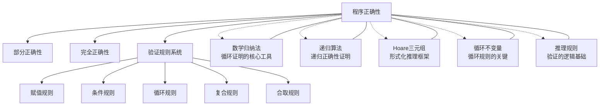

# 程序正确性

> [!abstract] 概述
> ==程序正确性（Program Correctness）==是==验证程序是否满足其规格说明==的形式化理论。程序正确性分为==部分正确性（partial correctness）==——若程序终止则结果正确，和==完全正确性（total correctness）==——程序既终止又产生正确结果。数学归纳法是证明循环程序正确性的核心工具。

## 定义

> [!def] 部分正确性与完全正确性
>
> 设 $S$ 为一段程序，$P$ 为==初始断言（precondition）==，$Q$ 为==终结断言（postcondition）==。
>
> - **部分正确性**：若初始断言 $P$ 为真且程序 $S$ 终止，则终结断言 $Q$ 为真。记为 $P \{S\} Q$。
> - **完全正确性**：若初始断言 $P$ 为真，则程序 $S$ 必定终止，且终止后终结断言 $Q$ 为真。记为 $P \{S\} Q$（加终止性标记）。
>
> 两者的本质区别在于：部分正确性**不保证程序终止**，而完全正确性**同时要求终止性和结果正确性**。
>
> 验证完全正确性通常分两步进行：
> 1. 先证明部分正确性
> 2. 再单独证明程序终止性

> [!def] 初始断言与终结断言
>
> - ==初始断言（precondition）== $P$：描述程序执行前输入变量和程序状态必须满足的条件。
> - ==终结断言（postcondition）== $Q$：描述程序执行后期望的输出和程序状态应满足的条件。
>
> 程序验证的核心任务就是证明：**在初始断言 $P$ 成立的前提下，程序 $S$ 执行后终结断言 $Q$ 成立**。
>
> 例如，对于计算 $x = a + b$ 的程序：
> - 初始断言：$P$ 为"变量 $a$ 和 $b$ 已被赋值"
> - 终结断言：$Q$ 为"$x = a + b$"

> [!def] 程序验证的基本框架
>
> 程序验证的基本框架如下：
>
> 1. **编写规格说明**：用逻辑公式明确初始断言 $P$ 和终结断言 $Q$
> 2. **构造验证条件**：根据程序结构，将整个程序的正确性分解为若干子目标
> 3. **逐条证明验证条件**：对每个程序构造，使用对应的推理规则证明其正确性
> 4. **证明终止性**（仅完全正确性需要）：证明所有循环最终会终止
>
> 对于结构化程序（由顺序、选择、循环三种基本结构组成），上述过程可以系统地展开。

> [!def] 规则系统概述
>
> 程序验证的推理规则系统包含以下五条核心规则：
>
> | 规则名称 | 作用 | 形式化表示 |
> |:---------|:-----|:----------|
> | ==赋值规则== | 处理赋值语句 $x := e$ | 将 $Q$ 中 $x$ 替换为 $e$ 得到 $P$ |
> | ==条件规则== | 处理 if-else 语句 | 分别证明两个分支 |
> | ==循环规则== | 处理 while 循环 | 需要找到循环不变量 |
> | ==复合规则== | 处理语句顺序执行 $S_1; S_2$ | 中间断言连接两段程序 |
> | ==合取规则== | 合并多个验证条件 | 同时满足多个后条件 |
>
> 这些规则构成了 [[Hoare三元组]] 推理系统的基础，详见 [[Hoare三元组]]。

## 核心性质

| 性质 | 描述 | 说明 |
|:----:|:-----|:-----|
| 部分正确性不蕴含终止性 | $P\{S\}Q$ 成立不意味着 $S$ 一定终止 | 死循环程序也可以是部分正确的 |
| 完全正确性蕴含部分正确性 | 若程序完全正确，则必然部分正确 | 终止性是额外的要求 |
| 结构化分解 | 复杂程序的正确性可分解为基本结构的正确性 | 顺序、选择、循环三种结构 |
| 归纳法核心地位 | 循环正确性证明本质上是数学归纳法 | 初始化对应基础步，保持对应归纳步 |
| 不变量必要性 | 循环验证必须找到合适的循环不变量 | 不变量的选择是验证的关键难点 |
| 规格说明驱动 | 正确性证明以规格说明（$P$ 和 $Q$）为基准 | 证明的是相对于规格说明的正确性 |
| 组合性 | 子程序正确可组合为整个程序的正确 | 通过复合规则和合取规则实现 |
| 自动化潜力 | 验证条件可机械生成（但证明不一定自动化 | 归纳断言方法可部分自动化 |

## 关系网络

- **核心工具**：[[数学归纳法]] 是证明循环程序正确性的数学基础
- **形式化框架**：[[Hoare三元组]] 提供了程序验证的公理化表示
- **关键概念**：[[循环不变量]] 是循环规则中必须找到的断言
- **逻辑基础**：[[推理规则]] 为验证系统提供逻辑推理能力
- **扩展应用**：[[递归算法]] 的正确性可用类似框架证明

## 章节扩展

### 第5章 — 5.5节核心内容

程序正确性是 Rosen 第5章 5.5 节（程序正确性）的核心主题：

- **程序验证导论**：程序正确性的动机、部分正确性与完全正确性的区分
- **验证条件与规则**：赋值规则、条件规则、循环规则、复合规则、合取规则的详细表述
- **循环不变量方法**：如何构造和使用循环不变量证明循环程序的正确性
- **终止性证明**：通过良序集或度量函数证明循环必定终止
- **实例验证**：求最大值程序、线性搜索程序、整数除法程序的正确性证明
- **与归纳法的联系**：循环不变量的保持性证明与数学归纳法的对应关系

本节将第5章前面所学的数学归纳法、递归等概念与程序验证紧密结合，是离散数学在软件工程中的重要应用。

## 补充

> [!info] 学术背景
>
> 程序验证的理论基础由三位先驱奠定：
>
> - **Floyd（1967）** 在 "Assigning Meanings to Programs" 中首次提出了基于**归纳断言**的程序验证方法，为程序正确性证明奠定了方法论基础。Floyd 的方法通过在程序控制流图的边上标注断言，将程序验证转化为逻辑证明问题。
>
> - **Hoare（1969）** 在 "An Axiomatic Basis for Computer Programming" 中提出了 [[Hoare三元组]] $\{P\}S\{Q\}$ 的公理化系统，使程序验证有了优雅的逻辑框架，并提出了赋值、条件、循环等推理规则。
>
> - **Dijkstra（1975）** 在 "A Discipline of Programming" 中发展了==最弱前置条件==（weakest precondition）理论，用谓词变换器 $wp(S, Q)$ 系统化地计算保证程序终止且满足后条件的最弱前条件，进一步统一了程序验证和程序构造的理论。
>
> **来源**：
> - Rosen, K. H. *Discrete Mathematics and Its Applications*, 8th ed., Section 5.5
> - Floyd, R. W. (1967). "Assigning Meanings to Programs." *Mathematical Aspects of Computer Science*, 19, 19-32.
> - Hoare, C. A. R. (1969). "An axiomatic basis for computer programming." *Communications of the ACM*, 12(10), 576-580.
> - Dijkstra, E. W. (1975). *A Discipline of Programming*. Prentice-Hall.

## 参见

- [[数学归纳法]] — 循环正确性证明的核心数学工具
- [[递归算法]] — 递归程序的正确性证明方法
- [[Hoare三元组]] — 程序验证的公理化推理框架
- [[循环不变量]] — 循环规则中必须找到的关键断言
- [[推理规则]] — 验证系统的逻辑推理基础
