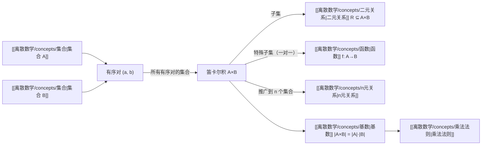

# 笛卡尔积

> [!abstract]
> **笛卡尔积**（Cartesian product）是集合论中的基本构造运算。给定集合 $A$ 和 $B$，其笛卡尔积 $A \times B$ 是由所有有序对 $(a, b)$（其中 $a \in A$，$b \in B$）构成的集合。笛卡尔积是定义[[离散数学/concepts/二元关系|二元关系]]和[[离散数学/concepts/函数|函数]]的理论基础——二元关系就是笛卡尔积的子集，而函数是满足额外条件的关系。
>
> - 有序对 $(a, b)$：$a$ 为第一分量，$b$ 为第二分量，$(a, b) = (c, d)$ 当且仅当 $a = c$ 且 $b = d$
> - $|A \times B| = |A| \cdot |B|$：笛卡尔积的基数等于各集合基数之积
> - 可推广到 $n$ 个集合的笛卡尔积 $A_1 \times A_2 \times \cdots \times A_n$

## 定义

> [!def] 有序对（Ordered Pair）
> 由两个元素按确定顺序排列而成的序列 $(a, b)$ 称为**有序对**，其中 $a$ 是**第一分量**（first component），$b$ 是**第二分量**（second component）。
>
> 有序对的相等条件：
>
> $$(a, b) = (c, d) \iff a = c \text{ 且 } b = d$$
>
> 这与无序对 $\{a, b\}$ 不同：$\{a, b\} = \{b, a\}$，但 $(a, b) \neq (b, a)$（当 $a \neq b$ 时）。

> [!def] 笛卡尔积（Cartesian Product）
> 设 $A$ 和 $B$ 是集合。$A$ 和 $B$ 的**笛卡尔积** $A \times B$ 是所有有序对 $(a, b)$ 的集合，其中 $a \in A$，$b \in B$：
>
> $$A \times B = \{(a, b) \mid a \in A \text{ 且 } b \in B\}$$
>
> - $A$ 称为**第一集合**，$B$ 称为**第二集合**
> - $A \times B$ 一般**不等于** $B \times A$（除非 $A = B$ 或其中之一为空集）
> - 空集性质：$A \times \emptyset = \emptyset \times B = \emptyset$

> [!def] $n$ 个集合的笛卡尔积
> 设 $A_1, A_2, \ldots, A_n$ 是 $n$ 个集合。它们的**笛卡尔积**定义为：
>
> $$A_1 \times A_2 \times \cdots \times A_n = \{(a_1, a_2, \ldots, a_n) \mid a_i \in A_i, \, i = 1, 2, \ldots, n\}$$
>
> 其中的元素 $(a_1, a_2, \ldots, a_n)$ 称为 **$n$ 元组**（$n$-tuple）。
>
> 当 $A_1 = A_2 = \cdots = A_n = A$ 时，简记为 $A^n$。

## 核心性质

| 性质 | 公式 | 说明 |
|:-----|:-----|:-----|
| **基数公式** | $\|A \times B\| = \|A\| \cdot \|B\|$ | 笛卡尔积的基数等于各集合基数之积 |
| **$n$ 个集合的基数** | $\|A_1 \times \cdots \times A_n\| = \|A_1\| \cdots \|A_n\|$ | 乘法法则的理论依据 |
| **空集性质** | $A \times \emptyset = \emptyset$ | 空集与任何集合的笛卡尔积为空集 |
| **交换律** | $A \times B \neq B \times A$（一般） | 笛卡尔积**不满足**交换律 |
| **分配律（并）** | $A \times (B \cup C) = (A \times B) \cup (A \times C)$ | 笛卡尔积对并满足分配律 |
| **分配律（交）** | $A \times (B \cap C) = (A \times B) \cap (A \times C)$ | 笛卡尔积对交满足分配律 |
| **子集关系** | $A \subseteq C \wedge B \subseteq D \Rightarrow A \times B \subseteq C \times D$ | 子集的笛卡尔积仍是子集 |

> [!info] 笛卡尔积与函数的关系
> [[离散数学/concepts/函数|函数]] $f: A \to B$ 的图（graph）定义为有序对集合 $\{(a, f(a)) \mid a \in A\}$，它是 $A \times B$ 的子集。因此：
> - **函数的图是一个二元关系**（笛卡尔积的子集）
> - 函数的图具有特殊性质：$A$ 中每个元素恰好是一个有序对的第一分量
> - 笛卡尔积 $A \times B$ 本身也是从 $A$ 到 $B$ 的一个关系（最大的关系）
> - 空集 $\emptyset$ 也是从 $A$ 到 $B$ 的一个关系（最小的关系）

> [!info] 笛卡尔积与乘法法则
> 笛卡尔积的基数公式 $\|A \times B\| = \|A\| \cdot \|B\|$ 是[[离散数学/concepts/乘法法则|乘法法则]]的理论基础。乘法法则指出：若任务 $T_1$ 有 $n_1$ 种做法，任务 $T_2$ 有 $n_2$ 种做法，则两任务依次执行共有 $n_1 \times n_2$ 种做法——这本质上就是笛卡尔积的元素计数。

## 关系网络

## 章节扩展

笛卡尔积是离散数学中多个章节的基础概念：

- **第02章 基本结构**：笛卡尔积的原始定义，有序对与 $n$ 元组，函数定义为特殊的笛卡尔积子集
- **第05章 归纳与递归**：用笛卡尔积定义字符串集合 $\Sigma^*$、递归定义结构化数据
- **第06章 计数**：乘法法则的理论依据，排列与组合的集合论解释
- **第09章 关系**：二元关系是笛卡尔积的子集，[[离散数学/concepts/n元关系|n元关系]]是 $n$ 个集合笛卡尔积的子集
- **第10章 图论**：有向图可视为关系 $R \subseteq V \times V$ 的可视化表示

## 补充

> [!info] 笛卡尔积的命名来源
> 笛卡尔积以法国数学家勒内-笛卡尔（Rene Descartes, 1596-1650）命名。笛卡尔创立的解析几何正是建立在有序对（坐标）的概念之上——平面上的每个点可以用一个有序对 $(x, y)$ 表示，即 $\mathbb{R}^2 = \mathbb{R} \times \mathbb{R}$。这一思想将几何与代数统一了起来。

> [!info] 笛卡尔积的运算性质
> 笛卡尔积满足以下分配律（但不满足交换律）：
> - $A \times (B \cup C) = (A \times B) \cup (A \times C)$
> - $A \times (B \cap C) = (A \times B) \cap (A \times C)$
> - $A \times (B - C) = (A \times B) - (A \times C)$
> - $(A \cup B) \times C = (A \times C) \cup (B \times C)$
> - $(A \cap B) \times C = (A \times C) \cap (B \times C)$
>
> 但一般地，$A \times B \neq B \times A$（除非 $A = B$ 或 $A = \emptyset$ 或 $B = \emptyset$）。

> [!info] 笛卡尔积与关系数据库
> 在关系数据库中，笛卡尔积（CROSS JOIN）是将两个表的所有行进行组合的操作。若表 $R$ 有 $m$ 行，表 $S$ 有 $n$ 行，则 $R \times S$ 有 $m \times n$ 行。实际查询中通常使用带条件的连接（JOIN）来筛选笛卡尔积的结果。

## 参见

- [[离散数学/concepts/二元关系]] -- 二元关系是笛卡尔积的子集
- [[离散数学/concepts/函数]] -- 函数是满足一对一条件的特殊二元关系
- [[离散数学/concepts/集合]] -- 笛卡尔积的构造基于集合概念
- [[离散数学/concepts/基数]] -- 笛卡尔积的基数公式 $|A \times B| = |A| \cdot |B|$
