# 等价关系

> [!abstract] 概述
> ==等价关系==（equivalence relation）是同时满足==自反性==、==对称性==和==传递性==的二元关系，用 $\sim$ 表示。等价关系将集合中的元素分成若干不相交的==等价类== $[a]_R = \{s \in A \mid (a,s) \in R\}$，等价类中的任何元素都可以作为==代表元==。核心定理保证等价类要么相等要么不相交，从而等价类的集合构成集合的一个==划分==。等价关系与划分之间存在一一对应关系，==同余关系== $a \equiv b \pmod{m}$ 是最重要的等价关系实例。

## 定义

> [!def] 等价关系（Equivalence Relation）
>
> 设 $R$ 是集合 $A$ 上的关系。若 $R$ 同时满足以下三个性质，则称 $R$ 为 $A$ 上的==等价关系==：
>
> 1. **自反性**：对任意 $a \in A$，有 $(a, a) \in R$
> 2. **对称性**：若 $(a, b) \in R$，则 $(b, a) \in R$
> 3. **传递性**：若 $(a, b) \in R$ 且 $(b, c) \in R$，则 $(a, c) \in R$
>
> 若 $a$ 和 $b$ 在等价关系 $R$ 下相关，记作 $a \sim b$，称 $a$ 和 $b$ 是==等价的==（equivalent）。

> [!def] 等价类（Equivalence Class）
>
> 设 $R$ 是集合 $A$ 上的等价关系。元素 $a \in A$ 的==等价类==（记为 $[a]_R$ 或简写为 $[a]$）定义为：
>
> $$[a]_R = \{s \in A \mid (a, s) \in R\}$$
>
> 即所有与 $a$ 等价的元素组成的集合。若 $b \in [a]_R$，则称 $b$ 是该等价类的一个==代表元==（representative）。等价类中的任何元素都可以作为代表元。

> [!def] 同余模 $m$（Congruence Modulo $m$）
>
> 设 $m$ 为正整数。整数集上的关系
>
> $$R = \{(a, b) \mid a \equiv b \pmod{m}\}$$
>
> 称为==同余模 $m$== 关系，其中 $a \equiv b \pmod{m}$ 表示 $m$ 整除 $a - b$。同余模 $m$ 是整数集上的等价关系，产生 $m$ 个等价类 $[0]_m, [1]_m, \ldots, [m-1]_m$。

> [!def] 商集（Quotient Set）
>
> 设 $R$ 是集合 $A$ 上的等价关系，则 $A$ 关于 $R$ 的==商集==定义为
>
> $$A/R = \{[a]_R \mid a \in A\}$$
>
> 即所有等价类构成的集合。由等价类的性质，商集 $A/R$ 构成 $A$ 的一个划分。

## 核心性质

| 性质 | 描述 | 公式/规则 |
|:-----|:-----|:----------|
| ==等价关系三要素== | 自反 + 对称 + 传递 | 缺一不可 |
| ==等价类非空== | 每个元素属于自身的等价类 | $a \in [a]$（由自反性） |
| ==等价类要么相等要么不相交== | 任意两个等价类的关系 | $[a] = [b]$ 或 $[a] \cap [b] = \emptyset$ |
| ==等价类相等的充要条件== | 三个等价命题 | $aRb \Leftrightarrow [a]=[b] \Leftrightarrow [a]\cap[b]\neq\emptyset$ |
| ==代表元无关性== | 类中任一元素可作为代表元 | $b \in [a] \Rightarrow [a] = [b]$ |
| ==等价关系与划分一一对应== | 核心定理 | 等价类 $\to$ 划分，划分 $\to$ 等价关系 |
| ==同余类个数== | 模 $m$ 恰好 $m$ 个等价类 | $[0]_m, [1]_m, \ldots, [m-1]_m$ |

## 关系网络

```mermaid
graph TB
    A["等价关系"] --> B["定义"]
    A --> C["等价类"]
    A --> D["核心定理"]
    A --> E["重要实例"]
    A --> F["一一对应"]

    B --> B1["自反性"]
    B --> B2["对称性"]
    B --> B3["传递性"]

    C --> C1["[a]_R = {s | (a,s) ∈ R}"]
    C --> C2["代表元"]
    C --> C3["商集 A/R"]

    D --> D1["定理1：等价类相等或不相交"]
    D --> D2["证明：(i)⟹(ii)⟹(iii)⟹(i)"]

    E --> E1["[[离散数学/concepts/同余]] a ≡ b (mod m)"]
    E --> E2["相等关系"]
    E --> E3["字符串前缀等价"]

    F --> F1["[[离散数学/concepts/划分]]"]
    F --> F2["等价关系 ⟺ 划分"]

    A --> G["关联概念"]
    G --> G1["[[离散数学/concepts/二元关系]]"]
    G --> G2["[[离散数学/concepts/划分]]"]
    G --> G3["[[离散数学/concepts/同余]]"]
    G --> G4["[[离散数学/concepts/偏序关系]]"]
    G --> G5["[[离散数学/concepts/集合]]"]
```

- **前置知识**：[[离散数学/concepts/二元关系]]（等价关系是特殊的二元关系）、[[离散数学/concepts/集合]]（等价类是集合的子集）
- **核心关联**：等价关系的本质是在保持自反、对称、传递的前提下，用"等价类"代替单个元素进行推理。等价关系与划分的一一对应是离散数学中最重要的对偶性之一
- **后继概念**：[[离散数学/concepts/偏序关系]]（与等价关系并列的另一类重要关系）、[[离散数学/concepts/划分]]（等价类的集合构成划分）

## 章节扩展

### 第09章：关系

等价关系是 Rosen 第8版第9章第9.5节的核心内容，是关系理论从"性质分析"走向"结构分类"的关键概念。

**等价类要么相等要么不相交（定理1）**：这是等价关系最重要的性质。证明通过三个命题的循环蕴含完成：
- (i) $aRb$ $\Rightarrow$ (ii) $[a]=[b]$：利用对称性和传递性证明双向包含
- (ii) $[a]=[b]$ $\Rightarrow$ (iii) $[a]\cap[b]\neq\emptyset$：由自反性 $a\in[a]$
- (iii) $[a]\cap[b]\neq\emptyset$ $\Rightarrow$ (i) $aRb$：取公共元素 $c$，由 $aRc$ 和 $cRb$（对称性+传递性）

**等价关系与划分的一一对应（定理2）**：
- 等价关系 $\Rightarrow$ 划分：等价类非空（自反性）、不相交（定理1）、并集为全集（每个元素属于自身等价类）
- 划分 $\Rightarrow$ 等价关系：定义"属于同一子集"为关系，利用划分的不相交性证明传递性

**同余关系的完整证明**：自反性（$a-a=0=0\cdot m$）、对称性（$a-b=km \Rightarrow b-a=(-k)m$）、传递性（$a-b=km, b-c=lm \Rightarrow a-c=(k+l)m$）。

## 补充

> [!info] 等价关系的历史与应用
>
> 等价关系的概念可追溯到 19 世纪末。Leopold Kronecker 在研究代数数论时系统使用了同余关系。等价关系在现代数学中无处不在：在代数中用于定义商群和商环，在拓扑学中用于定义商空间和等价度量，在集合论中用于定义基数（通过双射等价关系）。
>
> 在计算机科学中，等价关系有广泛应用：编译器中的标识符等价（如 C 语言前缀匹配）、数据库中的实体识别（record linkage）、图论中的连通分量（连通关系是等价关系）、程序分析中的指针等价（alias analysis）等。
>
> **等价关系与函数的逆像**：给定函数 $f: A \to B$，定义 $R_f$：$(x,y) \in R_f$ 当且仅当 $f(x) = f(y)$，则 $R_f$ 是等价关系。反之，每个等价关系都可以看作某个函数的"等值核"。这一对应在代数、拓扑和范畴论中都是基本工具。

> [!warning] 常见误区
>
> - 自反 + 对称不保证等价关系，必须同时满足传递性。反例：$R = \{(x,y) \in \mathbb{R}^2 \mid |x-y| < 1\}$ 是自反且对称的，但不是传递的
> - 整除关系不是等价关系：它是自反和传递的，但不是对称的（$2 \mid 4$ 但 $4 \nmid 2$）。整除关系实际上是偏序关系
> - 不同代表元不一定给出不同的等价类：若 $b \in [a]$，则 $[a] = [b]$

## 参见

- [[离散数学/concepts/二元关系]] -- 等价关系是特殊的二元关系
- [[离散数学/concepts/划分]] -- 等价关系与划分一一对应
- [[离散数学/concepts/同余]] -- 最重要的等价关系实例
- [[离散数学/concepts/偏序关系]] -- 与等价关系并列的另一类重要关系
- [[离散数学/concepts/集合]] -- 等价类是集合的子集
