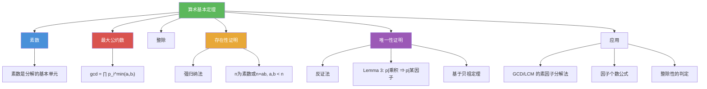

# 算术基本定理

> [!abstract] 概述
> ==算术基本定理（Fundamental Theorem of Arithmetic）==是数论最重要的定理之一，也称为==唯一素因子分解定理==。它断言：每个大于 1 的整数都可以==唯一==地表示为素数的乘积（按非递减顺序排列），即 $n = p_1^{a_1} \cdot p_2^{a_2} \cdots p_k^{a_k}$，其中 $p_1 < p_2 < \cdots < p_k$ 为素数，$a_i \geq 1$。存在性部分可通过==强归纳法==证明，唯一性部分通过==反证法==结合"素数整除乘积则整除某个因子"的引理证明。该定理将素数确立为整数的"原子"。

## 定义

> [!def] 算术基本定理（Theorem 1: The Fundamental Theorem of Arithmetic）
>
> 每个大于 1 的整数都可以唯一地表示为一个素数或两个及以上素数的乘积，其中素因子按非递减顺序排列。
>
> 即若 $n > 1$，则存在唯一的表示
> $$n = p_1^{a_1} p_2^{a_2} \cdots p_k^{a_k}$$
> 其中 $p_1 < p_2 < \cdots < p_k$ 为素数，$a_i \geq 1$。
>
> - 该表示称为 $n$ 的==标准素因子分解==（canonical prime factorization）
> - "唯一"意味着：若 $n = q_1^{b_1} q_2^{b_2} \cdots q_m^{b_m}$ 是另一个标准分解，则 $k = m$，$p_i = q_i$，$a_i = b_i$ 对所有 $i$ 成立

## 核心性质

| 性质 | 描述 | 说明 |
|------|------|------|
| 存在性 | 每个 $n > 1$ 都可分解为素数乘积 | 可用强归纳法证明 |
| 唯一性 | 标准素因子分解至多有一种 | 反证法 + Lemma 3 |
| 素数 = "原子" | 素数是不可再分的构建单元 | 类比化学中的原子 |
| 1 的特殊性 | 1 不参与素因子分解 | 空乘积约定为 1 |
| 因子个数公式 | $n = \prod p_i^{a_i}$ 的正因子个数为 $\prod (a_i + 1)$ | 由组合计数直接得出 |
| GCD/LCM 公式 | $\gcd = \prod p_i^{\min(a_i, b_i)}$，$\text{lcm} = \prod p_i^{\max(a_i, b_i)}$ | 素因子分解的直接应用 |
| 唯一性证明关键 | Lemma 3: $p \mid a_1 a_2 \cdots a_n \Rightarrow p \mid$ 某 $a_i$ | 由贝祖定理推出 |

## 关系网络

- [[素数]] 是算术基本定理的基本单元：素数是"原子"，每个整数由素数"组装"而成
- [[最大公约数]] 的素因子分解法直接依赖于算术基本定理：$\gcd(a,b) = \prod p_i^{\min(a_i, b_i)}$
- [[整除]] 的判定可通过素因子分解实现：$a \mid b$ 当且仅当 $a$ 的每个素因子的指数不超过 $b$ 中对应指数

## 章节扩展

### 第4章：数论与密码学

算术基本定理是第 4 章 4.3 节的基础定理：

- **4.3 素数与最大公约数**：算术基本定理（Theorem 1）是素因子分解法求 GCD/LCM 的理论基础，唯一性证明依赖 Lemma 3（由贝祖定理推出）
- **4.3 欧几里得算法**：虽然欧几里得算法不需要先分解素因子，但算术基本定理保证了 GCD 的存在性和唯一性
- **4.5 密码学应用**：RSA 的安全性基于"大整数的素因子分解是困难的"，而算术基本定理保证了这种分解存在且唯一

### 第5章：归纳与递归

- **5.2 强归纳法**：算术基本定理的唯一性部分是强归纳法的经典应用。证明思路：假设 $n$ 有两个不同的素因子分解，利用强归纳法对 $n$ 的素因子个数进行归纳，导出矛盾。

## 补充

> [!info] 算术基本定理的数学地位
>
> 算术基本定理是数论中最重要的定理之一，其地位相当于分析中的微积分基本定理或线性代数中的秩-零化度定理。该定理的==存在性==部分相对直观（可通过强归纳法证明），但==唯一性==部分则需要更精细的工具——关键引理是"若素数 $p$ 整除乘积 $a_1 a_2 \cdots a_n$，则 $p$ 整除某个 $a_i$"（Lemma 3），该引理的证明依赖于[[贝祖定理]]。算术基本定理在更一般的代数结构中不一定成立：例如在 $\mathbb{Z}[\sqrt{-5}]$ 中，$6 = 2 \times 3 = (1+\sqrt{-5})(1-\sqrt{-5})$ 有两种不同的"素"因子分解。研究唯一分解何时成立的代数分支称为==代数数论==。
>
> **学术来源**：Rosen, K. H. (2019). *Discrete Mathematics and Its Applications* (8th ed.). McGraw-Hill, Section 4.3, Theorem 1.
>
> **参考链接**：Hardy, G. H., & Wright, E. M. (2008). *An Introduction to the Theory of Numbers* (6th ed.). Oxford University Press, Chapter II.

## 参见

- [[素数]] -- 算术基本定理的基本单元，整数的"原子"
- [[最大公约数]] -- 素因子分解法 $\gcd(a,b) = \prod p_i^{\min(a_i, b_i)}$ 依赖于唯一分解
- [[整除]] -- $a \mid b$ 可通过比较素因子分解中的指数判定
- [[贝祖定理]] -- 唯一性证明中 Lemma 3 的证明依赖于贝祖恒等式
