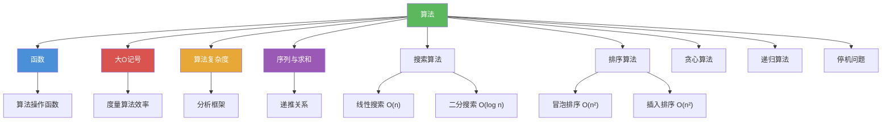

# 算法

> [!abstract] 概述
> ==算法（algorithm）==是用于执行计算或求解问题的==有限精确指令序列==，必须具备输入、输出、确定性、有限性、有效性等特性。"algorithm"一词源自 9 世纪数学家 al-Khowarizmi。算法通过==伪代码==进行与编程语言无关的精确描述，涵盖搜索、排序、字符串匹配、贪心策略等经典设计范式。==停机问题==的不可判定性揭示了计算的内在极限。

## 定义

> [!def] 算法（Algorithm）
>
> ==算法==是一个用于执行计算或求解问题的==有限精确指令序列==。
>
> - "algorithm"一词源自 9 世纪数学家 al-Khowarizmi 的名字，最初指用十进制记数法进行算术运算的规则，后来演变为包含所有用于求解问题的确定过程的更一般概念

> [!def] 算法的五大特性
>
> | 特性 | 说明 |
> |------|------|
> | ==输入（Input）== | 算法从指定的集合中接收输入值 |
> | ==输出（Output）== | 对于每组输入值，算法产生指定集合中的输出值，即问题的解 |
> | ==确定性（Definiteness）== | 算法的每一步都必须被精确地定义 |
> | ==有限性（Finiteness）== | 对于任何输入，算法应在有限步之后产生期望的输出 |
> | ==有效性（Effectiveness）== | 算法的每一步都必须能在有限时间内精确地执行 |

> [!def] 伪代码（Pseudocode）
>
> ==伪代码==是介于自然语言描述和编程语言实现之间的==中间表示==，其指令类似于编程语言中的语句，但可以使用任何定义良好的操作或语句。
>
> | 结构 | 语法 | 说明 |
> |------|------|------|
> | 赋值 | `变量 := 表达式` | 将表达式的值赋给变量 |
> | 条件语句 | `if 条件 then 语句` | 条件为真时执行 |
> | 循环 | `for 变量 := 初值 to 终值` | 计数循环 |
> | 循环 | `while 条件` | 条件循环 |
> | 过程 | `procedure 名称(参数)` | 定义一个过程 |
> | 返回 | `return 值` | 返回结果 |

> [!def] 线性搜索（Linear Search）
>
> ==线性搜索==从列表的第一个元素开始，逐个将目标元素 $x$ 与列表中的元素进行比较，直到找到匹配或搜索完整个列表。
>
> - 返回值为 $x$ 在列表中的位置（下标），若未找到则返回 0
> - ==时间复杂度==：最坏情况下需要比较 $n$ 次，即 $O(n)$
> - ==适用条件==：列表中的元素可以是任意顺序

> [!def] 二分搜索（Binary Search）
>
> ==二分搜索==利用列表==有序==这一条件，通过反复将搜索区间减半来快速定位目标元素。
>
> - ==时间复杂度==：每次将搜索区间减半，最坏情况下需要 $O(\log n)$ 次比较
> - ==适用条件==：列表必须按递增顺序排列
> - ==核心思想==：比较 $x$ 与中间元素 $a_m$，若 $x > a_m$ 则搜索右半部分，否则搜索左半部分

> [!def] 冒泡排序（Bubble Sort）
>
> ==冒泡排序==通过反复比较相邻元素，若顺序错误则交换它们，使较大的元素逐渐"下沉"到列表末尾，较小的元素"上浮"到列表前端。
>
> - 第 $i$ 趟遍历后，最大的 $i$ 个元素已就位
> - ==时间复杂度==：$O(n^2)$ 次比较

> [!def] 插入排序（Insertion Sort）
>
> ==插入排序==从第二个元素开始，将每个元素插入到前面已排序部分的正确位置。
>
> - 在第 $j$ 步中，第 $j$ 个元素被插入到前 $j-1$ 个已排序元素中的正确位置
> - ==时间复杂度==：最坏情况下 $O(n^2)$ 次比较；最好情况（已排序）$O(n)$ 次比较

> [!def] 贪心算法（Greedy Algorithm）
>
> ==贪心算法==在每一步做出==局部最优选择==，而不考虑所有可能导向全局最优解的步骤序列。
>
> - 贪心算法的设计关键在于选择合适的贪心准则
> - 贪心算法==不一定总能找到最优解==，需要通过证明或反例来验证
> - 即使贪心算法不总能找到最优解，它仍然可能找到可行解

> [!def] 停机问题（Halting Problem）
>
> ==停机问题==：是否存在一个过程，以程序 $P$ 和输入 $I$ 为输入，能够判定 $P$ 在给定 $I$ 时是否会最终停止？
>
> **Alan Turing（1936）通过反证法证明了不存在这样的过程**：
> 1. 假设存在这样的过程 $H(P, I)$，它输出 "halt" 或 "loops forever"
> 2. 构造过程 $K(P)$：若 $H(P, P)$ 输出 "loops forever"，则 $K(P)$ 停止；若 $H(P, P)$ 输出 "halt"，则 $K(P)$ 无限循环
> 3. 考虑 $K(K)$：无论 $H(K, K)$ 输出什么，都产生矛盾
> 4. 因此 $H$ 不可能对所有输入给出正确答案，即停机问题是==不可判定的==

## 核心性质

| 性质 | 描述 | 说明 |
|------|------|------|
| 有限性 | 算法必须在有限步后终止 | 区别于可能无限循环的程序（如操作系统） |
| 确定性 | 每一步必须被精确地定义 | 不允许模糊或歧义的指令 |
| 有效性 | 每一步可在有限时间内执行 | 操作必须是基本且可实现的 |
| 线性搜索复杂度 | 适用于任意列表，$O(n)$ | 无需预处理，小数据集首选 |
| 二分搜索复杂度 | 要求列表有序，$O(\log n)$ | 多次搜索同一列表时总体更高效 |
| 冒泡排序复杂度 | 始终 $O(n^2)$ | 即使列表已有序仍执行全部比较 |
| 插入排序最优情况 | 已有序列表仅需 $O(n)$ | 对"几乎有序"数据表现优异 |
| 贪心算法不保证最优 | 局部最优不等于全局最优 | 最优性依赖于具体问题的贪心准则 |
| 停机问题不可判定 | 不存在通用判定过程 | Turing 1936 年证明，使用对角线论证 |

## 关系网络

- [[函数]] 是算法操作的基础：算法的每一步操作本质上是对输入数据的函数变换
- [[大O记号]] 用于度量算法效率：通过渐近分析比较不同算法的性能
- [[算法复杂度]] 提供分析框架：从最坏情况、平均情况、最好情况三个视角评估算法
- [[序列与求和]] 中的递推关系是分析递归算法复杂度的核心工具

## 章节扩展

### 第3章：算法

算法是第 3 章的核心主题（3.1 节），是离散数学从理论走向实践的关键桥梁：

- **3.1 算法**：算法的定义与五大特性、伪代码语法、搜索算法（线性搜索、二分搜索）、排序算法（冒泡排序、插入排序）、字符串匹配、贪心算法、停机问题
- **3.2 函数的增长**：大O、大$\Omega$、大$\Theta$ 等渐近记号，为算法效率比较提供数学基础
- **3.3 算法复杂度分析**：时间复杂度与空间复杂度的度量方法，最坏情况与平均情况分析，NP完全问题与 P vs NP

### 第5章：归纳与递归

- **5.4 递归算法**：递归算法是第5章引入的新算法范式，通过函数调用自身来求解问题。递归算法的正确性用数学归纳法证明，复杂度通过递推关系分析。归并排序是递归分治策略的经典应用。

### 第13章：计算建模

- **13.5 图灵机**：==图灵机==（Turing Machine）是==算法==概念的终极精确化。第3章中算法的五大特性（输入、输出、确定性、有限性、有效性）在图灵机模型中得到了完全的形式化：有限状态控制对应有限性，转移函数对应确定性，读写头移动对应逐步执行。Church-Turing 论题断言：任何"有效可计算"的函数都存在图灵机来计算它。因此，图灵机为"什么是算法"这一问题提供了数学上严格的回答。

## 补充

> [!info] 算法概念的历史与学术背景
>
> "algorithm"一词源自 9 世纪波斯数学家 **al-Khowarizmi**（约 780--850）的名字，其著作《印度数字算术》系统介绍了十进制记数法与算术运算规则。现代算法理论的基础由 **Alan Turing** 在 1936 年的论文 "On Computable Numbers" 中奠定，该论文引入了图灵机模型并证明了停机问题的不可判定性。伪代码作为一种"程序设计语言无关"的算法描述方式，由 **Donald Knuth** 在《The Art of Computer Programming》第 1 卷（Knuth, 1968）中系统推广。
>
> **学术来源**：Rosen, K. H. (2019). *Discrete Mathematics and Its Applications* (8th ed.). McGraw-Hill, Section 3.1.
>
> **参考链接**：Cormen, T. H., Leiserson, C. E., Rivest, R. L., & Stein, C. (2022). *Introduction to Algorithms* (4th ed.). MIT Press.

## 参见

- [[函数]] -- 算法的每一步操作本质上是对数据的函数变换
- [[大O记号]] -- 度量算法效率的渐近记号
- [[算法复杂度]] -- 时间复杂度与空间复杂度的系统分析方法
- [[序列与求和]] -- 递推关系是分析递归算法复杂度的核心工具
