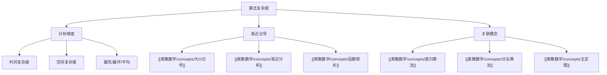

# 算法复杂度

> [!abstract] 概述
> ==算法复杂度==（algorithm complexity）是衡量算法==效率==的量化指标，分为==时间复杂度==（执行时间随输入规模的增长）和==空间复杂度==（内存使用随输入规模的增长）。复杂度分析使用==渐近记号==（$O$, $\Omega$, $\Theta$）描述算法在输入规模 $n$ 趋于无穷时的行为。对于==递归算法==，复杂度通常通过==递推关系==描述，==主定理==提供了一类常见递推关系的封闭解。算法复杂度是选择和比较算法的核心依据——在实际应用中，常数因子和低阶项虽然被渐近记号忽略，但对小规模输入可能至关重要。

## 定义

> [!def] 时间复杂度（Time Complexity）
>
> 算法的==时间复杂度== $T(n)$ 描述算法执行==基本操作次数==作为输入规模 $n$ 的函数。使用渐近记号：
>
> - $T(n) = O(f(n))$：$T(n)$ 的增长不超过 $f(n)$ 的常数倍（上界）
> - $T(n) = \Omega(f(n))$：$T(n)$ 的增长不低于 $f(n)$ 的常数倍（下界）
> - $T(n) = \Theta(f(n))$：$T(n)$ 的增长与 $f(n)$ 同阶（紧确界）

> [!def] 空间复杂度（Space Complexity）
>
> 算法的==空间复杂度== $S(n)$ 描述算法执行过程中所需的==额外存储空间==作为输入规模 $n$ 的函数。空间复杂度通常关注==辅助空间==（不包括输入和输出本身占用的空间）。

> [!def] 最优/最坏/平均情况
>
> 对于输入规模为 $n$ 的所有合法输入 $I_n$：
> - ==最优情况==：$T_{\text{best}}(n) = \min\{T(I) : |I| = n\}$
> - ==最坏情况==：$T_{\text{worst}}(n) = \max\{T(I) : |I| = n\}$
> - ==平均情况==：$T_{\text{avg}}(n) = \sum_{I:|I|=n} P(I) \cdot T(I)$
>
> 通常使用最坏情况作为算法复杂度的保证。

> [!def] 摊还分析（Amortized Analysis）
>
> ==摊还分析==将一系列操作的==总成本==分摊到每个操作上，得到每个操作的==摊还成本==。即使某些单次操作代价很高，只要高价操作不频繁，摊还成本可能很低。常见方法：
> - **聚合分析**：直接计算 $n$ 个操作的总成本上限
> - **记账方法**：为每种操作预付"信用"
> - **势能方法**：用势能函数记录"预付"的能量

## 核心性质

| 性质 | 描述 | 备注 |
|:-----|:-----|:-----|
| ==渐近忽略常数== | $O(3n^2) = O(n^2)$ | 大O记号忽略常数因子和低阶项 |
| ==多项式 vs 指数== | $O(n^k)$ vs $O(k^n)$ | 多项式时间 = "高效"，指数时间 = "难" |
| ==对数极快== | $O(\log n)$ 增长极慢 | 二分搜索、平衡树操作 |
| ==递推关系== | 递归算法的复杂度常用递推描述 | $T(n) = aT(n/b) + f(n)$ |
| ==主定理== | 一类递推关系的封闭解 | 三种情况覆盖常见分治算法 |
| ==空间-时间权衡== | 有时可用更多空间换取更少时间 | 哈希表、动态规划 |

## 关系网络

- **前置知识**：函数的增长（大O记号）
- **核心关联**：算法复杂度是评估和比较算法效率的核心工具，递归算法的复杂度通过递推关系和主定理分析
- **后继概念**：[[离散数学/concepts/递归算法]]（递归复杂度分析）、[[离散数学/concepts/分治算法]]（主定理应用）

## 章节扩展

### 第3章：算法

算法复杂度分析是第3章的核心内容（Section 3.3），涉及最优/最坏/平均情况分析和常见复杂度类。

### 第10章：图论

图论算法的复杂度分析：
- **Dijkstra 算法**：$O(n^2)$（朴素实现）或 $O((n+e)\log n)$（最小堆实现）
- **Floyd-Warshall**：$O(n^3)$
- **拓扑排序**：$O(n + e)$

### 第11章：树

树相关算法的复杂度分析：
- **BST 查找/插入/删除**：平均 $O(\log n)$，最坏 $O(n)$
- **AVL/红黑树操作**：$O(\log n)$ 保证
- **DFS/BFS 遍历**：$O(n + e)$
- **Prim 算法**：$O(n^2)$（朴素）或 $O(e \log n)$（最小堆）
- **Kruskal 算法**：$O(e \log e)$（排序边）+ 并查集

### 第13章：计算建模

- **13.5 图灵机**：图灵机理论为==算法复杂度==提供了更深层的分类框架。==P 类==问题是可以由确定性图灵机在多项式时间内求解的判定问题；==NP 类==问题是可以由非确定性图灵机在多项式时间内验证的问题。第3章中讨论的 NP 完全问题（如旅行商问题的判定版本）在图灵机框架下得到了精确的形式化定义。P vs NP 问题是计算机科学中最重要的开放问题之一，其本质是问：是否存在多项式时间的图灵机来求解所有 NP 问题？

## 补充

> [!info] 常见复杂度类
>
> | 复杂度 | 名称 | 典型算法 |
> |:-------|:-----|:---------|
> | $O(1)$ | 常数 | 数组访问 |
> | $O(\log n)$ | 对数 | 二分搜索 |
> | $O(n)$ | 线性 | 线性搜索 |
> | $O(n \log n)$ | 线性对数 | 归并排序 |
> | $O(n^2)$ | 平方 | 冒泡排序 |
> | $O(2^n)$ | 指数 | 子集枚举 |
> | $O(n!)$ | 阶乘 | 全排列 |

> [!tip] 复杂度分析的实际建议
>
> - **优先关注最内层循环**：循环嵌套的层数直接决定多项式阶数
> - **递归 → 递推关系**：写出递推关系后用主定理或展开法求解
> - **注意输入表示**：图的算法复杂度通常用 $(n, e)$ 而非单一 $n$ 表示
> - **摊还分析**：对于支持多种操作的数据结构（如动态数组），摊还分析更准确

## 参见

- [[离散数学/concepts/大O记号]] -- 渐近记号的定义与性质
- [[离散数学/concepts/渐近分析]] -- 渐近分析的详细方法
- [[离散数学/concepts/函数增长]] -- 常见函数的增长阶比较
- [[离散数学/concepts/递归算法]] -- 递归算法的复杂度分析
- [[离散数学/concepts/分治算法]] -- 分治算法与主定理
- [[离散数学/concepts/主定理]] -- 递推关系的封闭解
