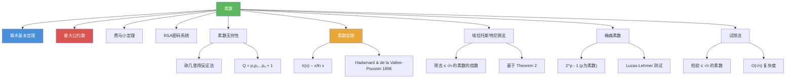

# 素数

> [!abstract] 概述
> ==素数（prime）==是大于 1 且仅被 1 和自身整除的正整数，是数论的"原子"——每个大于 1 的整数都可以唯一分解为素数的乘积（[[离散数学/theorems/算术基本定理]]）。素数有==无穷多个==（欧几里得反证法证明），其分布规律由==素数定理== $\pi(x) \sim x / \ln x$ 刻画。==埃拉托斯特尼筛法==是找出不超过 $n$ 的所有素数的经典算法，==梅森素数== $2^p - 1$ 是一类重要的特殊素数。素数是现代密码学（如 RSA）安全性的数学基础。

## 定义

> [!def] 素数与合数（Definition 1）
>
> - 大于 1 的正整数 $p$ 如果仅被 1 和 $p$ 整除，则称 $p$ 为==素数==（prime）
> - 大于 1 的正整数如果不是素数，则称为==合数==（composite）
> - 注意：整数 ==1 既不是素数也不是合数==（它只有一个正因子）
> - 等价判定：$n$ 是合数当且仅当存在整数 $a$ 使得 $a \mid n$ 且 $1 < a < n$

> [!def] 素数定理（Theorem 4: The Prime Number Theorem）
>
> 设 $\pi(x)$ 为不超过 $x$ 的素数个数，则
> $$\lim_{x \to \infty} \frac{\pi(x)}{x / \ln x} = 1$$
> 即 $\pi(x) \sim x / \ln x$。
>
> 该定理由 Hadamard 和 de la Vallee-Poussin 于 1896 年利用复变函数理论证明。

> [!def] 埃拉托斯特尼筛法（Sieve of Eratosthenes）
>
> 找出不超过给定正整数 $n$ 的所有素数的算法：
> 1. 列出 $2$ 到 $n$ 的所有整数
> 2. 从第一个素数 $2$ 开始，删除所有 $2$ 的倍数（$2$ 本身保留）
> 3. 找到下一个未被删除的数（即下一个素数），删除其所有倍数
> 4. 重复步骤 3，直到处理完不超过 $\sqrt{n}$ 的所有素数
> 5. 剩余未被删除的数即为不超过 $n$ 的所有素数

> [!def] 梅森素数（Mersenne Primes）
>
> 形如 $2^p - 1$（$p$ 为素数）的素数称为==梅森素数==。
>
> - $2^2 - 1 = 3$，$2^3 - 1 = 7$，$2^5 - 1 = 31$，$2^7 - 1 = 127$ 都是梅森素数
> - $2^{11} - 1 = 2047 = 23 \times 89$ 不是梅森素数
> - 判定 $2^p - 1$ 是否为素数有高效的 ==Lucas-Lehmer 测试==
> - 目前已知最大素数几乎都是梅森素数，由 GIMPS 分布式计算项目发现

## 核心性质

| 性质 | 描述 | 说明 |
|------|------|------|
| 素数无穷性 | 素数有无穷多个 | 欧几里得反证法证明（Theorem 3） |
| 素数定理 | $\pi(x) \sim x / \ln x$ | 刻画素数的渐近分布 |
| 合数的素因子上界 | 合数 $n$ 必有不超过 $\sqrt{n}$ 的素因子 | 试除法的基础（Theorem 2） |
| 1 的特殊性 | 1 既不是素数也不是合数 | 只有一个正因子 |
| 唯一分解 | 每个大于 1 的整数唯一分解为素数乘积 | 算术基本定理 |
| 梅森素数条件 | $2^p - 1$ 为素数要求 $p$ 为素数 | 反之不成立（如 $p = 11$） |
| 素数密度递减 | 在 $n$ 附近找到素数的概率约为 $1 / \ln n$ | 素数定理的直接推论 |

## 关系网络

- [[离散数学/theorems/算术基本定理]] 将素数确立为整数的"原子"：每个大于 1 的整数唯一分解为素数乘积
- [[最大公约数]] 的素因子分解法依赖于素数：$\gcd(a,b) = \prod p_i^{\min(a_i, b_i)}$
- [[离散数学/theorems/费马小定理]] $a^{p-1} \equiv 1 \pmod{p}$ 是以素数模为条件的核心定理
- RSA 密码系统的安全性依赖于大整数素因子分解的计算困难性

## 章节扩展

### 第4章：数论与密码学

素数是第 4 章 4.3 节的核心主题之一：

- **4.3 素数与最大公约数**：素数与合数的定义（Definition 1）、素数无穷性（Theorem 3）、素数定理（Theorem 4）、埃拉托斯特尼筛法、梅森素数、试除法（Theorem 2）
- **4.4 解同余方程**：当模为素数 $p$ 时，$\mathbb{Z}_p$ 构成域，每个非零元素都有乘法逆元
- **4.5 密码学应用**：RSA 需要 finding large primes（找大素数）和 factoring 的大数分解困难性
- **4.6 素性测试**：Miller-Rabin 概率性测试和 AKS 确定性多项式时间测试

## 补充

> [!info] 素性测试的算法演进
>
> 素性测试（primality testing）是计算数论的核心问题之一。试除法的时间复杂度为 $O(\sqrt{n})$，对于大整数效率不足。实际应用中广泛使用的是 ==Miller-Rabin 概率性素性测试==（Miller & Rabin, 1980），它基于费马小定理的逆命题，可以在 $O(k \log^3 n)$ 时间内以 $4^{-k}$ 的错误概率判定 $n$ 是否为素数。2002 年，Agrawal、Kayal 和 Saxena 发现了 ==AKS 素性测试==，这是第一个==确定性多项式时间==的素性测试算法，复杂度为 $O((\log n)^6)$ 位运算。值得注意的是，虽然素性测试有多项式时间算法，但整数分解至今没有已知的多项式时间算法，这一不对称性正是 RSA 密码系统安全性的基础。
>
> **学术来源**：Rosen, K. H. (2019). *Discrete Mathematics and Its Applications* (8th ed.). McGraw-Hill, Section 4.3.
>
> **参考链接**：Agrawal, M., Kayal, N., & Saxena, N. (2004). PRIMES is in P. *Annals of Mathematics*, 160(2), 781-793.

## 参见

- [[离散数学/theorems/算术基本定理]] -- 每个大于 1 的整数唯一分解为素数乘积
- [[最大公约数]] -- 素因子分解法求 GCD 依赖于素数
- [[离散数学/theorems/费马小定理]] -- $a^{p-1} \equiv 1 \pmod{p}$（$p$ 为素数），素数的重要性质
- [[RSA密码系统]] -- 安全性依赖于大整数素因子分解的计算困难性
