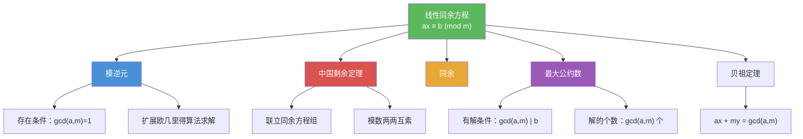

# 线性同余方程

> [!abstract] 概述
> ==线性同余方程==（linear congruence）是形如 $ax \equiv b \pmod{m}$ 的方程，其中 $m$ 为正整数，$a$、$b$ 为整数，$x$ 为未知量。其求解的核心工具是==模逆元==：当 $\gcd(a, m) = 1$ 时，方程有唯一解 $x \equiv \bar{a}b \pmod{m}$。更一般地，方程有解的充要条件是 $\gcd(a, m) \mid b$，此时恰有 $\gcd(a, m)$ 个不同解（模 $m$ 下）。线性同余方程是数论中求解问题的基本工具，也是==中国剩余定理==的基础构件。

## 定义

> [!def] 线性同余方程（Linear Congruence）
>
> 形如
>
> $$ax \equiv b \pmod{m}$$
>
> 的方程称为==线性同余方程==，其中 $m$ 为正整数，$a$、$b$ 为整数，$x$ 为未知量。
>
> 求解的目标是找到所有满足 $m \mid (ax - b)$ 的整数 $x$。

> [!def] 有解条件与解的个数
>
> 设 $d = \gcd(a, m)$。则线性同余方程 $ax \equiv b \pmod{m}$：
>
> - **有解**当且仅当 $d \mid b$
> - 当有解时，在模 $m$ 下恰有 $d$ 个==不同解==
> - 这 $d$ 个解为 $x_0, x_0 + \frac{m}{d}, x_0 + 2 \cdot \frac{m}{d}, \ldots, x_0 + (d-1) \cdot \frac{m}{d}$，其中 $x_0$ 是某个特解

## 核心性质

| 性质 | 描述 | 说明 |
|------|------|------|
| 有解充要条件 | $\gcd(a, m) \mid b$ | 当 $\gcd(a, m) \nmid b$ 时方程无解 |
| 唯一解条件 | $\gcd(a, m) = 1$ | 逆元存在，$x \equiv \bar{a}b \pmod{m}$ |
| 解的个数 | $\gcd(a, m)$ 个（模 $m$ 下） | 解之间间隔 $m / \gcd(a, m)$ |
| 求解核心 | 利用模逆元 $\bar{a}$ | $x \equiv \bar{a}b \pmod{m}$（当 $\gcd(a,m)=1$） |
| 等价形式 | $ax - my = b$ | 线性同余方程等价于线性 Diophantine 方程 |

## 关系网络

- [[模逆元]] 是求解线性同余方程的核心工具：当 $\gcd(a, m) = 1$ 时，$x \equiv \bar{a}b \pmod{m}$
- [[中国剩余定理]] 将多个线性同余方程联立为方程组，在模数两两互素时有唯一解
- [[同余]] 是线性同余方程的理论基础，提供了模运算的基本性质
- [[最大公约数]] 决定方程是否有解以及解的个数：$\gcd(a, m) \mid b$ 是有解的充要条件

## 章节扩展

### 第4章：数论与密码学

线性同余方程是第 4.4 节"解同余方程"的核心内容：

- **4.4 解同余方程**：线性同余方程的定义、有解条件、利用模逆元求解、解的个数分析
- **4.4 中国剩余定理**：将多个线性同余方程联立为方程组，构造法与回代法求解
- **4.4 费马小定理**：$a^{p-1} \equiv 1 \pmod{p}$，可用于简化大幂模素数的计算
- **4.6 密码学**：RSA 密码系统的解密过程涉及求解线性同余方程

## 补充

> [!info] 线性同余方程的学术背景
>
> 线性同余方程的求解可追溯到古代数论。其现代理论建立在 [[贝祖定理]]（Bézout's identity）之上：$\gcd(a, m)$ 可以表示为 $a$ 和 $m$ 的线性组合，即存在整数 $s, t$ 使得 $sa + tm = \gcd(a, m)$。这一等式直接给出了模逆元的构造方法，也是扩展欧几里得算法的理论基础。线性同余方程在密码学中有广泛应用，例如 RSA 密码系统中需要求解 $ed \equiv 1 \pmod{\varphi(n)}$ 来确定解密密钥 $d$。
>
> **学术来源**：Rosen, K. H. (2019). *Discrete Mathematics and Its Applications* (8th ed.). McGraw-Hill, Section 4.4.
>
> **参考链接**：Hardy, G. H., & Wright, E. M. (2008). *An Introduction to the Theory of Numbers* (6th ed.). Oxford University Press, Chapter VIII.

## 参见

- [[模逆元]] -- 线性同余方程求解的核心工具，$a\bar{a} \equiv 1 \pmod{m}$
- [[中国剩余定理]] -- 联立线性同余方程组的系统求解方法
- [[同余]] -- 模运算的基本定义与性质
- [[最大公约数]] -- 决定方程有解条件与解的个数
