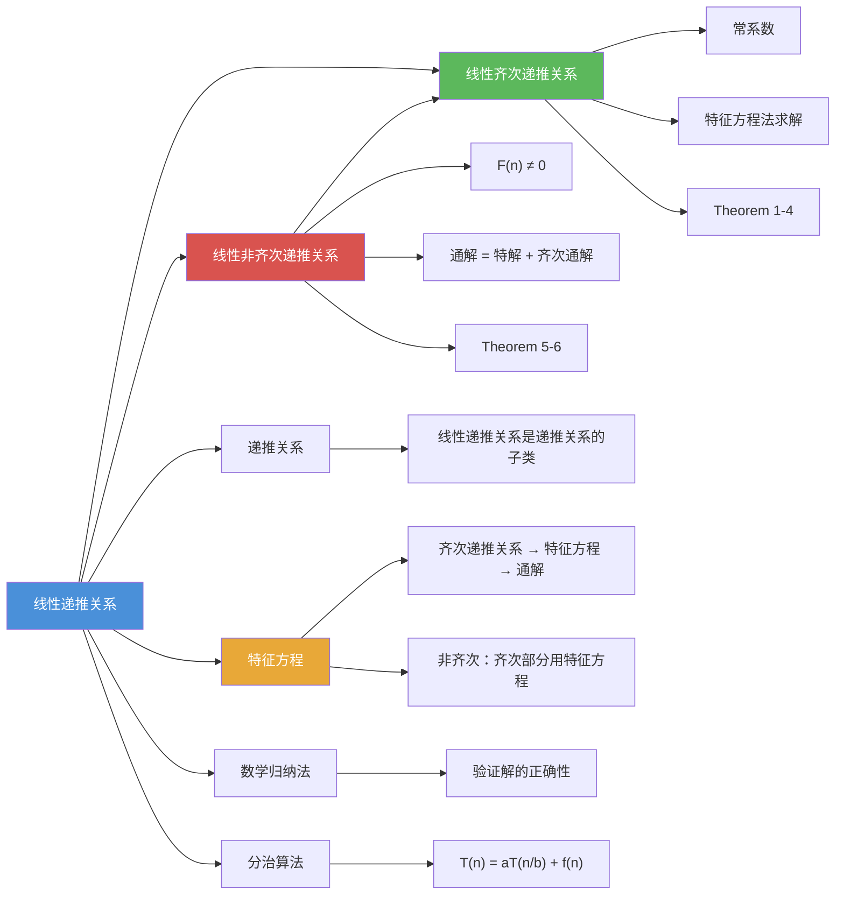

# 线性递推关系

> [!abstract] 概述
> ==线性递推关系（Linear Recurrence Relation）==是指递推关系的右边是前若干项的线性组合（每项乘以系数后相加）的递推关系。当无常数项时称为==齐次==的，当系数为常数时称为==常系数==的。常系数线性齐次递推关系可通过[[离散数学/concepts/特征方程|特征方程]]系统求解；非齐次递推关系的通解等于==特解==加上==齐次通解==。

## 定义

> [!def] 线性齐次递推关系（Linear Homogeneous Recurrence Relation）
>
> ==阶为 $k$ 的常系数线性齐次递推关系==是指形如
> $$a_n = c_1 a_{n-1} + c_2 a_{n-2} + \cdots + c_k a_{n-k}$$
>
> 的递推关系，其中 $c_1, c_2, \ldots, c_k$ 为实数且 $c_k \neq 0$。
>
> 名称中各术语的含义：
> - ==线性（linear）==：右边是前 $k$ 项的线性组合（每项乘以系数后相加）
> - ==齐次（homogeneous）==：没有不依赖于 $a_j$ 的项（即无常数项或 $F(n)$ 项）
> - ==常系数（constant coefficients）==：系数 $c_1, c_2, \ldots, c_k$ 是常数，不是 $n$ 的函数
> - ==阶为 $k$（degree $k$）==：$a_n$ 由前面 $k$ 项表示

> [!def] 线性非齐次递推关系（Linear Nonhomogeneous Recurrence Relation）
>
> ==线性非齐次递推关系==是指形如
> $$a_n = c_1 a_{n-1} + c_2 a_{n-2} + \cdots + c_k a_{n-k} + F(n)$$
>
> 的递推关系，其中 $c_1, \ldots, c_k$ 为实数，$F(n)$ 是仅依赖于 $n$ 的函数且不恒为零。
>
> 去掉 $F(n)$ 后得到的递推关系 $a_n = c_1 a_{n-1} + \cdots + c_k a_{n-k}$ 称为==关联齐次递推关系==（associated homogeneous recurrence relation）。

> [!def] 通解与特解
>
> 对于非齐次递推关系：
> - ==特解（particular solution）== $\{a_n^{(p)}\}$：满足非齐次递推关系的任意一个解
> - ==齐次通解（homogeneous solution）== $\{a_n^{(h)}\}$：关联齐次递推关系的所有解
> - ==通解==：非齐次递推关系的所有解 = 特解 + 齐次通解，即 $\{a_n^{(p)} + a_n^{(h)}\}$

## 核心性质

| 性质 | 描述 | 说明 |
|------|------|------|
| ==线性== | 右边是前 $k$ 项的线性组合 | 出现 $a_{n-2}^2$ 等高次项则不是线性的 |
| ==齐次== | 无不依赖于 $a_j$ 的项 | 有常数项 $+1$ 等则不是齐次的（如汉诺塔 $H_n = 2H_{n-1}+1$） |
| ==常系数== | 系数是常数，不依赖 $n$ | 系数为 $n$ 的函数则不是常系数（如 $B_n = n \cdot B_{n-1}$） |
| ==阶数== | $a_n$ 依赖的最远前项距离 | 阶为 $k$ 需要 $k$ 个初始条件 |
| ==齐次通解结构== | 由特征方程的特征根完全决定 | 互异根：$\sum \alpha_i r_i^n$；$m$ 重根：多项式 $\times\ r^n$ |
| ==非齐次通解== | 通解 = 特解 + 齐次通解 | 叠加原理（Theorem 5） |
| ==解的唯一性== | 递推关系 + $k$ 个初始条件唯一确定序列 | 由第二数学归纳原理保证 |

## 关系网络

- [[离散数学/concepts/递推关系]] 是更一般的概念，线性递推关系是其最重要的子类
- [[离散数学/concepts/特征方程]] 是求解线性齐次递推关系的核心工具
- [[离散数学/concepts/数学归纳法]] 用于验证求得的显式公式的正确性
- [[离散数学/concepts/分治算法]] 的复杂度分析产生特殊形式的线性递推关系

## 章节扩展

### 第8章：高级计数技术 — 8.2节完整理论

线性递推关系是8.2节的核心主题，包含四个核心定理（Theorem 1-4）处理齐次情形，两个核心定理（Theorem 5-6）处理非齐次情形。

#### 齐次递推关系的求解（Theorem 1-4）

**Theorem 1（二阶互异根）**：特征方程 $r^2 - c_1 r - c_2 = 0$ 有两个互异根 $r_1, r_2$ 时，通解为 $a_n = \alpha_1 r_1^n + \alpha_2 r_2^n$。

**Theorem 2（二阶重根）**：特征方程只有一根 $r_0$（二重根）时，通解为 $a_n = \alpha_1 r_0^n + \alpha_2 n r_0^n$。

**Theorem 3（$k$ 阶互异根）**：$k$ 个互异根 $r_1, \ldots, r_k$ 时，通解为 $a_n = \alpha_1 r_1^n + \cdots + \alpha_k r_k^n$。

**Theorem 4（$k$ 阶含重根）**：$t$ 个互异根 $r_1, \ldots, r_t$，重数分别为 $m_1, \ldots, m_t$ 时，通解为各根贡献之和，$m$ 重根 $r$ 贡献 $(\alpha_0 + \alpha_1 n + \cdots + \alpha_{m-1} n^{m-1}) r^n$。

#### 非齐次递推关系的求解（Theorem 5-6）

**Theorem 5（解的结构）**：若 $\{a_n^{(p)}\}$ 是非齐次递推关系的一个特解，则所有解具有形式 $\{a_n^{(p)} + a_n^{(h)}\}$，其中 $\{a_n^{(h)}\}$ 是关联齐次递推关系的解。

**Theorem 6（特解的形式）**：设 $F(n) = (b_t n^t + \cdots + b_0) \cdot s^n$：
- 当 $s$ 不是特征根时，特解形如 $(p_t n^t + \cdots + p_0) \cdot s^n$
- 当 $s$ 是重数为 $m$ 的特征根时，特解形如 $n^m(p_t n^t + \cdots + p_0) \cdot s^n$

其中待定系数 $p_0, \ldots, p_t$ 通过代入递推关系比较同类项系数确定。

**注意**：当 $F(n)$ 是纯多项式时，等价于 $s = 1$，需检查 $1$ 是否为特征根。

### 第8章：高级计数技术 — 8.3节分治算法

分治算法的复杂度产生形如 $T(n) = aT(n/b) + f(n)$ 的递推关系，这是线性递推关系的一种特殊形式，可用主定理（Master Theorem）求解。

## 补充

> [!info] 判定线性齐次递推关系的示例
>
> - $P_n = 1.11 \cdot P_{n-1}$：线性齐次，阶为1
> - $f_n = f_{n-1} + f_{n-2}$：线性齐次，阶为2
> - $a_n = a_{n-5}$：线性齐次，阶为5
> - $a_n = a_{n-1} + a_{n-2}^2$：**不是线性的**（$a_{n-2}^2$ 是二次项）
> - $H_n = 2H_{n-1} + 1$：**不是齐次的**（有常数项 $+1$）
> - $B_n = n \cdot B_{n-1}$：**不是常系数**（系数 $n$ 依赖于 $n$）

> [!info] 特解形式判断的注意事项
>
> 1. **$s = 1$ 的特殊情况**：当 $F(n)$ 是纯多项式（如 $n^2 + 3n + 1$）时，实际上 $s = 1$（因为 $n^k = n^k \cdot 1^n$）。需要检查 $1$ 是否为特征根
> 2. **待定系数法**：设好特解形式后，代入递推关系，比较同类项系数，解线性方程组确定待定系数
> 3. **叠加原理**：若 $F(n) = F_1(n) + F_2(n)$，可分别求对应 $F_1$ 和 $F_2$ 的特解，然后相加
> 4. **$n^m$ 因子的区别**：齐次解中 $m$ 重根贡献最高 $n^{m-1} r^n$；非齐次特解中 $s$ 为 $m$ 重特征根时乘以 $n^m$（是 $m$ 而非 $m-1$）

## 参见

- [[离散数学/concepts/递推关系]] — 线性递推关系是递推关系的最重要子类
- [[离散数学/concepts/特征方程]] — 求解线性齐次递推关系的核心代数工具
- [[离散数学/concepts/数学归纳法]] — 验证线性递推关系求得的解的正确性
- [[离散数学/concepts/分治算法]] — 分治递推关系 $T(n) = aT(n/b) + f(n)$ 的分析
