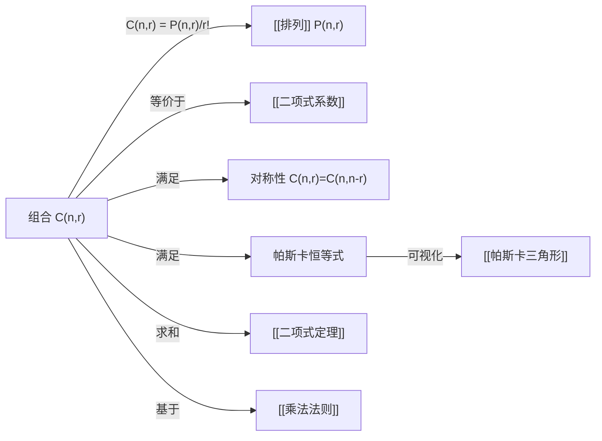

# 组合

> [!abstract]
> ==组合（Combination）==是从 $n$ 个不同元素中选取 $r$ 个元素的**无序选取**的计数问题。组合数记为 $C(n,r)$ 或 $\binom{n}{r}$，其公式为：
>
> $$C(n,r) = \binom{n}{r} = \frac{n!}{r!(n-r)!}$$
>
> 组合与[[排列]]的核心区别在于**不考虑顺序**。组合数具有对称性 $\binom{n}{r} = \binom{n}{n-r}$，这是[[二项式系数]]的基本性质之一。

## 定义

> [!def] 组合（Combination）
> 设 $S$ 为含 $n$ 个不同元素的集合，$r$ 为满足 $0 \leq r \leq n$ 的整数。
>
> $S$ 的一个 **$r$-组合**（$r$-combination）是从 $S$ 中选取 $r$ 个元素的**无序子集**。
>
> $S$ 的 $r$-组合的总数记为 $C(n,r)$ 或 $\binom{n}{r}$，计算公式为：
>
> $$C(n,r) = \binom{n}{r} = \frac{P(n,r)}{r!} = \frac{n!}{r!(n-r)!}$$
>
> 其中 $P(n,r)$ 为[[排列]]数，除以 $r!$ 是因为同一组 $r$ 个元素的全排列被视为同一种组合。

> [!def] 组合的等价定义
> $\binom{n}{r}$ 等价于：
>
> - 从 $n$ 个不同元素中选取 $r$ 个的方式数（无序）
> - $n$ 元素集合的 $r$ 元子集的个数
> - $n$ 个位置中选 $r$ 个放置标记的方式数

## 核心性质

| 编号 | 性质 | 公式 | 说明 |
|:---:|------|------|------|
| 1 | 基本公式 | $\dbinom{n}{r} = \dfrac{n!}{r!(n-r)!}$ | 组合数的定义公式 |
| 2 | 对称性 | $\dbinom{n}{r} = \dbinom{n}{n-r}$ | 选 $r$ 个等价于排除 $n-r$ 个 |
| 3 | 与排列的关系 | $\dbinom{n}{r} = \dfrac{P(n,r)}{r!}$ | 组合数 = 排列数 / 内部排列数 |
| 4 | 递推关系（帕斯卡恒等式） | $\dbinom{n}{r} = \dbinom{n-1}{r-1} + \dbinom{n-1}{r}$ | 固定一个元素，分"含"与"不含"两类 |
| 5 | 上指标求和 | $\displaystyle\sum_{k=0}^{n} \dbinom{n}{k} = 2^n$ | 所有子集总数（[[二项式定理]]的推论） |
| 6 | 吸收恒等式 | $\dbinom{n}{r} = \dfrac{n}{r} \dbinom{n-1}{r-1}$ | 组合数的降阶表示 |
| 7 | 边界值 | $\dbinom{n}{0} = \dbinom{n}{n} = 1$ | 空集和全集都只有一种选取方式 |

## 关系网络

## 章节扩展

- **组合与排列的转换**：每个 $r$-组合对应 $r!$ 个 $r$-排列，因此 $P(n,r) = C(n,r) \cdot r!$。
- **组合数的对称性**是[[二项式系数]]最重要的性质之一，在组合证明中经常使用。
- **帕斯卡恒等式** $\binom{n}{r} = \binom{n-1}{r-1} + \binom{n-1}{r}$ 是[[帕斯卡三角形]]的构造原理，也是[[排列组合恒等式]]中的核心恒等式之一。
- **7.1-7.2 概率**：等可能概率 $P(E) = |E|/|S|$ 和二项分布 $b(k;n,p)$ 的计算大量依赖组合数 $\binom{n}{k}$。

## 补充

> [!info] 组合的直观理解
> 想象从 $n$ 个同学中选出 $r$ 个组成委员会（委员会无职位区分，即无序）：
>
> - 如果关心谁当主席、谁当秘书（有序），那就是[[排列]]问题，有 $P(n,r)$ 种方式
> - 如果只关心哪些人入选（无序），那就是组合问题，有 $C(n,r)$ 种方式
>
> 每个委员会对应 $r!$ 种不同的职位分配方案。

> [!info] 对称性的直观解释
> $\binom{n}{r} = \binom{n}{n-r}$ 的含义是：
>
> 从 $n$ 个人中选 $r$ 个人参加活动，等价于选 $n-r$ 个人不参加活动。
>
> "选谁去"和"选谁不去"是一一对应的，因此两种计数方式结果相同。

## 参见

- [[排列]] —— 考虑顺序的选取
- [[二项式系数]] —— $\binom{n}{r}$ 的代数性质
- [[二项式定理]] —— 组合数在代数展开中的应用
- [[排列组合恒等式]] —— 关于组合数的经典恒等式
- [[乘法法则]] —— 计数的基本法则
